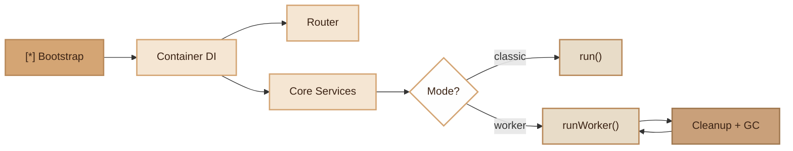

# App

> Main entry point of the Fennec framework: bootstrap, dependency injection and FrankenPHP worker loop.

## Overview

The `App` class is the framework's boot kernel. It initializes all core services
(Container DI, Router, ErrorHandler, EventDispatcher, Profiler, Storage, Webhook, RateLimiter, etc.)
and offers two execution modes: classic (`run()`) and FrankenPHP worker (`runWorker()`).

The worker mode keeps the application in memory between requests, with a full lifecycle:
boot, beforeRequest, handler, afterRequest, cleanup, then repeat or shutdown.

## Diagram



## Public API

### `__construct()`

Initializes core services. The **eager** services (instantiated immediately) are: ErrorHandler, Container, TenantManager, DatabaseManager, JwtService, Router, RateLimiter, and UiRoutes (if `UI_ADMIN_EMAIL` is defined).

The following services are **lazy-initialized** via Container singletons and are only instantiated on first call:

- `EventDispatcher`
- `Storage`
- `ImageTransformer`
- `WebhookManager`
- `Profiler`

This reduces boot cost by avoiding instantiation of unused services for a given request.

```php
$app = new App();
```

### `router(): Router`

Returns the router instance for registering routes.

```php
$router = $app->router();
$router->get('/api/health', [HealthController::class, 'check']);
```

### `container(): Container`

Returns the dependency injection container.

```php
$db = $app->container()->get(DatabaseManager::class);
```

### `loadRoutes(string $path): void`

Loads route files from a file or directory. If `$path` is a directory,
all `*.php` files are loaded automatically.

```php
$app->loadRoutes(__DIR__ . '/app/Routes');
```

### `run(): void`

Executes HTTP dispatch in classic mode (one request = one process).

```php
$app->run();
```

### `runWorker(): void`

FrankenPHP worker loop. The application stays in memory, each request is handled
by `frankenphp_handle_request()`. Includes the scheduler, metrics, and cleanup
(DB flush, auth reset, GC) between each request.

```php
$app->runWorker();
```

## OpenAPI Documentation

The built-in `DocsController` auto-generates an OpenAPI 3.0.3 specification from your routes and DTOs.

**Server URL auto-detection**: if `APP_URL` is not set, the server URL is automatically detected from the incoming HTTP request (scheme, host, port). This means you do not need to configure `APP_URL` for development or single-server deployments.

**Customizable metadata**: the OpenAPI `info` block reads from environment variables:
- `APP_NAME` — title (default: `Fennectra API`)
- `APP_DESCRIPTION` — description (default: `REST API built with Fennectra`)
- `APP_VERSION` — version (default: `1.0.0`)

**OAuth2 token URL**: the OAuth2 password flow `tokenUrl` is configurable via `AUTH_TOKEN_URL` (default: `/auth/login`).

## Configuration

| Variable | Description | Default |
|---|---|---|
| `APP_ENV` | Environment (`dev`/`prod`) | `prod` |
| `APP_NAME` | Application name (used in OpenAPI docs) | `Fennectra API` |
| `APP_DESCRIPTION` | Application description (OpenAPI) | `REST API built with Fennectra` |
| `APP_VERSION` | API version (OpenAPI) | `1.0.0` |
| `APP_URL` | Base URL for OpenAPI server; if empty, auto-detected from the HTTP request | _(auto-detect)_ |
| `AUTH_TOKEN_URL` | OAuth2 token URL in OpenAPI spec | `/auth/login` |
| `EVENT_BROKER` | Event driver (`sync`/`redis`/`database`) | `sync` |
| `PROFILER_ENABLED` | Enable the profiler | `1` in dev, `0` in prod |
| `STORAGE_DRIVER` | Storage driver (`local`/`s3`) | `local` |
| `REDIS_HOST` | Redis host (for RateLimiter, Scheduler) | - |
| `REDIS_PORT` | Redis port | `6379` |
| `REDIS_PASSWORD` | Redis password | - |
| `REDIS_DB` | Redis database | `0` |
| `REDIS_PREFIX` | Redis key prefix | `app:` |
| `UI_ADMIN_EMAIL` | Enable the admin dashboard | - |
| `SCHEDULER_ENABLED` | Enable the scheduler in worker mode | `0` |
| `MAX_REQUESTS` | Max requests before worker shutdown | `0` (unlimited) |

## Integration with other modules

- **Container**: creates and manages all service instances
- **Router**: created in the constructor, used for `dispatch()`
- **ErrorHandler**: registers global handlers at boot
- **DatabaseManager**: singleton, flushed between each worker request
- **TenantManager**: reset between each worker request
- **EventDispatcher**: lazy-initialized, auto-discovery of listeners on first use
- **Profiler**: lazy-initialized, instantiated on first call via Container singleton
- **WorkerStats**: memory and error metrics in worker mode
- **Scheduler**: tick executed on each worker loop (60s throttle)

## CLI Commands

| Command | Description |
|---|---|
| `serve` | Start the server (`--frankenphp`, `--worker`, `--port=8080`) |
| `cache:routes` | Pre-compile the route cache |

## Full Example

```php
// public/index.php — classic mode
require __DIR__ . '/../vendor/autoload.php';

$app = new \Fennec\Core\App();

// Global middleware
$app->router()->addGlobalMiddleware(\App\Middleware\CorsMiddleware::class);

// Load application routes
$app->loadRoutes(__DIR__ . '/../app/Routes');

// Dispatch
$app->run();
```

```php
// public/worker.php — FrankenPHP mode
require __DIR__ . '/../vendor/autoload.php';

$app = new \Fennec\Core\App();
$app->loadRoutes(__DIR__ . '/../app/Routes');
$app->runWorker();
```

## Module Files

| File | Role | Last Modified |
|---|---|---|
| `src/Core/App.php` | Main App class | 2026-03-23 |
| `src/Controllers/DocsController.php` | OpenAPI spec generator (auto-detect URL) | 2026-03-23 |
| `src/Commands/ServeCommand.php` | `serve` command | 2026-03-21 |
| `src/Commands/CacheRoutesCommand.php` | `cache:routes` command | 2026-03-21 |
