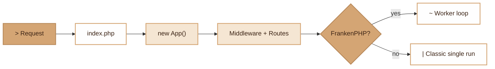
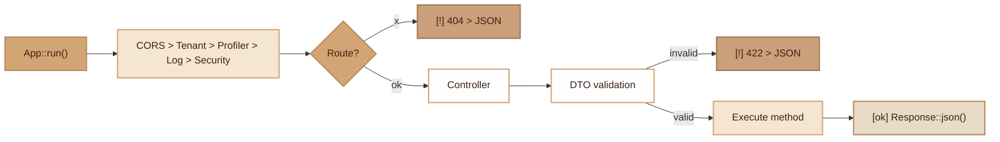
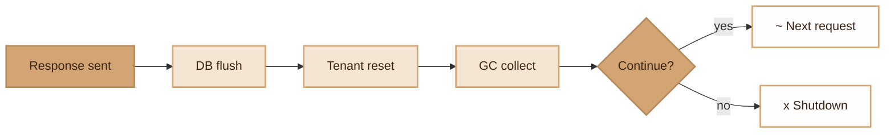

# Fennec — Application Lifecycle

## 1. Boot & Mode Detection

```mermaid
graph LR
    A["> Request"]:::chamois --> B["index.php"]:::blanc
    B --> C["new App()"]:::beige
    C --> D["Middleware + Routes"]:::beige
    D --> F{"FrankenPHP?"}:::chamois
    F -->|yes| G["~ Worker loop"]:::blanc
    F -->|no| H["| Classic single run"]:::blanc

    classDef chamois fill:#d4a574,color:#3b2314,stroke:#b8895a,stroke-width:2px
    classDef blanc fill:#fefefe,color:#3b2314,stroke:#d4a574,stroke-width:2px
    classDef beige fill:#f5e6d3,color:#3b2314,stroke:#d4a574,stroke-width:2px
```

## 2. Request Pipeline

```mermaid
graph LR
    RUN["App::run()"]:::chamois --> MW["CORS > Tenant > Profiler > Log > Security"]:::beige
    MW --> R{"Route?"}:::chamois
    R -->|"x"| E["[!] 404 > JSON"]:::error
    R -->|"ok"| C["Controller"]:::blanc
    C --> D["DTO validation"]:::blanc
    D -->|invalid| E2["[!] 422 > JSON"]:::error
    D -->|valid| M["Execute method"]:::beige
    M --> RS["[ok] Response::json()"]:::success

    classDef chamois fill:#d4a574,color:#3b2314,stroke:#b8895a,stroke-width:2px
    classDef blanc fill:#fefefe,color:#3b2314,stroke:#d4a574,stroke-width:2px
    classDef beige fill:#f5e6d3,color:#3b2314,stroke:#d4a574,stroke-width:2px
    classDef success fill:#e8dcc8,color:#3b2314,stroke:#b8895a,stroke-width:2px
    classDef error fill:#c9a07a,color:#3b2314,stroke:#a07850,stroke-width:2px
```

## 3. Worker Cleanup

```mermaid
graph LR
    RS["Response sent"]:::chamois --> CL1["DB flush"]:::beige
    CL1 --> CL2["Tenant reset"]:::beige
    CL2 --> CL3["GC collect"]:::beige
    CL3 --> L{"Continue?"}:::chamois
    L -->|yes| LOOP["~ Next request"]:::blanc
    L -->|no| EXIT["x Shutdown"]:::blanc

    classDef chamois fill:#d4a574,color:#3b2314,stroke:#b8895a,stroke-width:2px
    classDef blanc fill:#fefefe,color:#3b2314,stroke:#d4a574,stroke-width:2px
    classDef beige fill:#f5e6d3,color:#3b2314,stroke:#d4a574,stroke-width:2px
```
