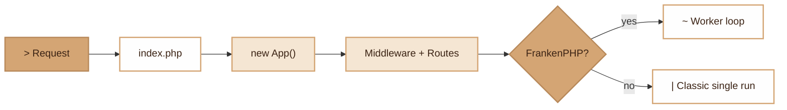
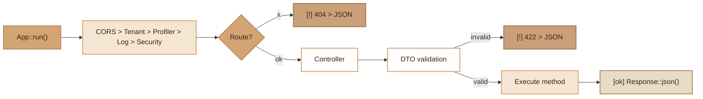
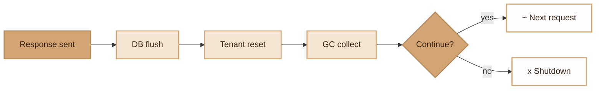

# Fennec — Application Lifecycle

## 1. Boot & Mode Detection



## 2. Request Pipeline



## 3. Worker Cleanup



## 4. Docker Deployment

Fennectra provides two production-ready Dockerfiles in `docker/`. Both are designed for the **Composer package structure** (not the monorepo) and should be copied to the project root for CI/CD.

### Dockerfile.frankenphp (Recommended)

Uses [FrankenPHP](https://frankenphp.dev/) with worker mode for optimal performance.

```dockerfile
FROM dunglas/frankenphp:latest-php8.3
```

**Key features:**
- PHP extensions: `pdo_pgsql`, `pdo_mysql`, `pdo_sqlite`, `gd`
- **Docker cache layer**: `composer.json` + `composer.lock` are copied first, then `composer install` runs. Application code is copied after, so dependency installation is cached across builds.
- **Caddyfile**: copied from `vendor/fennectra/framework/docker/Caddyfile` after `composer install`
- **Environment**: `FENNEC_BASE_PATH=/app`, `PORT=8080`
- Worker mode: `index.php` detects worker mode via `FRANKENPHP_WORKER` env var

### Dockerfile.fpm (Alternative)

Uses PHP-FPM with Nginx for traditional deployments.

```dockerfile
FROM php:8.3-fpm
```

**Key features:**
- PHP extensions: `pdo`, `pdo_pgsql`, `pdo_mysql`, `pdo_sqlite`
- **Docker cache layer**: same strategy as FrankenPHP (composer files first)
- **Nginx config**: copied from `vendor/fennectra/framework/docker/nginx.conf` after `composer install`
- PHP-FPM `clear_env = no` enabled for K8s/Docker env var passthrough
- **Environment**: `FENNEC_BASE_PATH=/app`
- Runs PHP-FPM + Nginx together via `sh -c "php-fpm -D && nginx -g 'daemon off;'"`

### Usage

Copy the Dockerfile to your project root:

```bash
cp vendor/fennectra/framework/docker/Dockerfile.frankenphp Dockerfile
docker build -t my-app .
docker run -p 8080:8080 --env-file .env my-app
```

### Build Structure

Both Dockerfiles follow the same layered copy pattern:

```
1. composer.json + composer.lock    (cache layer)
2. composer install --no-dev        (cached if lock unchanged)
3. app/ public/ database/ .env      (application code)
4. Server config from vendor/       (Caddyfile or nginx.conf)
5. Runtime dirs: var/, storage/     (created + chown www-data)
```
