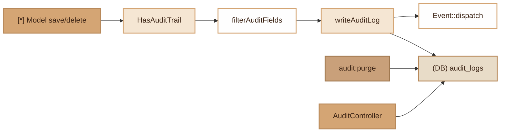

# Audit Trail
> Automatic logging of Model changes (create/update/delete) for SOC 2 and ISO 27001 compliance.

## Overview

The Audit Trail module intercepts `save()` and `delete()` operations on Models annotated with `#[Auditable]` to record each change in the `audit_logs` table. It captures old and new values, the authenticated user, IP address and request identifier. A filtering system via `only` / `except` controls which fields are audited (e.g. exclude `password`). Purging old logs is built in via the `audit:purge` command (configurable retention, ISO 27001 A.5.33 compliance).

## Diagram



## Public API

### Trait `HasAuditTrail`

Add the trait to a Model to enable automatic auditing:

```php
use Fennec\Attributes\Auditable;
use Fennec\Attributes\Table;
use Fennec\Core\Model;
use Fennec\Core\Audit\HasAuditTrail;

#[Table('users'), Auditable(except: ['password', 'remember_token'])]
class User extends Model
{
    use HasAuditTrail;
}
```

The `save()` and `delete()` methods are automatically intercepted. No manual call is required.

### Model `AuditLog` (generated by `make:audit`)

```php
// Logs for an entity
AuditLog::forEntity('App\Models\User', 42);

// Logs by user
AuditLog::byUser(userId: 1, limit: 20, offset: 0);

// Statistics by action
AuditLog::stats();
// => [['action' => 'created', 'count' => 150], ...]

// Recent activity
AuditLog::recentActivity(limit: 20);

// Search with filters
AuditLog::search([
    'action' => 'updated',
    'auditable_type' => 'App\Models\User',
    'user_id' => 1,
    'date_from' => '2026-01-01',
    'date_to' => '2026-03-31',
], limit: 20, offset: 0);
```

### Controller `AuditController` (generated by `make:audit`)

| Method | Route | Description |
|---|---|---|
| `index` | `GET /audit` | Paginated list with filters |
| `show` | `GET /audit/{id}` | Entry details |
| `forEntity` | `GET /audit/entity/{type}/{entityId}` | Logs for an entity |
| `byUser` | `GET /audit/users/{userId}` | Logs for a user |
| `stats` | `GET /audit/stats` | Statistics by action |
| `recentActivity` | `GET /audit/recent` | Recent activity |

All routes are protected by the `Auth` middleware with the `admin` role.

## Configuration

| Variable | Default | Description |
|---|---|---|
| `AUDIT_RETENTION_DAYS` | `365` | Log retention period (days) |
| `DB_DRIVER` | `pgsql` | DB driver (pgsql/mysql/sqlite) for migration |

## DB Tables

### `audit_logs`

| Column | Type | Description |
|---|---|---|
| `id` | BIGSERIAL / BIGINT / INTEGER | Primary key |
| `auditable_type` | VARCHAR(255) | Model class (FQCN) |
| `auditable_id` | BIGINT | Entity ID |
| `action` | VARCHAR(20) | `created`, `updated`, `deleted` |
| `old_values` | JSONB / JSON / TEXT | Old values |
| `new_values` | JSONB / JSON / TEXT | New values |
| `user_id` | BIGINT | User who performed the action |
| `ip_address` | VARCHAR(45) | IP address (IPv4/IPv6) |
| `request_id` | VARCHAR(32) | Request identifier (traceability) |
| `created_at` | TIMESTAMP | Creation date |

Index: `(auditable_type, auditable_id)`, `(user_id)`, `(created_at)`.

## Events

Each audit write triggers an event:

```
{ClassName}.audited
```

Payload: `['action' => string, 'model' => Model, 'old_values' => array, 'new_values' => array]`

Example: `App\Models\User.audited`

## PHP 8 Attributes

### `#[Auditable]`

Target: class. Parameters:

| Param | Type | Default | Description |
|---|---|---|---|
| `only` | `string[]` | `[]` | Columns to audit (empty = all) |
| `except` | `string[]` | `[]` | Columns to exclude from auditing |

```php
#[Auditable(only: ['email', 'name'])]       // Audit only these fields
#[Auditable(except: ['password', 'token'])]  // Everything except these fields
```

## CLI Commands

### `make:audit`

Generates the complete module: migration + `AuditLog` Model + 3 DTOs + Controller + Routes.

```bash
./forge make:audit
./forge migrate
```

### `audit:purge`

Deletes logs older than N days (default: 365). Compatible with pgsql, mysql, sqlite.

```bash
# Check without deleting
./forge audit:purge --days=365 --dry-run

# Actual purge
./forge audit:purge --days=180
```

## Integration with other modules

- **Encryption**: `#[Encrypted]` fields are audited in encrypted form (values stored in `old_values`/`new_values` remain encrypted).
- **Event System**: the `.audited` event allows attaching listeners (alerts, notifications).
- **SecurityLogger**: the module relies on the `X_REQUEST_ID` and `REMOTE_ADDR` server headers.
- **Admin UI**: the Compliance page of the dashboard displays audit logs.

## Full Example

```php
// 1. Define the Model
#[Table('orders'), Auditable(except: ['internal_notes'])]
class Order extends Model
{
    use HasAuditTrail;
}

// 2. Normal usage — auditing is transparent
$order = new Order(['client' => 'ACME', 'total' => 1500.00]);
$order->save();
// -> INSERT audit_logs: action=created, new_values={client: "ACME", total: 1500}

$order->total = 1800.00;
$order->save();
// -> INSERT audit_logs: action=updated, old_values={total: 1500}, new_values={total: 1800}

$order->delete();
// -> INSERT audit_logs: action=deleted, old_values={client: "ACME", total: 1800}

// 3. View the logs
$logs = AuditLog::forEntity(Order::class, $order->id);
```

## Module Files

| File | Role |
|---|---|
| `src/Core/Audit/HasAuditTrail.php` | Trait intercepting save/delete |
| `src/Attributes/Auditable.php` | PHP 8 configuration attribute |
| `src/Commands/MakeAuditCommand.php` | Complete module generator |
| `src/Commands/AuditPurgeCommand.php` | ISO 27001 purge command |
