# Authentication
> Complete JWT authentication with full RBAC (Role-Based Access Control), password policy, account lockout and security logging.

## Overview

The Fennec Authentication module covers the entire access security chain:

- **`JwtService`**: JWT token generation and validation (access + refresh) via `firebase/php-jwt`.
- **`AuthMiddleware`**: middleware verifying the Bearer token, user roles and permissions via `role:X` and `permission:X` constraints.
- **`PasswordPolicy`**: password strength validation (ISO 27001 A.8.5).
- **`AccountLockout`**: automatic lockout after N failed attempts.
- **`SecurityLogger`**: security event logging with HMAC chain (SOC 2 + ISO 27001).
- **RBAC system**: full role-based access control with User, Role, Permission models and pivot tables.

The JWT token is encoded in HS256, verified in the database to detect revocations, and TTLs are configurable via environment variables.

**Optimization**: token creation (login/refresh) uses a single PostgreSQL CTE query (`WITH ... INSERT`) instead of two separate queries (`UPDATE` + `INSERT`) in a transaction. This reduces DB round-trips from 4 to 1.

## RBAC Architecture

The `make:auth` command generates a complete RBAC system with the following database schema:

### Tables

| Table | Purpose |
|---|---|
| `users` | User accounts (email, password, activation, soft deletes) |
| `roles` | Named roles with guard and description (e.g. admin, manager, user) |
| `permissions` | Named permissions (e.g. users.create, roles.update) |
| `role_permissions` | Pivot: which permissions belong to which role |
| `user_roles` | Pivot: which roles are assigned to which user |
| `personal_access_tokens` | API tokens for programmatic access |

### Permission Chain

```
user -> user_roles -> roles -> role_permissions -> permissions
```

A user can have multiple roles, and each role can have multiple permissions. Permission checks traverse the full chain.

### User Model RBAC Methods

The generated `User` model includes:

```php
$user->roles();                    // Get all Role objects via user_roles pivot
$user->permissions();              // Get all Permission objects via the full chain
$user->hasRole('admin');           // Check if user has a specific role
$user->hasPermission('users.create'); // Check permission via any assigned role
$user->assignRole('manager');      // Assign a role by name or ID
$user->removeRole('manager');      // Remove a role by name or ID
```

### Auth Middleware

The generated `Auth` middleware uses `JwtService` (not manual base64) for token validation and supports role/permission constraints in route definitions:

```php
// Just authentication
$router->get('/profile', [ProfileController::class, 'show'], [Auth::class, []]);

// Require a specific role
$router->get('/admin/dashboard', [AdminController::class, 'index'], [Auth::class, ['role:admin']]);

// Require a specific permission
$router->post('/users', [UserController::class, 'store'], [Auth::class, ['permission:users.create']]);
```

### AuthSeeder

The `AuthSeeder` creates a default RBAC matrix:

**3 roles**: `admin`, `manager`, `user`

**16 permissions** (CRUD for 4 resources): `users.*`, `roles.*`, `permissions.*`, `organizations.*`

**Role-permission matrix**:
- **admin**: all 16 permissions
- **manager**: `users.read`, `users.update`, `organizations.*` (CRUD)
- **user**: `users.read` (own profile only)

## Diagram

```mermaid
graph LR
    classDef chamois fill:#d4a574,color:#3b2314,stroke:#b8895a,stroke-width:2px
    classDef blanc fill:#fefefe,color:#3b2314,stroke:#d4a574,stroke-width:2px
    classDef beige fill:#f5e6d3,color:#3b2314,stroke:#d4a574,stroke-width:2px
    classDef success fill:#e8dcc8,color:#3b2314,stroke:#b8895a,stroke-width:2px
    classDef error fill:#c9a07a,color:#3b2314,stroke:#a07850,stroke-width:2px

    A["[>] Login"]:::blanc --> B["PasswordPolicy"]:::beige
    B --> C["AccountLockout"]:::beige
    C --> D["JwtService"]:::chamois
    D --> E["[OK] Access + Refresh"]:::success
    E --> F["AuthMiddleware"]:::chamois
    F --> G["SecurityLogger"]:::error
```



## Public API

### `JwtService`

JWT token generation and validation service.

```php
use Fennec\Core\JwtService;

$jwt = new JwtService(); // uses SECRET_KEY from .env

// Generate an access token
$result = $jwt->generateAccessToken('user@example.com');
// ['token' => 'eyJ...', 'exp' => 1711234567, 'rand' => 'a1b2c3d4']

// Generate a refresh token (linked to the access token via rand)
$refreshToken = $jwt->generateRefreshToken('user@example.com', $result['rand']);

// Decode a token
$claims = $jwt->decode($token);
// ['sub' => 'user@example.com', 'exp' => ..., 'rand' => '...'] or null

// Encode a custom payload
$token = $jwt->encode(['sub' => 'admin', 'exp' => time() + 3600, 'custom' => 'data']);
```

**Methods:**

| Method | Description |
|---|---|
| `encode(array $claims): string` | Encode a payload into a JWT token |
| `decode(string $token): ?array` | Decode and validate a token, returns null if invalid |
| `generateAccessToken(string $email, ?int $ttl = null): array` | Generate an access token with configurable TTL |
| `generateRefreshToken(string $email, string $rand, ?int $ttl = null): string` | Generate a refresh token linked to the access token |
| `getAccessTtl(): int` | Returns the access token TTL |
| `getRefreshTtl(): int` | Returns the refresh token TTL |

### `PasswordPolicy`

Password strength validation according to ISO 27001 A.8.5.

```php
use Fennec\Core\Security\PasswordPolicy;

// Validate (returns an array of errors)
$errors = PasswordPolicy::validate('weak');
// ['Password must contain at least 12 characters',
//  'Password must contain at least one uppercase letter',
//  'Password must contain at least one special character']

// Validate with exception
PasswordPolicy::assertValid('MySuperP@ss1'); // OK, no exception

// Strength score (0-5)
$score = PasswordPolicy::strength('MySuperP@ss1'); // 5
```

**Validated rules:**

| Rule | Description |
|---|---|
| Minimum length | Configurable via `PASSWORD_MIN_LENGTH` (default: 12) |
| Uppercase | At least one uppercase letter |
| Lowercase | At least one lowercase letter |
| Digit | At least one digit |
| Special character | At least one non-alphanumeric character |
| Common words | Blacklist of 24 forbidden passwords (password, azerty, etc.) |

### `AccountLockout`

Automatic account lockout after failed attempts (ISO 27001 A.8.5).

```php
use Fennec\Core\Security\AccountLockout;

// Check if an account is locked
if (AccountLockout::isLocked('user@example.com')) {
    $remaining = AccountLockout::remainingLockout('user@example.com');
    throw new HttpException(429, "Account locked, retry in {$remaining}s");
}

// Record an authentication failure
AccountLockout::recordFailure('user@example.com');

// Reset after a successful login
AccountLockout::reset('user@example.com');

// Number of attempts
$attempts = AccountLockout::attempts('user@example.com');

// List all locked accounts
$locked = AccountLockout::locked();
```

**Storage:** Redis (production) with file fallback (`var/lockout/`). Bounded in-memory cache (LRU, max 500 entries) for performance in worker mode. Automatic purge of expired entries every 100 operations.

### `SecurityLogger`

Dedicated logger for security events with HMAC integrity chain.

```php
use Fennec\Core\Security\SecurityLogger;

// Critical event (auth fail, unauthorized access)
SecurityLogger::alert('auth.failed', ['email' => $email, 'ip' => $ip]);

// Informational event (token revoked, password changed)
SecurityLogger::track('token.revoked', ['user_id' => 42]);

// Very critical event (intrusion, brute force)
SecurityLogger::critical('brute_force.detected', ['ip' => $ip]);

// Reset HMAC chain (beginning of request in worker mode)
SecurityLogger::resetRequestState();
```

**Features:**

- Separate Monolog `security` channel writing to `var/logs/security.log`.
- Automatic log rotation (90 days).
- Stderr output in FrankenPHP worker mode (Docker/K8s compatible).
- Automatic sensitive data masking via `LogMaskingProcessor`.
- SHA-256 HMAC chain for log integrity (ISO 27001 A.8.15).
- Automatic enrichment: `request_id`, `ip`, `uri`, `method`, `user`, `timestamp`.

## Configuration

| Variable | Description | Default |
|---|---|---|
| `SECRET_KEY` | Secret key for signing JWTs (required) | _(none)_ |
| `JWT_ACCESS_TTL` | Access token lifetime (seconds) | `900` (15 min) |
| `JWT_REFRESH_TTL` | Refresh token lifetime (seconds) | `86400` (24h) |
| `PASSWORD_MIN_LENGTH` | Minimum password length | `12` |
| `LOCKOUT_MAX_ATTEMPTS` | Attempts before lockout | `5` |
| `LOCKOUT_DURATION` | Lockout duration (seconds) | `900` (15 min) |
| `REDIS_HOST` | Redis host for AccountLockout | _(file fallback)_ |
| `REDIS_PORT` | Redis port | `6379` |
| `REDIS_PASSWORD` | Redis password | _(empty)_ |
| `REDIS_DB` | Redis database | `0` |
| `REDIS_PREFIX` | Redis key prefix | `app:` |
| `LOG_MASK_FIELDS` | Additional fields to mask (comma-separated) | _(empty)_ |

## Integration with other modules

| Module | Integration |
|---|---|
| **Middleware** | `Auth` middleware uses `JwtService` for token validation, supports `role:X` and `permission:X` constraints |
| **Router** | Auth middleware registered per route or per group with optional RBAC params |
| **Container** | `JwtService` resolved via dependency injection |
| **Model (User)** | `User::findByEmailAndToken()` for DB verification, RBAC methods via pivot queries |
| **Model (Role/Permission)** | Generated models for roles and permissions management |
| **Profiler** | Auth middleware execution time measured |
| **Worker** | `SecurityLogger::resetRequestState()` called between requests, bounded LRU cache |

## Full Example

```php
// Login controller
use Fennec\Core\JwtService;
use Fennec\Core\Security\AccountLockout;
use Fennec\Core\Security\PasswordPolicy;
use Fennec\Core\Security\SecurityLogger;

class AuthController
{
    public function __construct(
        private JwtService $jwt,
    ) {}

    public function login(LoginRequest $dto): array
    {
        // 1. Check lockout
        if (AccountLockout::isLocked($dto->email)) {
            $remaining = AccountLockout::remainingLockout($dto->email);
            SecurityLogger::alert('auth.locked_attempt', ['email' => $dto->email]);
            throw new HttpException(429, "Account locked ({$remaining}s)");
        }

        // 2. Verify credentials
        $user = User::findByEmail($dto->email);
        if (!$user || !password_verify($dto->password, $user['password'])) {
            AccountLockout::recordFailure($dto->email);
            SecurityLogger::alert('auth.failed', ['email' => $dto->email]);
            throw new HttpException(401, 'Invalid credentials');
        }

        // 3. Reset lockout + generate tokens
        AccountLockout::reset($dto->email);
        $access = $this->jwt->generateAccessToken($dto->email);
        $refresh = $this->jwt->generateRefreshToken($dto->email, $access['rand']);

        SecurityLogger::track('auth.success', ['email' => $dto->email]);

        return [
            'access_token' => $access['token'],
            'refresh_token' => $refresh,
            'expires_at' => $access['exp'],
        ];
    }

    public function register(RegisterRequest $dto): array
    {
        // Validate password strength
        PasswordPolicy::assertValid($dto->password);

        $user = User::create([
            'email' => $dto->email,
            'password' => password_hash($dto->password, PASSWORD_ARGON2ID),
        ]);

        SecurityLogger::track('user.registered', ['email' => $dto->email]);

        return ['id' => $user['id']];
    }
}
```

## Module Files

| File | Role |
|---|---|
| `src/Core/JwtService.php` | JWT service (encode, decode, access/refresh tokens) |
| `src/Middleware/AuthMiddleware.php` | Framework-level authentication middleware |
| `src/Core/Security/PasswordPolicy.php` | Password policy |
| `src/Core/Security/AccountLockout.php` | Account lockout |
| `src/Core/Security/SecurityLogger.php` | Security logger with HMAC |
| `src/Commands/MakeAuthCommand.php` | Generator: full auth module with RBAC |
| `app/Middleware/Auth.php` | Generated auth middleware (JwtService + role/permission checks) |
| `app/Models/User.php` | Generated User model with RBAC methods |
| `app/Models/Role.php` | Generated Role model |
| `app/Models/Permission.php` | Generated Permission model |
| `app/Models/PersonalAccessToken.php` | Generated PAT model |
| `database/seeders/AuthSeeder.php` | Default roles, permissions and role-permission matrix |
