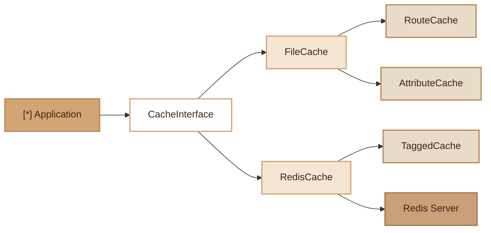

# Cache
> Multi-driver cache system (file, Redis) with tag support, route cache and PHP 8 attribute cache.

## Overview

The Fennec Cache module offers several caching strategies suited to different needs:

- **FileCache**: PHP file cache (var_export + opcache), zero dependency, ideal for routes and configuration.
- **RedisCache**: Redis cache with TTL, JSON serialization, scan+delete for flush.
- **TaggedCache**: Redis overlay allowing invalidation of key groups by tags.
- **RouteCache**: compilation of routes into pre-computed regular expressions, stored via FileCache.
- **AttributeCache**: bounded in-memory cache (LRU, max 500 entries) for PHP 8 attribute reflection, worker-safe.

## Diagram



## Public API

### `CacheInterface`

All implementations (except FileCache) follow this interface:

```php
interface CacheInterface {
    public function get(string $key): mixed;
    public function set(string $key, mixed $value, int $ttl = 3600): void;
    public function has(string $key): bool;
    public function forget(string $key): bool;
    public function remember(string $key, int $ttl, callable $callback): mixed;
    public function flush(): void;
}
```

### `RedisCache`

```php
use Fennec\Core\Cache\RedisCache;
use Fennec\Core\Redis\RedisConnection;

$cache = new RedisCache(new RedisConnection());

// Store with TTL (seconds)
$cache->set('user:42', ['name' => 'Alice'], ttl: 3600);

// Retrieve
$user = $cache->get('user:42'); // array or null

// Remember: get or compute + store
$stats = $cache->remember('stats:daily', 600, fn() => computeStats());

// Check existence
$cache->has('user:42'); // bool

// Delete a key
$cache->forget('user:42'); // bool

// Flush all cache (scan + delete by prefix)
$cache->flush();

// Access the underlying Redis connection
$cache->getRedisConnection(); // RedisConnection
```

### `TaggedCache`

Allows invalidating a group of keys by tags (requires Redis):

```php
use Fennec\Core\Cache\TaggedCache;

$tagged = new TaggedCache($redisCache, ['users', 'api']);

// Keys are automatically tagged on set
$tagged->set('user:42', $data, 3600);
$tagged->set('user:43', $data, 3600);

// Invalidate all keys for the 'users' and 'api' tags
$tagged->flush();

// Also works with remember
$tagged->remember('user:list', 600, fn() => User::all());
```

Internal implementation: each tag is a Redis SET (`tag:<name>`) containing the associated keys. `flush()` iterates through the SETs, deletes the keys, then deletes the SETs. `forget()` automatically removes the key from all associated tag SETs before deleting it from the cache.

### `FileCache`

Simple file cache, no TTL, ideal for configuration:

```php
use Fennec\Core\Cache\FileCache;

$cache = new FileCache(); // default: var/cache/
$cache = new FileCache('/tmp/cache'); // custom directory

$cache->set('config', ['debug' => true]);
$config = $cache->get('config'); // array

$cache->has('config'); // bool
$cache->clear('config'); // delete a key
$cache->clear(); // delete all
```

Files are written in `<?php return ...;` format with `LOCK_EX` and opcache invalidation.

### `RouteCache`

Pre-compiles routes into regular expressions:

```php
use Fennec\Core\Cache\RouteCache;
use Fennec\Core\Cache\FileCache;

$routeCache = new RouteCache(new FileCache());

// Compile routes
$routeCache->compile($router->getRoutes());

// Load compiled routes
$routes = $routeCache->load(); // array or null

// Check if cache exists
$routeCache->isCached(); // bool

// Invalidate
$routeCache->clear();
```

Patterns `{param}` are converted to `(?P<param>[^/]+)`.

### `AttributeCache`

Bounded in-memory cache for PHP 8 reflection:

```php
use Fennec\Core\Cache\AttributeCache;
use Fennec\Core\Cache\FileCache;

$attrCache = new AttributeCache(new FileCache());

// Get attributes of a method
$attrs = $attrCache->get(UserController::class, 'index', Route::class);

// Get attributes of a class (method = null)
$attrs = $attrCache->get(User::class, null, Table::class);

// Current in-memory cache size
AttributeCache::size(); // int (max 500)

// Clear the cache
$attrCache->clear();
```

FIFO eviction when the cache exceeds 500 entries (worker-safe).

## Configuration

| Variable | Default | Description |
|---|---|---|
| `REDIS_HOST` | `127.0.0.1` | Redis host (for RedisCache) |
| `REDIS_PORT` | `6379` | Redis port |
| `REDIS_PASSWORD` | _(empty)_ | Redis password |
| `REDIS_DB` | `0` | Redis database (0-15) |

The FileCache directory is `var/cache/` by default.

## CLI Commands

| Command | Description |
|---|---|
| `cache:routes` | Compile routes and store them in FileCache |
| `cache:clear` | Delete all files from `var/cache/` |

```bash
# Pre-compile routes (recommended for production)
./forge cache:routes

# Clear all file caches
./forge cache:clear
```

## Integration with other modules

- **Router**: `RouteCache` speeds up route matching in production.
- **PHP 8 Attributes**: `AttributeCache` avoids repeated reflection on `#[Route]`, `#[Table]`, etc. attributes.
- **Worker safety**: `AttributeCache` uses a static in-memory cache bounded to 500 entries with FIFO eviction, compatible with FrankenPHP worker.
- **Redis**: `RedisCache` and `TaggedCache` depend on `RedisConnection` (Redis module).
- **Opcache**: `FileCache` automatically invalidates modified files in opcache.

## Full Example

```php
use Fennec\Core\Cache\RedisCache;
use Fennec\Core\Cache\TaggedCache;
use Fennec\Core\Redis\RedisConnection;

// 1. Simple Redis cache
$redis = new RedisCache(new RedisConnection());

$user = $redis->remember('user:42', 3600, function () {
    return DB::table('users')->where('id', 42)->first();
});

// 2. Tagged cache for group invalidation
$tagged = new TaggedCache($redis, ['products', 'catalog']);

$tagged->set('product:1', $product1, 1800);
$tagged->set('product:2', $product2, 1800);
$tagged->set('catalog:featured', $featured, 1800);

// Invalidate the entire catalog at once
$tagged->flush(); // deletes product:1, product:2, catalog:featured

// 3. Route cache in production
use Fennec\Core\Cache\RouteCache;
use Fennec\Core\Cache\FileCache;

$routeCache = new RouteCache(new FileCache());
if ($routeCache->isCached()) {
    $routes = $routeCache->load();
} else {
    // Load routes normally...
    $routeCache->compile($router->getRoutes());
}
```

## Module Files

| File | Description |
|---|---|
| `src/Core/Cache/CacheInterface.php` | Common interface (get/set/has/forget/remember/flush) |
| `src/Core/Cache/FileCache.php` | PHP file cache (var_export, opcache-aware) |
| `src/Core/Cache/RedisCache.php` | Redis cache with TTL and JSON serialization |
| `src/Core/Cache/TaggedCache.php` | Redis overlay with tag-based invalidation (SETs) |
| `src/Core/Cache/RouteCache.php` | Route compilation to regex |
| `src/Core/Cache/AttributeCache.php` | Bounded in-memory cache for attribute reflection |
| `src/Commands/CacheRoutesCommand.php` | `cache:routes` command |
| `src/Commands/CacheClearCommand.php` | `cache:clear` command |
