# CLI
> Extensible command system with automatic discovery via PHP 8.3+ attributes

## Overview

The Fennec CLI module provides a complete infrastructure for creating and executing command-line commands. It relies on three main components:

- **`CommandInterface`**: contract that each command must implement (method `execute(array $args): int`)
- **`#[Command]`**: PHP 8.3 attribute to declare the name and description of a command
- **`CommandRunner`**: discovery and execution engine that scans PHP files, detects the `#[Command]` attribute, and routes calls

The single entry point is `./forge`, which initializes the DI Container, registers the necessary singletons (JwtService, DatabaseManager), then launches the `CommandRunner`.

## Diagram

```mermaid
graph LR
    classDef chamois fill:#d4a574,color:#3b2314,stroke:#b8895a,stroke-width:2px
    classDef blanc fill:#fefefe,color:#3b2314,stroke:#d4a574,stroke-width:2px
    classDef beige fill:#f5e6d3,color:#3b2314,stroke:#d4a574,stroke-width:2px
    classDef success fill:#e8dcc8,color:#3b2314,stroke:#b8895a,stroke-width:2px

    A["[*] ./forge"]:::chamois --> B["Container DI"]:::beige
    B --> C["CommandRunner"]:::blanc
    C --> D["discoverCommands()"]:::beige
    D --> E["#[Command] scan"]:::success
    E --> F["parseArgs()"]:::blanc
    F --> G["execute()"]:::chamois
    G --> H["Exit code"]:::success
```



## Public API

### CommandInterface

Every command must implement this interface:

```php
use Fennec\Core\Cli\CommandInterface;

class MyCommand implements CommandInterface
{
    public function execute(array $args): int
    {
        // $args contains the parsed arguments
        // Return 0 for success, 1+ for error
        return 0;
    }
}
```

### Attribute #[Command]

Declares the name and description of the command for automatic discovery:

```php
use Fennec\Attributes\Command;

#[Command('my:command', 'Description of my command [--option]')]
class MyCommand implements CommandInterface
{
    // ...
}
```

| Parameter     | Type   | Description                          |
|---------------|--------|--------------------------------------|
| `name`        | string | Command name (e.g. `make:model`) |
| `description` | string | Description displayed in help     |

### CommandRunner

```php
$runner = new CommandRunner($container);

// Discover commands in a directory
$runner->discoverCommands('/path/to/commands');

// Execute from $argv
$exitCode = $runner->run($argv);
```

### Argument Parsing

The `CommandRunner` automatically parses CLI arguments:

| CLI Format         | Result in `$args`       |
|--------------------|-----------------------------|
| `--port=9000`      | `['port' => '9000']`        |
| `--verbose`        | `['verbose' => true]`       |
| `-v`               | `['v' => true]`             |
| `User`             | `[0 => 'User']`             |

## CLI Commands

All available commands in `src/Commands/`:

### Server and Deployment

| Command       | Description                                                    |
|----------------|----------------------------------------------------------------|
| `serve`        | Start the server [--frankenphp] [--worker] [--port=8080]    |
| `deploy`       | Build, push and deploy to K8s [--tag=latest] [--dry-run]       |
| `ui`           | Start the Fennec UI dashboard [--build] [--sync] [--port=3001] |

### Code Generators (make:*)

| Command          | Description                                                     |
|-------------------|-----------------------------------------------------------------|
| `make:all`        | Generate Controller + DTO (request/response) + Model + Routes    |
| `make:controller` | Create a new controller [--crud]                            |
| `make:model`      | Create an ORM model [--connection=job] [--soft-delete] [--no-timestamps] |
| `make:dto`        | Create a new DTO [--request] [--response]                   |
| `make:route`      | Create a new routes file                              |
| `make:event`      | Create an event class                                          |
| `make:listener`   | Create a listener for an event [--event=UserCreated]           |
| `make:job`        | Create a new Job class \<name\>                          |
| `make:migration`  | Create a new migration \<name\>                                 |
| `make:seeder`     | Create a new seeder class \<name\>                              |
| `make:tenant`     | Generate multi-tenancy config file                              |

### Complete Module Generators

| Command       | Description                                                          |
|----------------|----------------------------------------------------------------------|
| `make:rgpd`    | Generate GDPR: migration + Models + DTOs + Controller + Routes       |
| `make:audit`   | Generate audit module: migration + Model + DTOs + Controller + Routes |
| `make:nf525`   | Generate NF525 module: migration + Models + DTOs + Controller + Routes |
| `make:webhook` | Generate webhook module: migration + Models + DTOs + Controller + Routes |

### Database

| Command  | Description                                                             |
|-----------|-------------------------------------------------------------------------|
| `migrate` | Run database migrations [--rollback] [--steps=1] [--status] [--fresh] [--connection=default] |
| `db:seed` | Run seeders [--class=DatabaseSeeder]                                    |
| `tinker`  | Execute an SQL query and display the result                          |

### Cache, Quality and Testing

| Command             | Description                                                                        |
|----------------------|------------------------------------------------------------------------------------|
| `cache:clear`        | Clear all caches                                                                  |
| `cache:routes`       | Pre-compile the route cache                                                       |
| `quality`            | Check code quality: types, style, tests [--fix] [--framework]                     |
| `test:integration`   | Generate temp app, run all make:\* commands, migrate, seed, run integration tests [--keep] |

### Queue and Scheduling

| Command       | Description                                                      |
|----------------|------------------------------------------------------------------|
| `queue:work`   | Process queue jobs [--queue=default] [--max-jobs=0] [--timeout=60] |
| `queue:retry`  | Retry failed jobs [--id=N] [--all]                       |
| `schedule:run` | Execute due scheduled tasks                               |

### Compliance (NF525 / Audit)

| Command        | Description                                                           |
|-----------------|-----------------------------------------------------------------------|
| `nf525:close`   | NF525 period closing [--daily=YYYY-MM-DD] [--monthly=YYYY-MM] [--annual=YYYY] |
| `nf525:export`  | Export FEC file [--year=YYYY] [--output=path]                         |
| `nf525:verify`  | Verify NF525 hash chain integrity [--table=invoices]                  |
| `audit:purge`   | Purge old audit logs (ISO 27001 A.5.33 data retention)                |

### Storage

| Command       | Description                                           |
|----------------|-------------------------------------------------------|
| `storage:link` | Create the symbolic link public/storage -> storage/   |
| `feature`      | Manage feature flags [enable\|disable\|list\|delete] \<name\> |

## Quality Command Details

The `quality` command auto-detects whether it runs inside an **application** (has `app/` directory) or in **framework development** mode. Pass `--framework` to force framework mode.

**App mode** (default when `app/` exists):
- CS-Fixer runs on `app/` with `@PSR12` rules
- PHPStan analyses `app/` at level 5 (excluding `Routes/`); uses the project `phpstan.neon` if present at the project root
- PHPUnit uses the app's `tests/phpunit.xml` if available

**Framework mode** (`--framework` or no `app/` directory):
- CS-Fixer, PHPStan, and PHPUnit use their respective config files in `config/`

## Integration Test Command

`./forge test:integration [--keep]` runs a full end-to-end validation:

1. **Creates a temp skeleton** with SQLite database and minimal config
2. **Runs all module generators**: `make:auth`, `make:organization`, `make:email`, `make:audit`, `make:nf525`, `make:rgpd`, `make:webhook`
3. **Runs migrations** on the temp SQLite database
4. **Seeds the database** via `AuthSeeder`
5. **Runs PHPUnit integration test suite** (`--testsuite=Integration`)
6. **Cleans up** the temp directory (pass `--keep` to preserve it for debugging)

Each step runs in a subprocess with `FENNEC_BASE_PATH` pointing to the temp skeleton, ensuring isolation from the development environment.

## Configuration

The `./forge` entry point automatically configures:

- **DI Container**: initialized with `JwtService` (optional, ignored if `SECRET_KEY` is absent) and `DatabaseManager`
- **Framework discovery**: scans `src/Commands/`
- **Application discovery**: scans `app/Commands/` if the directory exists

No environment variables are required for the CLI itself. Individual commands may have their own requirements (e.g. `DB_DRIVER` for `migrate`).

## Integration with other modules

- **Container**: all commands are resolved via the DI Container, allowing dependency injection
- **DatabaseManager**: registered as singleton for commands requiring DB access (migrate, tinker, seed)
- **JwtService**: registered as singleton (optional) for authentication-related commands
- **Router**: the `cache:routes` command interacts with the routing system to pre-compile routes

## Full Example

### Create a custom command

```php
<?php

namespace App\Commands;

use Fennec\Attributes\Command;
use Fennec\Core\Cli\CommandInterface;

#[Command('app:cleanup', 'Clean up temporary files [--days=30]')]
class CleanupCommand implements CommandInterface
{
    public function execute(array $args): int
    {
        $days = (int) ($args['days'] ?? 30);

        echo "Cleaning up files older than {$days} days...\n";
        // ... business logic
        echo "Done.\n";

        return 0;
    }
}
```

Place this file in `app/Commands/CleanupCommand.php`. It will be automatically discovered on the next call:

```bash
./forge app:cleanup --days=7
```

### Display help

```bash
./forge
# or
./forge help
# or
./forge --help
```

Running `./forge` with no arguments displays the Fennec banner and a **grouped help** listing.
Commands are organized by theme: **Scaffolding**, **Database**, **Server**, **Queue & Jobs**, **Features**, **Compliance**, and **Tools**.

### List commands in a group

```bash
./forge make
```

Running `./forge <group>` (without a colon) lists only the commands in that group.
For example, `./forge make` shows all `make:*` subcommands with their descriptions.

## Module Files

| File | Role |
|---------|------|
| `./forge` | CLI entry point |
| `src/Core/Cli/CommandInterface.php` | Command interface |
| `src/Core/Cli/CommandRunner.php` | Discovery, grouping and execution |
| `src/Attributes/Command.php` | Declaration attribute |
| `src/Commands/QualityCommand.php` | Code quality checks (app/framework mode) |
| `src/Commands/TestIntegrationCommand.php` | End-to-end integration test runner |
| `src/Commands/*.php` | 33+ framework commands |
