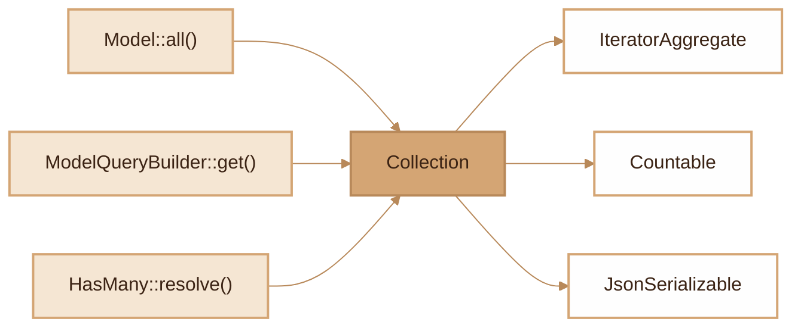

# Collection
> Typed and immutable collection for manipulating ORM results with a fluent functional API.

## Overview

The `Collection` class is a generic wrapper around a PHP array that provides a functional API inspired by Laravel. It implements `IteratorAggregate`, `Countable` and `JsonSerializable`, making it usable in `foreach` loops, with `count()` and in `json_encode()`. Each transformation method (map, filter, sortBy, take) returns a new instance, preserving immutability. Collection is the standard return type of all multi-result ORM queries (`Model::all()`, `ModelQueryBuilder::get()`, HasMany relations).

## Diagram



## Public API

### Construction

```php
$collection = new Collection([1, 2, 3]);
$collection = new Collection([$user1, $user2]);
```

### Element Access

```php
$collection->first(): mixed    // First element or null
$collection->last(): mixed     // Last element or null
$collection->all(): array      // Underlying raw array
```

### Counting and Checking

```php
$collection->count(): int       // Number of elements (also via count($collection))
$collection->isEmpty(): bool    // true if empty
$collection->isNotEmpty(): bool // true if not empty
```

### Transformation (returns a new Collection)

```php
// Apply a function to each element
$names = $users->map(fn (User $u) => $u->name);
```

```php
// Filter elements
$admins = $users->filter(fn (User $u) => $u->role === 'admin');
```

```php
// Extract a column/property
$emails = $users->pluck('email');
// Works with arrays and objects
```

```php
// Sort by key
$sorted = $users->sortBy('name');           // ASC by default
$sorted = $users->sortBy('created_at', 'DESC');
```

```php
// Limit the number of elements
$top5 = $users->take(5);
```

### Reduction and Iteration

```php
// Reduce to a value
$total = $orders->reduce(fn ($carry, $order) => $carry + $order->amount, 0);
```

```php
// Iterate with early stop
$users->each(function (User $user, int $index) {
    echo $user->name;
    if ($index >= 10) return false; // Stops iteration
});
```

### Indexing and Search

```php
// Index by a key (returns an array, not a Collection)
$byId = $users->keyBy('id');
// ['1' => User, '2' => User, ...]
```

```php
// Check for element existence
$hasAdmin = $users->contains(fn (User $u) => $u->role === 'admin');
```

### Serialization

```php
// To array (calls toArray() on Models)
$array = $collection->toArray();

// JSON (via JsonSerializable)
$json = json_encode($collection);

// Direct iteration (via IteratorAggregate)
foreach ($collection as $item) {
    // ...
}
```

## Integration with other modules

- **Model ORM**: `Model::all()` and `ModelQueryBuilder::get()` return a `Collection` of models
- **Relations**: `HasMany::resolve()` returns a `Collection`, `HasMany::eagerLoadOnto()` assigns `Collection`s to models
- **Eager Loading**: `ModelQueryBuilder::eagerLoadRelations()` receives and manipulates `Collection`s
- **Serialization**: `Model::toArray()` calls `Collection::toArray()` on loaded relations
- **Pagination**: `ModelQueryBuilder::paginate()` uses `Collection` internally for eager loading

## Full Example

```php
use Fennec\Core\Collection;
use App\Models\User;
use App\Models\Order;

// Retrieve users with their orders
$users = User::with('orders')->where('active', true)->get();

// Filter users with at least one order
$withOrders = $users->filter(fn (User $u) => $u->orders->isNotEmpty());

// Extract emails
$emails = $withOrders->pluck('email');

// Calculate total revenue
$revenue = $users->reduce(function (float $total, User $user) {
    return $total + $user->orders->reduce(
        fn (float $sum, $order) => $sum + $order->amount, 0.0
    );
}, 0.0);

// Sort by name and take the first 10
$top10 = $users->sortBy('name')->take(10);

// Index by ID for quick access
$userMap = $users->keyBy('id');
$specificUser = $userMap[42] ?? null;

// Check for an admin
$hasAdmin = $users->contains(fn (User $u) => $u->role === 'admin');

// Iterate with conditional stop
$users->each(function (User $user) {
    if ($user->isDeleted()) return false;
    echo "{$user->name}: {$user->email}\n";
});
```

## Module Files

| File | Role | Last Modified |
|---|---|---|
| `src/Core/Collection.php` | Generic Collection class | 2026-03-21 |
