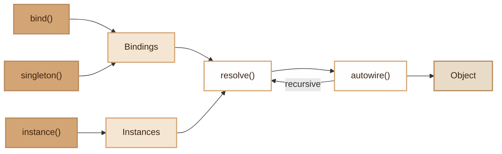

# Container

> Lightweight dependency injection container with autowiring, singletons and recursive resolution.

## Overview

The `Container` is the core of dependency injection in Fennec. It supports three registration modes:
bindings (factory), singletons (instantiated only once), and pre-built instances.
Resolution is done via autowiring: the class constructor is analyzed by reflection,
and each typed dependency is resolved recursively.

The Container is created by `App` at bootstrap and shared via a static singleton accessible
throughout the framework. It is used by the Router to instantiate controllers and middlewares.

## Diagram



## Public API

### `__construct()`

Creates a container and sets it as the static singleton.

```php
$container = new Container();
```

### `getInstance(): self`

Returns the global singleton (creates one if needed).

```php
$container = Container::getInstance();
```

### `bind(string $abstract, Closure|string $concrete): void`

Registers a factory binding. Each call to `get()` creates a new instance.

```php
$container->bind(LoggerInterface::class, fn() => new FileLogger('/var/log'));
```

### `singleton(string $abstract, Closure|string $concrete): void`

Registers a singleton. The first call to `get()` instantiates it, subsequent calls return the cached instance.

```php
$container->singleton(DatabaseManager::class, fn() => new DatabaseManager());
```

### `instance(string $abstract, mixed $object): void`

Registers an already-built instance (no factory, no autowiring).

```php
$container->instance(EventDispatcher::class, $dispatcher);
```

### `has(string $abstract): bool`

Checks if a binding or instance exists.

```php
if ($container->has(CacheService::class)) { /* ... */ }
```

### `get(string $abstract): mixed`

Resolves a dependency. Respects singleton cache and Profiler tracking.

```php
$db = $container->get(DatabaseManager::class);
```

### `make(string $abstract, array $params = []): mixed`

Always creates a new instance, even for singletons. Accepts additional parameters
passed to the constructor.

```php
$mailer = $container->make(Mailer::class, ['transport' => 'smtp']);
```

## Autowiring Resolution

Autowiring analyzes the target class constructor by reflection:

1. **Explicit parameter**: if provided in `$extraParams`, used directly
2. **Class type**: resolved recursively via `get()` (supports cascading dependencies)
3. **Default value**: used if available
4. **Nullable**: `null` injected if the type allows it
5. **Error**: `ContainerException` if resolution is impossible

## Exceptions

### `ContainerException`

Thrown when resolution fails. Extends `RuntimeException`.

```php
// Error cases:
// - "Class not found: Foo\Bar"
// - "Class not instantiable: AbstractService"
// - "Cannot resolve parameter $name of ClassName"
```

## Integration with other modules

- **App**: creates the Container at bootstrap, registers all core services
- **Router**: uses `get()` to instantiate controllers and `make()` for middlewares
- **MiddlewarePipeline**: resolves middlewares via the Container
- **Profiler**: each resolution is tracked via `addResolution()`

## Full Example

```php
$container = new Container();

// Interface -> Implementation
$container->bind(CacheInterface::class, RedisCache::class);

// Singleton with factory
$container->singleton(DatabaseManager::class, function (Container $c) {
    $manager = new DatabaseManager();
    $manager->setTenantManager($c->get(TenantManager::class));
    return $manager;
});

// Pre-built instance
$container->instance(EventDispatcher::class, EventDispatcher::withDriver('sync'));

// Resolution with autowiring
// If UserService has a constructor: __construct(DatabaseManager $db, CacheInterface $cache)
// Both dependencies are resolved automatically
$userService = $container->get(UserService::class);

// New instance every time (ignores singleton cache)
$freshDb = $container->make(DatabaseManager::class);
```

## Module Files

| File | Role | Last Modified |
|---|---|---|
| `src/Core/Container.php` | Main DI container | 2026-03-21 |
| `src/Core/ContainerException.php` | Resolution exception | 2026-03-21 |
