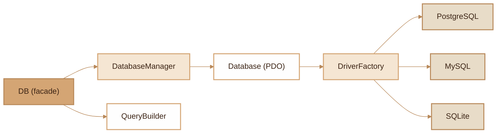

# Database
> Multi-driver database abstraction layer with connection management, QueryBuilder and multi-tenancy support.

## Overview

The Fennec Database module provides a multi-driver PDO abstraction (PostgreSQL, MySQL, SQLite) with a named connection system managed by the `DatabaseManager`. The static `DB` facade offers simplified access to connections, the fluent `QueryBuilder`, raw queries and transactions. The module is designed for FrankenPHP worker mode with automatic reconnection, connection purging between requests and orphaned transaction rollback. Multi-tenancy support is built in via the `TenantManager` which dynamically resolves connections per tenant.

## Diagram



## Public API

### DB (static facade)

```php
// Get a connection
DB::connection('default'): Database
```
Returns a `Database` instance with automatic reconnection if the connection is dead.

```php
// QueryBuilder on a table
DB::table('users'): QueryBuilder
DB::table('users', 'analytics'): QueryBuilder
```
Creates a `QueryBuilder` for the specified table, optionally on a named connection.

```php
// Raw SQL query
DB::raw('SELECT * FROM users WHERE id = ?', [1]): PDOStatement
```
Executes a prepared query and returns the `PDOStatement`.

```php
// Transaction
DB::transaction(function () {
    DB::table('accounts')->where('id', 1)->update(['balance' => 100]);
    DB::table('logs')->insert(['action' => 'update']);
}): mixed
```
Executes the callback within a PDO transaction. Automatic rollback on exception.

```php
// Worker cleanup
DB::purge('tenant_1');  // Purge a connection
DB::purge();            // Purge all connections
DB::flush();            // Orphan rollback + purge
```

### Database (PDO connection)

```php
$db = Database::getInstance('default');
$db->query('SELECT * FROM users', []): PDOStatement
$db->isConnected(): bool
$db->reconnect(): void
$db->disconnect(): void
$db->getDriver(): DatabaseDriverInterface
$db->getName(): string
$db->getConnection(): PDO
```

### DatabaseManager

```php
$manager->connection('default'): Database   // Lazy connect
$manager->reconnectIfMissing('default'): Database  // Auto-reconnect
$manager->purge('name'): void               // Close a connection
$manager->purge(): void                     // Close all connections
$manager->flush(): void                     // Rollback + purge (worker)
$manager->rollbackOrphanedTransactions(): void
$manager->getActiveConnections(): array
$manager->setTenantManager(TenantManager $tm): void
```

### QueryBuilder

```php
$qb = DB::table('users');

// Selection
$qb->select('id', 'name', 'email'): self

// Conditions
$qb->where('active', true): self
$qb->where('age', '>', 18): self
$qb->orWhere('role', 'admin'): self
$qb->whereIn('status', ['active', 'pending']): self
$qb->whereNull('deleted_at'): self
$qb->whereNotNull('email'): self

// Joins
$qb->join('roles', 'users.role_id', '=', 'roles.id'): self
$qb->leftJoin('profiles', 'users.id', '=', 'profiles.user_id'): self

// Sorting and pagination
$qb->orderBy('created_at', 'DESC'): self
$qb->limit(10): self
$qb->offset(20): self

// Terminal operations
$qb->get(): array               // All rows
$qb->first(): mixed             // First row or null
$qb->first(UserDto::class): UserDto  // DTO hydration
$qb->count(): int               // COUNT(*)
$qb->exists(): bool             // At least one row?
$qb->insert(['name' => 'Jo']): string|false  // INSERT, returns lastInsertId
$qb->update(['name' => 'Jo']): int           // UPDATE, returns rowCount
$qb->delete(): int              // DELETE, returns rowCount
```

### DriverFactory

```php
DriverFactory::make('pgsql'): DatabaseDriverInterface
DriverFactory::register('custom', MyDriver::class): void
DriverFactory::supported(): array  // ['pgsql', 'mysql', 'sqlite']
```

### DatabaseDriverInterface

Each driver implements:
- `buildDsn(array $config): string`
- `getDefaultPort(): string` (5432, 3306, '')
- `getDefaultHost(): string` (localhost, localhost, '')
- `getName(): string` (pgsql, mysql, sqlite)
- `getEnvPrefix(): string` (POSTGRES, MYSQL, SQLITE)
- `getMigrationsTableSql(): string`
- `getPdoOptions(): array`

## Configuration

| Variable | Description | Default |
|---|---|---|
| `DB_DRIVER` | Database driver | `pgsql` |
| `POSTGRES_HOST` | PostgreSQL host | `localhost` |
| `POSTGRES_PORT` | PostgreSQL port | `5432` |
| `POSTGRES_DB` | Database name | - |
| `POSTGRES_USER` | User | - |
| `POSTGRES_PASSWORD` | Password | - |
| `MYSQL_HOST` | MySQL host | `localhost` |
| `MYSQL_PORT` | MySQL port | `3306` |
| `MYSQL_DB` | Database name | - |
| `MYSQL_USER` | User | - |
| `MYSQL_PASSWORD` | Password | - |
| `SQLITE_DB` | SQLite file path | - |

For named connections (e.g. `job`), variables are prefixed: `POSTGRES_JOB_HOST`, `POSTGRES_JOB_PORT`, etc.

## DB Tables

### migrations
| Column | Type | Description |
|---|---|---|
| `id` | SERIAL/AUTO_INCREMENT/INTEGER | Primary key |
| `migration` | VARCHAR(255) UNIQUE | Migration file name |
| `batch` | INT | Batch number |
| `executed_at` | TIMESTAMP | Execution date |

## CLI Commands

| Command | Description |
|---|---|
| `migrate` | Run migrations |
| `migrate --rollback --steps=N` | Rollback N batch(es) |
| `migrate --status` | View migration status |
| `migrate --fresh` | Drop everything and re-migrate |
| `migrate --connection=job` | Migrate on a specific connection |
| `make:migration <name>` | Create a migration file |
| `tinker --sql="SELECT ..."` | Execute raw SQL |
| `tinker --sql="\dt"` | List tables |
| `tinker --sql="\d users"` | Describe a table |

## Integration with other modules

- **Model ORM**: `Model::query()` uses `DB::table()` internally for all CRUD operations
- **Multi-tenancy**: the `DatabaseManager` automatically resolves tenant connections via `TenantManager`
- **Migrations**: `MigrationRunner` uses `Database` and the driver to create the `migrations` table
- **Profiler**: each SQL query is tracked via `Profiler::addQuery()` (duration in ms)
- **Worker**: `App` calls `DatabaseManager::flush()` between each HTTP request to prevent leaks

## Full Example

```php
use Fennec\Core\DB;
use Fennec\Core\Database\DriverFactory;

// Register a custom driver
DriverFactory::register('cockroach', CockroachDriver::class);

// Query with QueryBuilder
$activeUsers = DB::table('users')
    ->select('id', 'name', 'email')
    ->where('active', true)
    ->where('created_at', '>', '2026-01-01')
    ->orderBy('name')
    ->limit(50)
    ->get();

// Join
$usersWithRoles = DB::table('users')
    ->select('users.name', 'roles.label')
    ->join('roles', 'users.role_id', '=', 'roles.id')
    ->where('users.active', true)
    ->get();

// Transaction
DB::transaction(function () {
    DB::table('accounts')->where('id', 1)->update(['balance' => 500]);
    DB::table('transfers')->insert([
        'from' => 1, 'to' => 2, 'amount' => 500
    ]);
});

// Raw query
$stmt = DB::raw('SELECT COUNT(*) as total FROM users WHERE role_id = ?', [3]);
$total = $stmt->fetch()['total'];
```

## Module Files

| File | Role | Last Modified |
|---|---|---|
| `src/Core/DB.php` | Static facade for connection access | 2026-03-21 |
| `src/Core/Database.php` | PDO wrapper with connect/reconnect | 2026-03-22 |
| `src/Core/DatabaseManager.php` | Named connection manager | 2026-03-21 |
| `src/Core/QueryBuilder.php` | Fluent query builder | 2026-03-21 |
| `src/Core/Database/DatabaseDriverInterface.php` | DB driver interface | 2026-03-21 |
| `src/Core/Database/PostgreSQLDriver.php` | PostgreSQL driver | 2026-03-21 |
| `src/Core/Database/MySQLDriver.php` | MySQL driver | 2026-03-21 |
| `src/Core/Database/SQLiteDriver.php` | SQLite driver | 2026-03-21 |
| `src/Core/Database/DriverFactory.php` | Driver factory with custom registration | 2026-03-21 |
| `src/Commands/MigrateCommand.php` | CLI migrate command | 2026-03-21 |
| `src/Commands/MakeMigrationCommand.php` | CLI make:migration command | 2026-03-21 |
| `src/Commands/TinkerCommand.php` | CLI tinker command (interactive SQL) | 2026-03-22 |
