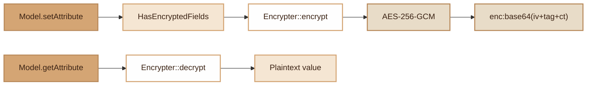

# Encryption
> Transparent AES-256-GCM encryption of sensitive Model fields via the `#[Encrypted]` attribute.

## Overview

The Encryption module provides transparent AES-256-GCM encryption for Model fields marked with the `#[Encrypted]` attribute. Encryption is performed automatically on write (`setAttribute`) and decryption on read (`getAttribute`). Each encrypted value is prefixed with `enc:` and contains the IV (12 bytes), the authentication tag (16 bytes) and the ciphertext, all base64-encoded. The encryption key is a 32-byte base64-encoded key provided via the `ENCRYPTION_KEY` environment variable.

## Diagram



## Public API

### Class `Encrypter`

Static encryption/decryption service.

```php
use Fennec\Core\Encryption\Encrypter;

// Encrypt a value
$cipher = Encrypter::encrypt('sensitive data');
// -> 'enc:base64...'

// Decrypt a value
$plain = Encrypter::decrypt($cipher);
// -> 'sensitive data'

// Decrypt a non-encrypted value (returned as-is)
Encrypter::decrypt('plain text');
// -> 'plain text'

// Check if a value is encrypted
Encrypter::isEncrypted($cipher);  // true
Encrypter::isEncrypted('hello');  // false

// Generate a new key
$key = Encrypter::generateKey();
// -> base64 of 32 random bytes

// Inject a key manually (testing)
Encrypter::setKey($rawKey);
```

### Trait `HasEncryptedFields`

Transparent encryption/decryption on properties marked with `#[Encrypted]`.

```php
use Fennec\Attributes\Encrypted;
use Fennec\Attributes\Table;
use Fennec\Core\Model;
use Fennec\Core\Encryption\HasEncryptedFields;

#[Table('users')]
class User extends Model
{
    use HasEncryptedFields;

    #[Encrypted]
    public string $phone;

    #[Encrypted]
    public string $ssn;
}
```

**Automatic behavior:**

```php
$user = new User();
$user->phone = '0612345678';
// -> In database: enc:base64(iv+tag+encrypted)
$user->save();

$user = User::find(1);
echo $user->phone;
// -> '0612345678' (automatically decrypted)
```

The trait intercepts `getAttribute()` and `setAttribute()`:
- On write: if the value is not already encrypted (no `enc:` prefix), it is encrypted.
- On read: if the value is encrypted, it is decrypted. On error, the raw value is returned.

## Configuration

| Variable | Format | Description |
|---|---|---|
| `ENCRYPTION_KEY` | Base64 of 32 bytes | AES-256 key. Generate with `Encrypter::generateKey()` |

Generate a key:

```bash
php -r "echo base64_encode(random_bytes(32)) . PHP_EOL;"
```

Then in `.env`:

```
ENCRYPTION_KEY=your_base64_key_here
```

**Possible errors:**
- `ENCRYPTION_KEY not set in .env`: variable missing or empty.
- `ENCRYPTION_KEY must be 32 bytes base64-encoded`: key improperly formatted or wrong size.
- `Decryption failed: invalid key or tampered data`: incorrect key or corrupted data.

## Storage Format

Encrypted values are stored in the form:

```
enc:<base64(IV[12] + TAG[16] + CIPHERTEXT)>
```

- **IV**: 12-byte initialization vector (randomly generated on each encryption)
- **TAG**: 16-byte GCM authentication tag (integrity)
- **CIPHERTEXT**: encrypted data

GCM mode ensures both confidentiality and authenticity of the data.

## PHP 8 Attributes

### `#[Encrypted]`

Target: property. No parameters.

```php
#[Encrypted]
public string $phone;
```

Marks a property for automatic encryption/decryption via the `HasEncryptedFields` trait.

## Integration with other modules

- **Audit Trail**: `#[Encrypted]` fields appear encrypted in `old_values`/`new_values` of `audit_logs` (values are never logged in plaintext).
- **NF525**: compatible with `HasNf525` — encrypted fields are included in the SHA-256 hash in encrypted form.
- **Log Masking**: the `LogMaskingProcessor` masks sensitive keys in logs, but encryption adds an additional layer in the database.

## Full Example

```php
// 1. Configure the key in .env
// ENCRYPTION_KEY=K7gNU3sdo+OL0wNhqoVWhr3g6s1xYv72ol/pe/Unols=

// 2. Define the Model
#[Table('patients')]
class Patient extends Model
{
    use HasEncryptedFields;

    #[Encrypted]
    public string $ssn;

    #[Encrypted]
    public string $medical_notes;
}

// 3. Transparent usage
$patient = new Patient([
    'name' => 'Jean Dupont',          // Not encrypted
    'ssn' => '1 86 05 75 108 042 15', // Automatically encrypted
    'medical_notes' => 'N/A',         // Automatically encrypted
]);
$patient->save();

// In the database:
// ssn = 'enc:dG9rZW4x...'
// medical_notes = 'enc:dG9rZW4y...'

// On read:
$p = Patient::find(1);
echo $p->ssn;            // '1 86 05 75 108 042 15'
echo $p->medical_notes;  // 'N/A'

// 4. Manual encryption/decryption
$encrypted = Encrypter::encrypt('confidential data');
$decrypted = Encrypter::decrypt($encrypted);
```

## Module Files

| File | Role |
|---|---|
| `src/Core/Encryption/Encrypter.php` | AES-256-GCM service (encrypt/decrypt/generateKey) |
| `src/Core/Encryption/HasEncryptedFields.php` | Transparent encryption trait on Model |
| `src/Attributes/Encrypted.php` | PHP 8 property marker attribute |
