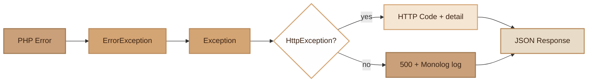

# Error Handling

> Centralized error and exception handling with structured JSON responses, Monolog logging and dev/prod mode.

## Overview

The Error Handling module intercepts all uncaught exceptions and PHP errors
to convert them into clean JSON responses. It distinguishes expected HTTP errors
(`HttpException`: 404, 422, etc.) from unexpected system errors (500).

In `dev` mode, error responses include the exception name, file, line
and the first 10 frames of the stack trace. In `prod` mode, only a generic message
is returned with a unique `request_id` for tracking in logs.

Logs are written via Monolog with rotation (14 days) to `var/logs/app.log`,
and additionally to stderr in dev mode (for the terminal or K8s logs).

## Diagram



## Public API

### ErrorHandler

#### `__construct(?string $environment = null)`

Initializes the Monolog logger with a `RotatingFileHandler` (14 days, ERROR level).
In `dev` mode, adds a `StreamHandler` to stderr (DEBUG level).

```php
$handler = new ErrorHandler('dev');
```

#### `register(): void`

Registers global handlers: `set_exception_handler()`, `set_error_handler()`,
and starts an output buffer to capture PHP warnings.

```php
$handler = new ErrorHandler();
$handler->register();
```

#### `handleException(Throwable $e): void`

Handles an uncaught exception. Builds the response, logs system errors
(not `HttpException`s), cleans output buffers, and sends the JSON response.

#### `buildErrorResponse(Throwable $e, ?string $requestId = null): array`

Builds the error response without side effects (testable). Returns an array
`['statusCode' => int, 'response' => array]`.

```php
$result = $handler->buildErrorResponse(new HttpException(404, 'Not found'));
// ['statusCode' => 404, 'response' => ['status' => 'error', 'message' => 'Not found', ...]]
```

Response format:
- `status`: always `'error'`
- `message`: error detail (or generic message in prod for 500s)
- `request_id`: unique identifier (hex 16 chars)
- `timestamp`: ISO 8601 date
- `errors`: validation array (if `HttpException` with errors)
- `exception`, `file`, `trace`: only in dev mode for system errors

#### `handleError(int $severity, string $message, string $file, int $line): never`

Converts PHP errors (`E_WARNING`, `E_NOTICE`, etc.) to `ErrorException`.

#### `getLogger(): Monolog\Logger`

Returns the Monolog logger instance.

### HttpException

#### `__construct(int $statusCode, string $detail, array $errors = [])`

HTTP exception with status code, detail message and optional errors (validation).

```php
throw new HttpException(404, 'User not found');
throw new HttpException(422, 'Validation failed', [
    'email' => 'Invalid email format',
    'name' => 'Required field',
]);
throw new HttpException(403, 'Access denied');
```

Public readonly properties:
- `$statusCode`: HTTP code (int)
- `$detail`: error message (string)
- `$errors`: validation errors (array)

## Configuration

| Variable | Description | Default |
|---|---|---|
| `APP_ENV` | Environment (`dev`/`prod`) — controls error detail level | `prod` |

## Integration with other modules

- **App**: creates and registers the ErrorHandler at bootstrap (first service initialized)
- **App (worker)**: `HttpException`s are caught in the handler without crashing the worker, system errors are logged and counted in `WorkerStats`
- **Router**: throws `HttpException(404)` for routes not found, `HttpException(422)` for DTO validation failures, `HttpException(400)` for invalid JSON body
- **Validator**: validation errors are passed in the `errors` field of `HttpException`

## Full Example

```php
// Throw an HTTP error in a controller
class UserController
{
    public function show(string $id): array
    {
        $user = User::find($id);
        if (!$user) {
            throw new HttpException(404, 'User not found');
        }

        return ['user' => $user->toArray()];
    }

    public function store(UserStoreRequest $dto): array
    {
        // DTO validation is automatic (Router)
        // If email already taken:
        if (User::where('email', $dto->email)->exists()) {
            throw new HttpException(422, 'Validation failed', [
                'email' => 'This email is already in use',
            ]);
        }

        $user = User::create([...]);
        return ['user' => $user->toArray()];
    }
}

// Response in dev mode (500):
// {
//   "status": "error",
//   "message": "Division by zero",
//   "request_id": "a1b2c3d4e5f67890",
//   "timestamp": "2026-03-22T10:30:00+01:00",
//   "exception": "DivisionByZeroError",
//   "file": "/app/Controllers/StatsController.php:42",
//   "trace": [...]
// }
```

## Module Files

| File | Role | Last Modified |
|---|---|---|
| `src/Core/ErrorHandler.php` | Global error handler | 2026-03-21 |
| `src/Core/HttpException.php` | Structured HTTP exception | 2026-03-21 |
