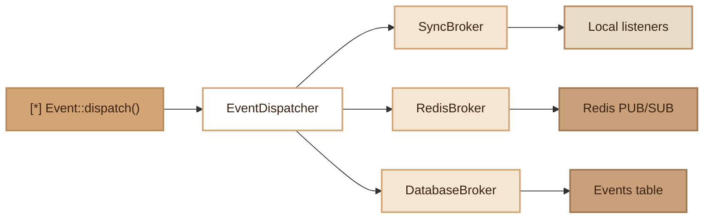

# Events
> Decoupled event system with sync, Redis and database brokers, automatic listener discovery via PHP 8 attributes.

## Overview

The Fennec Events module provides a complete publish/subscribe system. Events are dispatched via the static `Event` facade or directly via `EventDispatcher`. Three brokers are available:

- **Sync** (default): immediate execution in the same process, zero dependency.
- **Redis**: local sync execution + publication to a Redis channel for external consumers.
- **Database**: local sync execution + persistence in an `events` table for asynchronous processing.

Listeners can be registered manually (`Event::listen()`) or auto-discovered via the `#[Listener]` attribute on classes placed in `app/Listeners/`.

## Diagram



## Public API

### `Event` Facade

```php
use Fennec\Core\Event;

// Register a listener with priority (lower = executed first)
Event::listen('user.created', fn($user) => sendEmail($user), priority: 10);

// One-shot listener (executed once then removed)
Event::once('app.ready', fn() => warmUpCache());

// Dispatch an event by name + payload
Event::dispatch('user.created', $userData);

// Dispatch an event object (FQCN serves as name)
Event::dispatch(new UserCreated($user));

// Check if an event has listeners
Event::hasListeners('user.created'); // bool

// Remove listeners for an event
Event::forget('user.created');

// Remove all listeners
Event::forget();
```

### `EventDispatcher`

```php
use Fennec\Core\EventDispatcher;

// Create with a specific driver
$dispatcher = EventDispatcher::withDriver('redis'); // sync | redis | database

// Global singleton
$dispatcher = EventDispatcher::getInstance();
EventDispatcher::setInstance($dispatcher);

// Listener count
$dispatcher->listenerCount('user.created'); // int

// Active driver name
$dispatcher->driverName(); // 'sync', 'redis', 'database'

// Access the broker
$dispatcher->broker(); // EventBrokerInterface

// Auto-discover listeners in a directory
$dispatcher->discoverListeners(__DIR__ . '/../app/Listeners');
```

### `EventBrokerInterface`

All brokers implement this interface:

```php
interface EventBrokerInterface {
    public function publish(string $eventName, mixed $payload): void;
    public function driver(): string;
}
```

### `DatabaseBroker` — specific methods

```php
$broker = DatabaseBroker::fromEnv();

// Retrieve pending events (for a custom worker)
$pending = $broker->fetchPending(limit: 10);

// Mark as processed or failed
$broker->markProcessed($eventId);
$broker->markFailed($eventId);
```

### `EventHandlerInterface`

Interface for controller-type handlers (before/after):

```php
interface EventHandlerInterface {
    public function handle(Request $request, mixed $result = null): void;
}
```

## Configuration

| Variable | Default | Description |
|---|---|---|
| `EVENT_BROKER` | `sync` | Driver: `sync`, `redis`, `database` |
| `REDIS_HOST` | `127.0.0.1` | Redis host (if broker=redis) |
| `REDIS_PORT` | `6379` | Redis port |
| `REDIS_PASSWORD` | _(empty)_ | Redis password |
| `REDIS_DB` | `0` | Redis database (0-15) |
| `REDIS_PREFIX` | `app:events:` | Redis key prefix |
| `EVENT_DB_CONNECTION` | `default` | DB connection (if broker=database) |
| `EVENT_DB_TABLE` | `events` | Table name (if broker=database) |

## DB Tables

### `events` (database broker only)

```sql
CREATE TABLE events (
    id SERIAL PRIMARY KEY,
    event VARCHAR(255) NOT NULL,
    payload JSONB,
    status VARCHAR(20) DEFAULT 'pending',
    created_at TIMESTAMP DEFAULT NOW(),
    processed_at TIMESTAMP NULL
);
```

Statuses: `pending`, `processed`, `failed`.

## PHP 8 Attributes

### `#[Listener]`

Marks a class as an auto-discovered listener. Target: class.

```php
use Fennec\Attributes\Listener;

#[Listener(event: UserCreated::class, priority: 0)]
class SendWelcomeEmail {
    public function handle(UserCreated $event): void {
        // ...
    }
}
```

| Parameter | Type | Default | Description |
|---|---|---|---|
| `event` | `string` | _(required)_ | FQCN or event name |
| `priority` | `int` | `0` | Priority (lower = executed first) |

## CLI Commands

| Command | Description |
|---|---|
| `make:event <Name>` | Generates `app/Events/<Name>.php` (readonly class with payload) |
| `make:listener <Name> [--event=X]` | Generates `app/Listeners/<Name>.php` with `#[Listener]` attribute |

```bash
./forge make:event UserCreated
./forge make:listener SendWelcomeEmail --event=UserCreated
```

## Integration with other modules

- **Queue/Jobs**: dispatch a job from a listener for asynchronous processing.
- **Broadcasting**: the `Broadcaster` uses Redis Streams (XADD) for SSE, complementary to the event system.
- **Profiler**: each dispatch measures execution time and records it in the Profiler (if active).
- **Webhooks**: the Webhook module subscribes to events to auto-dispatch webhooks.
- **Worker safety**: `discoverListeners()` is protected against multiple calls (guard `$discoveredDirs`).

## Full Example

```php
// 1. Create the event
// app/Events/OrderPlaced.php
readonly class OrderPlaced {
    public function __construct(
        public int $orderId,
        public float $total,
    ) {}
}

// 2. Create the listener (auto-discovered)
// app/Listeners/NotifyWarehouse.php
use Fennec\Attributes\Listener;
use App\Events\OrderPlaced;

#[Listener(OrderPlaced::class, priority: 10)]
class NotifyWarehouse {
    public function handle(OrderPlaced $event): void {
        // Send notification to warehouse
        Job::dispatch(SendWarehouseNotification::class, [
            'order_id' => $event->orderId,
        ]);
    }
}

// 3. Dispatch in the controller
use Fennec\Core\Event;
use App\Events\OrderPlaced;

Event::dispatch(new OrderPlaced(orderId: 42, total: 199.99));

// 4. Inline listener (no file)
Event::listen('order.shipped', function ($data) {
    // Send tracking email
}, priority: 5);
```

## Module Files

| File | Description |
|---|---|
| `src/Core/Event.php` | Static facade |
| `src/Core/EventDispatcher.php` | Central dispatcher (singleton, multi-broker) |
| `src/Core/EventHandlerInterface.php` | Controller handler interface |
| `src/Core/Event/EventBrokerInterface.php` | Broker interface |
| `src/Core/Event/SyncBroker.php` | Synchronous broker (default) |
| `src/Core/Event/RedisBroker.php` | Redis broker (PUB/SUB + RPUSH) |
| `src/Core/Event/DatabaseBroker.php` | Database broker (events table) |
| `src/Attributes/Listener.php` | PHP 8 attribute for auto-discovery |
| `src/Commands/MakeEventCommand.php` | Event generator |
| `src/Commands/MakeListenerCommand.php` | Listener generator |
