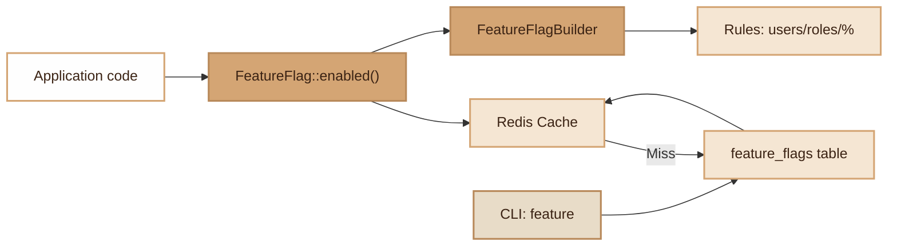

# Feature Flags

> Persistent feature flag system with database storage, Redis cache, conditional rules (user, role, percentage) and CLI command.

## Overview

The Feature Flags module allows enabling or disabling features on the fly, without redeployment. Flags are stored in the `feature_flags` table and cached in Redis (optional, 60s TTL). The system supports advanced rules: activation by user, by role, or by percentage (progressive rollout with deterministic hash).

The `feature` CLI command allows managing flags directly from the terminal.

## Diagram



## Public API

### Class `FeatureFlag`

#### `FeatureFlag::enabled(string $key): bool`

Checks if a flag is active. Checks Redis cache first, then the database.

```php
if (FeatureFlag::enabled('new-checkout')) {
    // New logic
}
```

#### `FeatureFlag::disabled(string $key): bool`

Inverse of `enabled()`.

```php
if (FeatureFlag::disabled('legacy-api')) {
    return response(410, 'Deprecated API');
}
```

#### `FeatureFlag::activate(string $key): void`

Activates an existing flag or creates it if it doesn't exist.

```php
FeatureFlag::activate('dark-mode');
```

#### `FeatureFlag::deactivate(string $key): void`

Deactivates an existing flag or creates it deactivated.

```php
FeatureFlag::deactivate('dark-mode');
```

#### `FeatureFlag::define(string $key, bool $enabled, ?array $rules = null): void`

Defines a flag with conditional rules. Updates if the flag already exists.

```php
FeatureFlag::define('beta-feature', true, [
    'users' => [1, 42, 100],        // Allowed IDs
    'roles' => ['admin', 'tester'], // Allowed roles
    'percentage' => 25,             // 25% of users
]);
```

#### `FeatureFlag::for(string $key): FeatureFlagBuilder`

Returns a builder for conditional evaluation with context.

```php
$enabled = FeatureFlag::for('beta-feature')
    ->whenUser(42)
    ->whenRole('admin')
    ->enabled();
```

#### `FeatureFlag::resetConnection(): void`

Closes and resets the Redis connection. Called during worker cleanup.

### Class `FeatureFlagBuilder`

Fluent builder for evaluating a flag with a user/role context.

#### `whenUser(int $userId): static`

Sets the user ID for rule evaluation.

#### `whenRole(string $role): static`

Sets the role for rule evaluation.

#### `enabled(): bool`

Evaluates the flag taking rules and the provided context into account.

**Rule evaluation logic:**

1. If the flag is globally disabled: `false`
2. If no rules defined: `true` (active for everyone)
3. If `users` rule: checks if the ID is in the list
4. If `roles` rule: checks if the role is in the list
5. If `percentage` rule: deterministic hash `crc32(key:userId) % 100` for stable per-user rollout
6. If `users`/`roles` rules exist but don't match: `false`

## Configuration

### Environment Variables

| Variable | Default | Description |
|---|---|---|
| `REDIS_HOST` | `127.0.0.1` | Redis host for cache |
| `REDIS_PORT` | `6379` | Redis port |
| `REDIS_PASSWORD` | _(empty)_ | Redis password |
| `REDIS_DB` | `0` | Redis database number |
| `REDIS_PREFIX` | `app:` | Redis key prefix |

### `feature_flags` Table

| Column | Type | Description |
|---|---|---|
| `key` | `string` | Unique flag identifier |
| `enabled` | `bool` | Global flag state |
| `rules` | `json\|null` | Conditional rules (JSON) |
| `created_at` | `datetime` | Creation date |
| `updated_at` | `datetime` | Last modification date |

### Redis Cache

- Key prefix: `{REDIS_PREFIX}feature:{key}`
- TTL: 60 seconds (static)
- Cache is optional: if Redis is unavailable, queries go directly to the database
- Connection with `ping()` health check and automatic reconnection

## CLI Commands

### `./forge feature <action> [name]`

| Action | Description |
|---|---|
| `list` | Displays all flags with their status and rules |
| `enable <name>` | Activates a flag (creates it if non-existent) |
| `disable <name>` | Deactivates a flag (creates it if non-existent) |
| `delete <name>` | Permanently deletes a flag |

Examples:

```bash
./forge feature list
./forge feature enable dark-mode
./forge feature disable legacy-api
./forge feature delete old-feature
```

## Integration with other modules

- **Worker**: Redis connection with `ping()` health check and `resetConnection()` for cleanup between worker requests. No memory leak.
- **Cache**: Uses Redis independently from the Cache module, with its own `feature:` prefix.
- **Database**: Queries via `DB::table('feature_flags')` — compatible with all drivers (PostgreSQL, MySQL, SQLite).

## Full Example

```php
use Fennec\Core\Feature\FeatureFlag;

// Definition with rules
FeatureFlag::define('new-dashboard', true, [
    'roles' => ['admin', 'manager'],
    'percentage' => 50,
]);

// Simple check (global)
if (FeatureFlag::enabled('new-dashboard')) {
    // Active for everyone if no rules,
    // otherwise rules evaluated via the builder
}

// Contextual check
$user = User::find($request->userId());

$showDashboard = FeatureFlag::for('new-dashboard')
    ->whenUser($user->id)
    ->whenRole($user->role)
    ->enabled();

if ($showDashboard) {
    return view('dashboard.new');
}

return view('dashboard.legacy');
```

```bash
# CLI management
./forge feature enable maintenance-mode
./forge feature list
# Name                          Status      Rules
# ──────────────────────────────────────────────────
# maintenance-mode              ACTIVE      -
# new-dashboard                 ACTIVE      {"roles":["admin","manager"],"percentage":50}
```

## Module Files

| File | Role |
|---|---|
| `src/Core/Feature/FeatureFlag.php` | Main class, Redis cache, CRUD |
| `src/Core/Feature/FeatureFlagBuilder.php` | Fluent builder for conditional evaluation |
| `src/Commands/FeatureFlagCommand.php` | CLI `feature` command |
