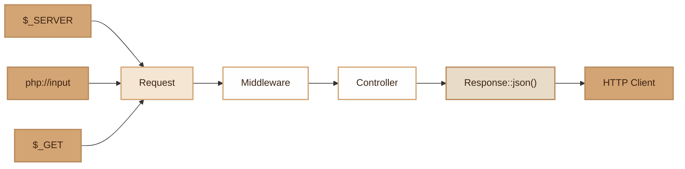

# HTTP

> Request/Response abstraction for processing incoming HTTP requests and generating JSON responses.

## Overview

The HTTP module provides two complementary classes: `Request` encapsulates the incoming HTTP
request (method, URI, headers, body, query params, attributes), and `Response` offers a
static method for emitting JSON responses.

`Request` is immutable for attributes (`withAttribute()` pattern which returns a clone),
allowing middlewares to enrich the request without side effects. The JSON body is
parsed on demand (lazy) and cached to avoid multiple reads of `php://input`.

`Response` is deliberately minimalist: a single static `json()` method that sets
the HTTP code, the Content-Type header and encodes the data as JSON.

## Diagram



## Public API

### Request

#### `__construct(string $method, string $uri, array $server, array $query)`

Creates a request. All parameters are optional and default to values read from superglobals.

```php
$request = new Request('GET', '/api/users');
```

#### `getMethod(): string`

Returns the HTTP method (GET, POST, PUT, DELETE, PATCH).

```php
$method = $request->getMethod(); // 'POST'
```

#### `getUri(): string`

Returns the URI path (without query string).

```php
$uri = $request->getUri(); // '/api/users/42'
```

#### `getHeader(string $name): ?string`

Returns an HTTP header. The name is converted to `$_SERVER` format (`HTTP_X_...`).

```php
$token = $request->getHeader('Authorization'); // 'Bearer xxx'
$custom = $request->getHeader('X-Request-Id');
```

#### `getBody(): ?array`

Parses and returns the JSON body (lazy, cached). Returns `null` if the body is empty or invalid.

```php
$data = $request->getBody();
// ['name' => 'John', 'email' => 'john@example.com']
```

#### `getQuery(?string $key = null, mixed $default = null): mixed`

Returns query parameters. Without arguments, returns the entire array.

```php
$page = $request->getQuery('page', 1);
$allParams = $request->getQuery();
```

#### `withAttribute(string $key, mixed $value): self`

Returns a clone with an added attribute (immutable). Used by middlewares.

```php
$request = $request->withAttribute('user', $authenticatedUser);
```

#### `getAttribute(string $key, mixed $default = null): mixed`

Reads an attribute added via `withAttribute()`.

```php
$user = $request->getAttribute('user');
```

#### `getAttributes(): array`

Returns all attributes.

#### `getServer(?string $key = null, mixed $default = null): mixed`

Access to server variables (`$_SERVER`).

```php
$ip = $request->getServer('REMOTE_ADDR');
```

### Response

#### `Response::json(array $data, int $statusCode = 200): void`

Sends a JSON response with the HTTP code and Content-Type header.

```php
Response::json(['users' => $users]);
Response::json(['error' => 'Not found'], 404);
Response::json(['id' => 42, 'created' => true], 201);
```

## Integration with other modules

- **Router**: creates a `Request` on each dispatch, calls `Response::json()` via `sendResponse()`
- **MiddlewarePipeline**: receives and propagates the `Request` through the pipeline
- **ErrorHandler**: uses `Response` indirectly for JSON error responses
- **App (worker)**: the `Request` is recreated on each iteration of the worker loop

## Full Example

```php
// In a middleware
class AuthMiddleware implements MiddlewareInterface
{
    public function handle(Request $request, callable $next): mixed
    {
        $token = $request->getHeader('Authorization');
        if (!$token) {
            Response::json(['error' => 'Not authenticated'], 401);
            return null;
        }

        $user = $this->jwt->verify(str_replace('Bearer ', '', $token));
        $request = $request->withAttribute('user', $user);

        return $next($request);
    }
}

// In a controller
class UserController
{
    public function index(UserListRequest $dto): array
    {
        // The DTO is hydrated and validated automatically by the Router
        $users = User::where('active', true)
            ->limit($dto->per_page)
            ->offset(($dto->page - 1) * $dto->per_page)
            ->get();

        return ['data' => $users, 'page' => $dto->page];
        // The Router calls Response::json() automatically
    }
}
```

## Module Files

| File | Role | Last Modified |
|---|---|---|
| `src/Core/Request.php` | HTTP request encapsulation | 2026-03-21 |
| `src/Core/Response.php` | JSON response emission | 2026-03-21 |
