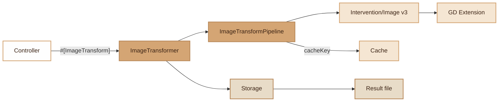

# Image

> Image transformation via Intervention/Image v3 with chainable pipeline, format detection and Storage integration.

## Overview

The Image module provides a complete image transformation service based on Intervention/Image v3 (GD driver). It offers two usage modes:

- **Direct static calls**: `ImageTransformer::resize()`, `ImageTransformer::crop()`, etc.
- **Chainable pipeline**: `ImageTransformer::make('path')->resize()->blur()->format('webp')->apply()`

Images are read and written via the Storage module, ensuring compatibility with all drivers (local, S3, GCS). The result is stored in a `transforms/` subdirectory with a hash of the operations in the filename.

## Diagram



## Public API

### ImageTransformer (static facade)

```php
// Chainable pipeline
$path = ImageTransformer::make('photos/pic.jpg')
    ->resize(800, 600)
    ->blur(5)
    ->format('webp', 85)
    ->apply();

// Static shortcuts
$path = ImageTransformer::resize('photos/pic.jpg', 800);
$path = ImageTransformer::crop('photos/pic.jpg', 400, 400, 10, 10);
$path = ImageTransformer::fit('photos/pic.jpg', 800, 600);
$path = ImageTransformer::thumbnail('photos/pic.jpg', 150);
$path = ImageTransformer::convert('photos/pic.jpg', 'webp', 90);

// Utilities
$format = ImageTransformer::detectFormat($binaryContent);   // 'jpeg', 'png', 'gif', 'webp'
$mime   = ImageTransformer::mimeType('webp');                // 'image/webp'
$image  = ImageTransformer::loadFromString($binaryContent);  // ImageInterface
$binary = ImageTransformer::encode($image, 'png', 90);       // string
$encoder = ImageTransformer::resolveEncoder('jpeg', 85);     // EncoderInterface
$content = ImageTransformer::loadFromStorage('photos/pic.jpg'); // string
```

### ImageTransformPipeline (chainable operations)

| Method | Description |
|---|---|
| `resize(int $w, ?int $h)` | Resize preserving aspect ratio (downscale) |
| `resizeExact(int $w, int $h)` | Resize without preserving aspect ratio (stretch) |
| `crop(int $w, int $h, int $x, int $y)` | Crop at given coordinates |
| `fit(int $w, int $h)` | Cover: resize + crop to fill |
| `watermark(string $text, string $pos, int $size, string $color, int $opacity)` | Text watermark |
| `blur(int $amount)` | Gaussian blur (default: 5) |
| `sharpen(int $amount)` | Increase sharpness (default: 10) |
| `brightness(int $level)` | Brightness (-100 to +100) |
| `contrast(int $level)` | Contrast (-100 to +100) |
| `rotate(float $angle)` | Rotation in degrees |
| `flip()` | Horizontal mirror |
| `flop()` | Vertical mirror |
| `greyscale()` | Greyscale |
| `orient()` | Automatic EXIF correction |
| `format(string $fmt, int $quality)` | Output format (jpg, png, webp, gif) |
| `quality(int $q)` | Output quality (0-100) |
| `apply()` | Execute and return the Storage path of the result |
| `toBuffer()` | Execute and return the binary content |
| `cacheKey()` | Deterministic cache key (`img:md5(...)`) |
| `getOutputFormat()` | Effective output format |

### Watermark Positions

`top-left`, `top-right`, `bottom-left`, `bottom-right` (default), `center`

## Configuration

The module requires the **GD** PHP extension. No specific environment variables.

The `ImageTransformer` is a **lazy-initialized** singleton: it is not instantiated at `App` boot, but only on first call via Container singleton. `getInstance()` auto-resolves from the Container when the instance is null.

```php
// Automatic resolution on first call
$transformer = ImageTransformer::getInstance();
// Or via the Container
$transformer = Container::getInstance()->get(ImageTransformer::class);
```

## PHP 8 Attributes

### `#[ImageTransform]`

Method attribute for endpoints returning transformed images.

```php
#[ImageTransform(maxWidth: 2000, maxHeight: 2000, allowedFormats: ['jpg', 'png', 'webp'], cacheTtl: 3600)]
public function transform() { ... }
```

| Parameter | Type | Default | Description |
|---|---|---|---|
| `maxWidth` | `int` | `4000` | Maximum allowed width |
| `maxHeight` | `int` | `4000` | Maximum allowed height |
| `allowedFormats` | `array` | `['jpg','jpeg','png','webp','gif']` | Accepted formats |
| `cacheTtl` | `int` | `86400` | Cache duration in seconds |

## Integration with other modules

- **Storage**: reading/writing images via `Storage::get()` and `Storage::put()`
- **Cache**: deterministic cache key via `cacheKey()` to avoid re-transformations
- **FileUpload**: combinable with `#[FileUpload]` to transform images on upload

## Full Example

```php
use Fennec\Attributes\ImageTransform;
use Fennec\Core\Image\ImageTransformer;

class PhotoController
{
    #[ImageTransform(maxWidth: 2000, allowedFormats: ['jpg', 'webp'])]
    public function resize(): array
    {
        $path = ImageTransformer::make('uploads/photo.jpg')
            ->resize(800, 600)
            ->orient()
            ->sharpen(5)
            ->format('webp', 85)
            ->apply();

        return ['path' => $path, 'url' => Storage::url($path)];
    }

    public function thumbnail(): array
    {
        $path = ImageTransformer::thumbnail('uploads/photo.jpg', 200);

        return ['thumbnail' => Storage::url($path)];
    }

    public function watermarked(): string
    {
        return ImageTransformer::make('uploads/photo.jpg')
            ->resize(1200)
            ->watermark('(c) Fennec', 'bottom-right', 18, 'ffffff', 40)
            ->format('jpg', 90)
            ->toBuffer();
    }
}
```

## Module Files

| File | Description |
|---|---|
| `src/Core/Image/ImageTransformer.php` | Static facade and utilities |
| `src/Core/Image/ImageTransformPipeline.php` | Chainable operation pipeline |
| `src/Attributes/ImageTransform.php` | PHP 8 attribute for endpoints |
| `tests/Unit/ImageTransformTest.php` | Unit tests (29 tests) |
