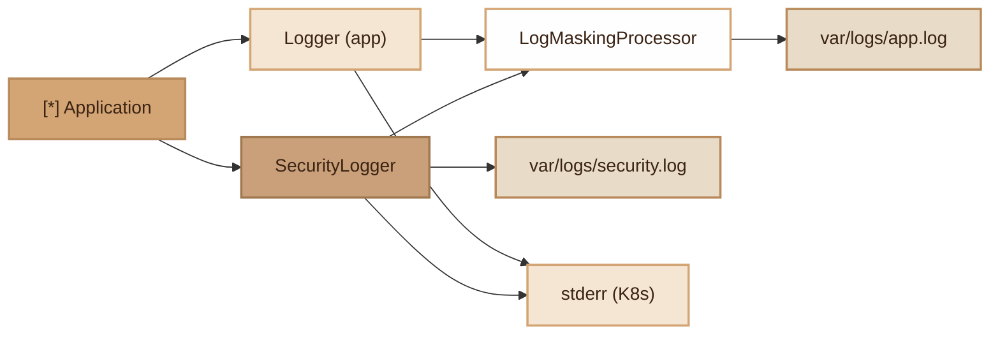

# Logging
> Monolog-based logging system with automatic sensitive data masking and worker support.

## Overview

The Logging module provides a complete logging system for the Fennec application. It relies on Monolog and offers two channels:

- **`app` channel** (`Logger`): general application logs, daily rotation over 14 days, file `var/logs/app.log`
- **`security` channel** (`SecurityLogger`): security events, rotation over 90 days, file `var/logs/security.log`

Both channels integrate the `LogMaskingProcessor` which automatically masks sensitive values (passwords, tokens, API keys, etc.) in all logs. In FrankenPHP worker or Docker mode, WARNING+ level messages are also written to `stderr` to be captured by `kubectl logs`.

## Diagram



## Public API

### Logger

Main application logger with static shortcuts.

```php
use Fennec\Core\Logger;

// Log levels (Monolog)
Logger::debug('Processing started', ['batch_id' => 42]);
Logger::info('User created', ['user_id' => 1, 'email' => 'test@example.com']);
Logger::warning('Suspicious attempt', ['ip' => '10.0.0.1']);
Logger::error('DB connection failed', ['driver' => 'pgsql']);
Logger::critical('Service unavailable', ['service' => 'redis']);

// Access the underlying Monolog instance
$monolog = Logger::getInstance();
$monolog->pushHandler(new CustomHandler());

// Inject a custom logger (testing)
Logger::setInstance($mockLogger);
```

**Automatically configured handlers:**

| Handler | Level | Description |
|---|---|---|
| `RotatingFileHandler` | DEBUG+ | `var/logs/app.log`, daily rotation, 14-day retention |
| `StreamHandler` (stderr) | WARNING+ | Active only in worker/Docker mode |

### LogMaskingProcessor

Monolog processor that replaces sensitive values with `***` in context and extras.

```php
use Fennec\Core\Logging\LogMaskingProcessor;

// Default masked keys:
// password, token, secret, authorization, credit_card, ssn,
// api_key, access_token, refresh_token

$processor = new LogMaskingProcessor();

// Add additional keys
$processor = new LogMaskingProcessor(['custom_secret', 'pin_code']);
```

**Behavior:**

```php
// Before masking:
Logger::info('Login', [
    'email' => 'user@example.com',
    'password' => 'MySecret123',
    'api_key' => 'sk-abc123',
]);

// In logs:
// {"email": "user@example.com", "password": "***", "api_key": "***"}
```

Detection is based on case-insensitive `str_contains`: any key containing a sensitive word is masked (e.g. `user_password`, `auth_token`, `my_secret_key`).

Masking is recursive: nested arrays are also traversed.

## Configuration

| Variable | Description | Default |
|---|---|---|
| `LOG_MASK_FIELDS` | Additional keys to mask (comma-separated) | empty |

Log files are written to `var/logs/`:

| File | Channel | Retention |
|---|---|---|
| `var/logs/app.log` | `app` (Logger) | 14 days |
| `var/logs/security.log` | `security` (SecurityLogger) | 90 days |

## Integration with other modules

- **Security (SecurityLogger)**: uses the LogMaskingProcessor to mask sensitive data in security logs
- **Security (AccountLockout)**: logs account lockouts via SecurityLogger
- **Security (IpAllowlistMiddleware)**: logs blocked IPs via SecurityLogger
- **Worker (FrankenPHP)**: stderr active automatically in worker mode for Docker/K8s integration
- **Env**: `LOG_MASK_FIELDS` allows adding project-specific sensitive fields

## Full Example

```php
use Fennec\Core\Logger;
use Fennec\Core\Security\SecurityLogger;

// --- Application logs ---

// Log a user action
Logger::info('order.created', [
    'order_id' => 'ORD-2026-001',
    'user_id' => 42,
    'total' => 159.99,
]);

// Log an error with sensitive context (automatically masked)
Logger::error('payment.failed', [
    'order_id' => 'ORD-2026-001',
    'credit_card' => '4111111111111111',  // -> '***'
    'api_key' => 'sk_live_abc123',        // -> '***'
    'error' => 'Card declined',
]);

// --- Security logs ---

// Failed authentication attempt
SecurityLogger::alert('auth.failed', [
    'email' => 'admin@example.com',
    'password' => 'attempt123',           // -> '***'
]);
// Written to security.log + stderr (worker)
// Enriched with: request_id, ip, uri, method, user, timestamp, _hmac

// Informational security event
SecurityLogger::track('token.revoked', [
    'user_id' => 42,
    'token' => 'eyJhbGci...',            // -> '***'
    'reason' => 'logout',
]);

// --- Custom configuration ---

// Add a custom handler
$logger = Logger::getInstance();
$logger->pushHandler(new \Monolog\Handler\SlackWebhookHandler(
    'https://hooks.slack.com/...',
    channel: '#alerts',
    level: \Monolog\Level::Critical,
));
```

## Module Files

| File | Description |
|---|---|
| `src/Core/Logger.php` | Main application logger (`app` channel) |
| `src/Core/Logging/LogMaskingProcessor.php` | Sensitive data masking processor |
| `src/Core/Security/SecurityLogger.php` | Security logger (`security` channel, HMAC) |
