# Middleware
> PSR-like middleware pipeline for intercepting and transforming HTTP requests/responses.

## Overview

The Fennec Middleware module implements the "pipe and filter" pattern:

- **`MiddlewareInterface`**: contract that each middleware must implement.
- **`MiddlewarePipeline`**: orchestrates middleware execution in chain (Russian doll).
- **Provided middlewares**: CORS, JWT authentication, rate limiting, IP restriction.

Middlewares are executed in the order they are added. Each middleware can:
- Modify the request before passing it to the next one.
- Short-circuit the chain (e.g. 401, 403, 429).
- Modify the response after handler execution.

The router automatically builds a `MiddlewarePipeline` for each request, stacking global middlewares first then route-specific ones.

## Diagram

```mermaid
graph LR
    classDef chamois fill:#d4a574,color:#3b2314,stroke:#b8895a,stroke-width:2px
    classDef blanc fill:#fefefe,color:#3b2314,stroke:#d4a574,stroke-width:2px
    classDef beige fill:#f5e6d3,color:#3b2314,stroke:#d4a574,stroke-width:2px
    classDef success fill:#e8dcc8,color:#3b2314,stroke:#b8895a,stroke-width:2px
    classDef error fill:#c9a07a,color:#3b2314,stroke:#a07850,stroke-width:2px

    A["[>] Request"]:::blanc --> B["CORS"]:::beige
    B --> C["RateLimit"]:::beige
    C --> D["IpAllowlist"]:::beige
    D --> E["Auth JWT"]:::chamois
    E --> F["[*] Controller"]:::success
    F --> G["[<] Response"]:::blanc
```



## Public API

### `MiddlewareInterface`

```php
namespace Fennec\Core;

interface MiddlewareInterface
{
    public function handle(Request $request, callable $next): mixed;
}
```

Each middleware receives the request and a callable `$next` to pass to the next middleware.

### `MiddlewarePipeline`

```php
$pipeline = new MiddlewarePipeline($container);
$pipeline->pipe(CorsMiddleware::class);
$pipeline->pipe(AuthMiddleware::class, ['admin', 'manager']);
$result = $pipeline->run($request, fn(Request $r) => $controller->action());
```

**Methods:**

| Method | Description |
|---|---|
| `pipe(string $class, mixed $params = null): self` | Add a middleware to the pipeline |
| `run(Request $request, callable $core): mixed` | Execute the chain with a final handler |

The pipeline resolves middlewares via the `Container` (dependency injection). Params are passed to the middleware constructor.

### Global Registration (Router)

```php
$router->addGlobalMiddleware(CorsMiddleware::class);
```

### Per-route Middleware

```php
$router->get('/admin/users', [UserController::class, 'index'], [
    [AuthMiddleware::class, ['admin']],
]);
```

### Group Middleware

```php
$router->group([
    'prefix' => '/api/admin',
    'middleware' => [[AuthMiddleware::class, ['admin']]],
], function ($router) {
    $router->get('/stats', [StatsController::class, 'index']);
    $router->get('/users', [UserController::class, 'list']);
});
```

## Configuration

| Environment Variable | Middleware | Description | Default |
|---|---|---|---|
| `CORS_ALLOWED_ORIGINS` | CorsMiddleware | Allowed origins (comma-separated) | _(empty = blocked)_ |
| `APP_ENV` | CorsMiddleware | If `dev`, all origins are allowed | `prod` |
| `IP_ALLOWLIST` | IpAllowlistMiddleware | Allowed IPs/CIDR (comma-separated) | _(empty = all pass)_ |

## Provided Middlewares

### `CorsMiddleware`

CORS header management and preflight OPTIONS request handling.

- Dev mode (`APP_ENV=dev`): all origins allowed.
- Prod mode: whitelist via `CORS_ALLOWED_ORIGINS`.
- OPTIONS requests: immediate 204 response without reaching the controller.

```php
$router->addGlobalMiddleware(CorsMiddleware::class);
```

### `AuthMiddleware`

JWT authentication with database token verification.

- Extracts the Bearer token from the `Authorization` header.
- Decodes and validates the JWT via `JwtService`.
- Verifies user existence in the database (`User::findByEmailAndToken`).
- Stores the user in `$request->withAttribute('auth_user', $user)` and `$_REQUEST['__auth_user']`.
- Supports role checking via the `roles` parameter.
- Logs security events via `SecurityLogger`.

```php
// Without role restriction
$router->get('/profile', [UserController::class, 'me'], [
    [AuthMiddleware::class],
]);

// With role restriction
$router->get('/admin', [AdminController::class, 'index'], [
    [AuthMiddleware::class, ['admin']],
]);
```

### `RateLimitMiddleware`

Request rate limiting by IP + URI.

- Uses `RateLimiter` (Redis or in-memory backend).
- Adds `X-RateLimit-Limit`, `X-RateLimit-Remaining`, `X-RateLimit-Reset` headers.
- Responds 429 with `Retry-After` if the threshold is exceeded.
- Logs the event via `SecurityLogger`.

```php
$router->addGlobalMiddleware(RateLimitMiddleware::class, [
    'limit' => 100,
    'window' => 60,
]);
```

### `IpAllowlistMiddleware`

IP address access restriction (ISO 27001 A.8.5).

- Opt-in: if `IP_ALLOWLIST` is empty, everything passes.
- Supports CIDR notation (`192.168.1.0/24`).
- Logs blocked attempts via `SecurityLogger`.

```php
$router->group([
    'prefix' => '/internal',
    'middleware' => [[IpAllowlistMiddleware::class]],
], function ($router) {
    // Routes accessible only from allowed IPs
});
```

### `Auth` (legacy, app/)

Legacy application middleware using the old `handle($params)` style. Works via backward compatibility of the pipeline. Prefer `AuthMiddleware` for new projects.

## PHP 8 Attributes

### `#[RateLimit(int $limit, string $window)]`

Applies a rate limit on a controller or method.

```php
#[RateLimit(limit: 10, window: 'minute')]
public function login(): array { ... }
```

Supported windows: `second`, `minute`, `hour`, `day`.

## Integration with other modules

| Module | Integration |
|---|---|
| **Router** | Automatic pipeline construction, global and per-route middlewares |
| **Container** | Middleware resolution via dependency injection |
| **Profiler** | Execution time measurement for each middleware |
| **Security** | `SecurityLogger` for auth, rate limit, blocked IP events |
| **Cache** | `RouteCache` pre-compiles middlewares with routes |

## Full Example

```php
// app/Routes/admin.php
use Fennec\Middleware\AuthMiddleware;
use Fennec\Middleware\IpAllowlistMiddleware;

$router->group([
    'prefix' => '/api/admin',
    'middleware' => [
        [AuthMiddleware::class, ['admin', 'super_admin']],
        [IpAllowlistMiddleware::class],
    ],
], function ($router) {
    $router->get('/dashboard', [AdminController::class, 'dashboard']);
    $router->get('/users', [AdminController::class, 'users']);
    $router->delete('/users/{id}', [AdminController::class, 'deleteUser']);
});
```

## Creating a Custom Middleware

```php
namespace App\Middleware;

use Fennec\Core\MiddlewareInterface;
use Fennec\Core\Request;

class LogRequestMiddleware implements MiddlewareInterface
{
    public function handle(Request $request, callable $next): mixed
    {
        $start = microtime(true);
        $result = $next($request);
        $duration = (microtime(true) - $start) * 1000;
        error_log(sprintf('%s %s: %.2fms', $request->getMethod(), $request->getUri(), $duration));
        return $result;
    }
}
```

## Module Files

| File | Role |
|---|---|
| `src/Core/MiddlewareInterface.php` | Middleware contract interface |
| `src/Core/MiddlewarePipeline.php` | Execution pipeline (Russian doll) |
| `src/Middleware/AuthMiddleware.php` | JWT authentication + roles |
| `src/Middleware/CorsMiddleware.php` | CORS handling |
| `src/Middleware/RateLimitMiddleware.php` | Rate limiting |
| `src/Middleware/IpAllowlistMiddleware.php` | IP/CIDR restriction |
| `src/Attributes/RateLimit.php` | Rate limit attribute |
| `app/Middleware/Auth.php` | Legacy auth middleware (old style) |
