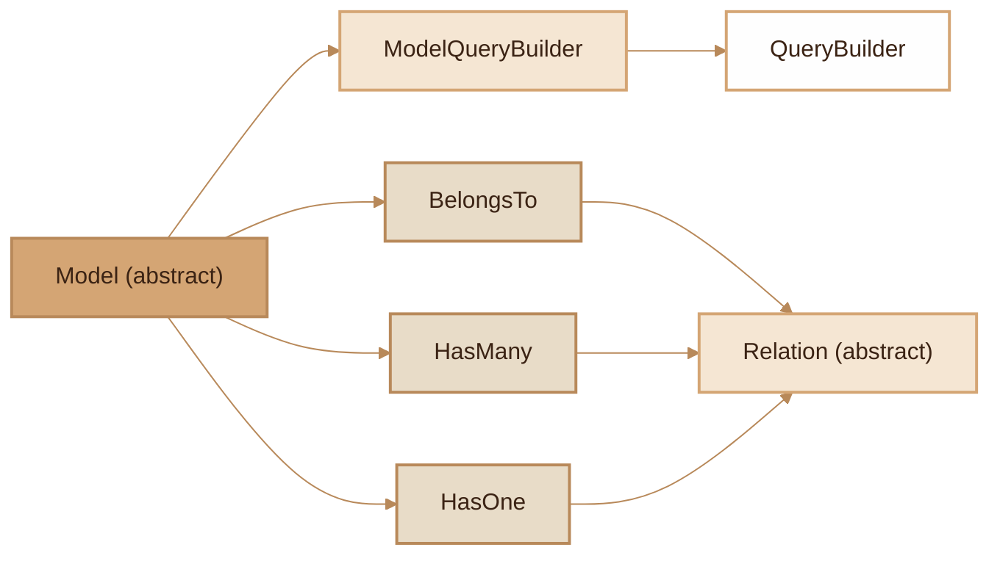

# Model ORM
> Lightweight ActiveRecord ORM with relations, eager loading, soft delete, casting and pagination.

## Overview

The Fennec Model ORM module implements the ActiveRecord pattern: each model represents a table and each instance a row. Models support full CRUD (create, read, update, delete), soft delete, automatic type casting, relations (BelongsTo, HasMany, HasOne) with lazy and eager loading, and native pagination. The `ModelQueryBuilder` wraps the `QueryBuilder` to return hydrated instances instead of raw arrays. Models are automatically discovered via the PHP 8 `#[Table]` attribute or by naming convention.

## Diagram



## Public API

### Model -- Static Methods (query)

```php
// Find by ID
User::find(1): ?User
User::findOrFail(1): User  // 404 if not found
```

```php
// All records
User::all(): Collection
User::count(): int
```

```php
// Conditional query (returns ModelQueryBuilder)
User::where('active', true): ModelQueryBuilder
User::where('age', '>', 18)->orderBy('name')->get(): Collection
```

```php
// Quick creation
User::create(['name' => 'Alice', 'email' => 'alice@example.com']): User
```

```php
// Pagination
User::paginate(20, 1): array  // {data: [...], meta: {total, per_page, current_page, last_page}}
```

```php
// Soft delete scopes
User::withTrashed(): ModelQueryBuilder    // Include deleted
User::onlyTrashed(): ModelQueryBuilder    // Only deleted
```

```php
// Eager loading
User::with('role', 'posts')->get(): Collection
```

### Model -- Instance Methods

```php
$user = new User(['name' => 'Alice']);
$user->save(): static        // INSERT or UPDATE depending on exists
$user->delete(): bool         // Soft delete if enabled, otherwise hard delete
$user->restore(): bool        // Restore a soft-deleted record
$user->forceDelete(): bool    // Permanent deletion

$user->fill(['name' => 'Bob']): static
$user->getDirty(): array      // Modified attributes
$user->isDirty('name'): bool
$user->getKey(): int|string|null
$user->toArray(): array       // Includes loaded relations
$user->isDeleted(): bool
```

### Model -- Relations

```php
// In the model, define relation methods:
protected function hasMany(string $related, ?string $foreignKey = null, ?string $localKey = null): HasMany
protected function belongsTo(string $related, ?string $foreignKey = null, ?string $ownerKey = null): BelongsTo
protected function hasOne(string $related, ?string $foreignKey = null, ?string $localKey = null): HasOne
```
Foreign keys are automatically guessed: `User` -> `user_id`.

### Model -- Casting

```php
protected static array $casts = [
    'is_active' => 'bool',
    'metadata'  => 'json',
    'age'       => 'int',
    'score'     => 'float',
    'born_at'   => 'datetime',
];
```
Supported types: `int`, `float`, `bool`, `string`, `json`/`array`, `datetime`.

### Model -- Configurable Static Properties

| Property | Type | Default | Description |
|---|---|---|---|
| `$table` | string | '' (auto) | Table name |
| `$primaryKey` | string | 'id' | Primary key |
| `$connection` | string | 'default' | DB connection |
| `$timestamps` | bool | true | Manage created_at/updated_at |
| `$softDeletes` | bool | false | Enable soft delete |
| `$createdAt` | string | 'created_at' | Column name |
| `$updatedAt` | string | 'updated_at' | Column name |
| `$deletedAt` | string | 'deleted_at' | Column name |
| `$casts` | array | [] | Column casting |

### ModelQueryBuilder

Wrapper of `QueryBuilder` that hydrates results into Model instances:

```php
$mqb = User::where('active', true);
$mqb->where('role', 'admin'): self
$mqb->orWhere('role', 'superadmin'): self
$mqb->whereIn('id', [1, 2, 3]): self
$mqb->whereNull('deleted_at'): self
$mqb->whereNotNull('email'): self
$mqb->orderBy('name', 'DESC'): self
$mqb->limit(10): self
$mqb->offset(5): self
$mqb->select('id', 'name'): self
$mqb->join('roles', 'users.role_id', '=', 'roles.id'): self
$mqb->leftJoin('profiles', 'users.id', '=', 'profiles.user_id'): self
$mqb->with('role', 'posts'): self

// Terminal operations
$mqb->get(): Collection           // Collection of Models
$mqb->first(): ?Model
$mqb->firstOrFail(): Model        // 404 if not found
$mqb->count(): int
$mqb->exists(): bool
$mqb->delete(): int
$mqb->update(['active' => false]): int
$mqb->paginate(15, 1): array
```

### Relations -- Eager Loading

Eager loading avoids the N+1 problem by loading all relations in 2 queries:

```php
// 1 users query + 1 roles query (instead of N+1)
$users = User::with('role')->get();
foreach ($users as $user) {
    echo $user->role->name;  // No additional query
}
```

### Relations -- Lazy Loading

Accessing an unloaded relation automatically triggers a query and caches the result:

```php
$user = User::find(1);
$role = $user->role;   // SQL query executed, result cached
$role = $user->role;   // Cached, no query
```

## Events

The following events are automatically dispatched:

| Event | Trigger |
|---|---|
| `App\Models\User.created` | After an INSERT |
| `App\Models\User.updated` | After an UPDATE |
| `App\Models\User.deleted` | After a DELETE or soft delete |

The pattern is `{FullModelName}.{action}` and the payload is the model instance.

## PHP 8 Attributes

### #[Table]

```php
use Fennec\Attributes\Table;

#[Table('users')]                        // Table 'users', connection 'default'
#[Table('analytics_events', 'analytics')] // Table on 'analytics' connection
class User extends Model {}
```

If `#[Table]` is absent, the table name is guessed by convention: `UserProfile` -> `user_profiles`.

## CLI Commands

| Command | Description |
|---|---|
| `make:model <Name>` | Create an ORM model |
| `make:model <Name> --connection=job` | Model on a named connection |
| `make:model <Name> --soft-delete` | Enable soft delete |
| `make:model <Name> --no-timestamps` | Disable timestamps |

The file is generated in `app/Models/<Name>.php` with the complete skeleton (Table attribute, casts, relation examples).

## Integration with other modules

- **Database**: `Model::query()` uses `DB::table()` to build queries
- **Collection**: multiple results are returned in a typed `Collection`
- **Events**: automatic dispatch on created/updated/deleted
- **NF525**: the `HasNf525` trait adds immutability and SHA-256 chaining to models
- **Audit**: the `HasAuditTrail` trait with `#[Auditable]` tracks changes
- **Encryption**: the `HasEncryptedFields` trait with `#[Encrypted]` transparently encrypts/decrypts
- **State Machine**: the `HasStateMachine` trait with `#[StateMachine]` manages state transitions

## Full Example

```php
use Fennec\Attributes\Table;
use Fennec\Core\Model;

#[Table('posts')]
class Post extends Model
{
    protected static bool $softDeletes = true;

    protected static array $casts = [
        'is_published' => 'bool',
        'metadata'     => 'json',
        'published_at' => 'datetime',
    ];

    public function author(): \Fennec\Core\Relations\BelongsTo
    {
        return $this->belongsTo(User::class, 'author_id');
    }

    public function comments(): \Fennec\Core\Relations\HasMany
    {
        return $this->hasMany(Comment::class);
    }
}

// Usage
$post = Post::create([
    'title' => 'My article',
    'author_id' => 1,
    'is_published' => true,
    'metadata' => ['tags' => ['php', 'fennec']],
]);

$posts = Post::with('author', 'comments')
    ->where('is_published', true)
    ->orderBy('published_at', 'DESC')
    ->paginate(10, 1);

$post->delete();          // Soft delete
$post->restore();         // Restore
Post::onlyTrashed()->get(); // List deleted
```

## Module Files

| File | Role | Last Modified |
|---|---|---|
| `src/Core/Model.php` | Abstract ActiveRecord class | 2026-03-21 |
| `src/Core/ModelQueryBuilder.php` | QueryBuilder with Model hydration | 2026-03-21 |
| `src/Core/Relations/Relation.php` | Abstract relations class | 2026-03-21 |
| `src/Core/Relations/BelongsTo.php` | N:1 relation | 2026-03-21 |
| `src/Core/Relations/HasMany.php` | 1:N relation | 2026-03-21 |
| `src/Core/Relations/HasOne.php` | 1:1 relation | 2026-03-21 |
| `src/Attributes/Table.php` | PHP 8 attribute for declaring the table | 2026-03-21 |
| `src/Commands/MakeModelCommand.php` | CLI make:model command | 2026-03-21 |
