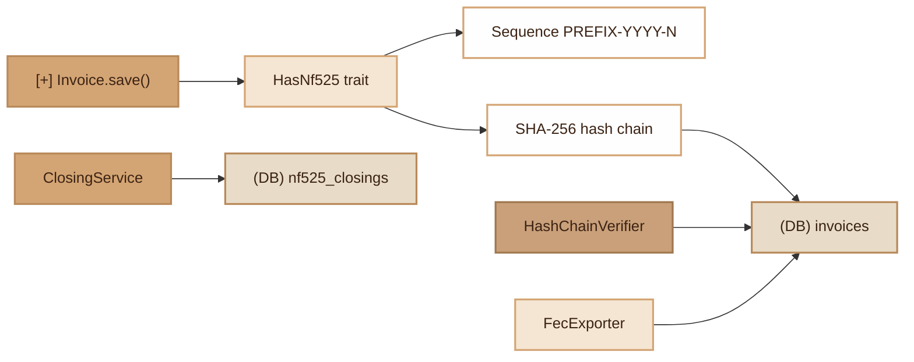

# NF525
> French NF525 fiscal compliance: invoice immutability, sequential numbering, SHA-256 chaining, periodic closings and FEC export.

## Overview

The NF525 module ensures compliance of point-of-sale and invoicing software with NF525 standard requirements. It relies on four pillars: immutability (modification and deletion forbidden), sequential numbering (format `PREFIX-YYYY-NNNNNN`), SHA-256 cryptographic chaining (each document includes the hash of the previous one), and periodic closings with HMAC signature. The module also includes a FEC (Fichier des Ecritures Comptables) exporter compliant with the French tax administration format and a hash chain integrity verifier.

## Diagram



## Public API

### Trait `HasNf525`

Makes a Model NF525-compliant: immutability, sequential numbering, hash chaining.

```php
use Fennec\Attributes\Nf525;
use Fennec\Attributes\Table;
use Fennec\Core\Model;
use Fennec\Core\Nf525\HasNf525;

#[Table('invoices'), Nf525(prefix: 'FA')]
class Invoice extends Model
{
    use HasNf525;
}
```

**Automatic behaviors:**

- `save()` on a new object: generates the sequential number, computes the SHA-256 hash, inserts the document.
- `save()` on an existing object: throws `RuntimeException` (modification forbidden).
- `delete()`: throws `RuntimeException` (deletion forbidden).

```php
// Create an invoice
$invoice = new Invoice([
    'client_name' => 'ACME',
    'total_ht' => 1000.00,
    'tva' => 200.00,
    'total_ttc' => 1200.00,
]);
$invoice->save();
// -> number: FA-2026-000001, hash: sha256(...)

// Create a credit note (only way to "correct")
$credit = $invoice->createCredit('Price error', [
    'client_name' => 'ACME',
    'total_ht' => 500.00,
    'tva' => 100.00,
    'total_ttc' => 600.00,
]);
// -> Amounts reversed, credit_of = invoice.id, is_credit = true

// Verify hash integrity
$invoice->verifyHash(); // true | false
```

### `ClosingService`

Periodic closings with HMAC-SHA256 hash and cumulative total.

```php
$service = new ClosingService(
    table: 'invoices',
    closingTable: 'nf525_closings',
    connection: 'default',
);

// Daily closing
$result = $service->closeDaily('2026-03-22');

// Monthly closing
$result = $service->closeMonthly('2026-03');

// Annual closing
$result = $service->closeAnnual('2026');

// Check if already closed
$service->isClosed('monthly', '2026-03-01', '2026-03-31'); // bool
```

Returned result:
```php
[
    'type' => 'daily',
    'period_start' => '2026-03-22',
    'period_end' => '2026-03-22',
    'totals' => ['total_ht' => 5000.00, 'total_tva' => 1000.00, 'total_ttc' => 6000.00, 'document_count' => 15],
    'cumulative_total' => 125000.00,
    'hash' => 'hmac-sha256...',
]
```

### `FecExporter`

Export in FEC (TSV) format compliant with the French tax administration.

```php
$exporter = new FecExporter(table: 'invoices', connection: 'default');

// TSV content
$content = $exporter->export('2026');

// Export to file (default name: FEC{SIREN}{YYYY}1231.txt)
$path = $exporter->exportToFile('2026', '/tmp/fec_2026.txt');

// Number of entries
$count = $exporter->count('2026');
```

FEC columns: `JournalCode`, `JournalLib`, `EcritureNum`, `EcritureDate`, `CompteNum`, `CompteLib`, `PieceRef`, `PieceDate`, `EcritureLib`, `Debit`, `Credit`, `Montantdevise`, `Idevise`.

### `HashChainVerifier`

Verification of the entire hash chain integrity.

```php
$result = HashChainVerifier::verify(
    table: 'invoices',
    hashColumn: 'hash',
    prevHashColumn: 'previous_hash',
    excludeFromHash: [],
    connection: 'default',
);
// ['valid' => true, 'total' => 1500, 'errors' => []]
```

Detected error types: `previous_hash_mismatch`, `hash_mismatch`.

## Configuration

| Variable | Default | Description |
|---|---|---|
| `SECRET_KEY` | `fennec-nf525` | HMAC key for periodic closings |
| `NF525_SIREN` | `000000000` | Company SIREN (FEC filename) |
| `DB_DRIVER` | `pgsql` | DB driver for migration |

## DB Tables

### `invoices`

| Column | Type | Description |
|---|---|---|
| `id` | BIGSERIAL | Primary key |
| `number` | VARCHAR(30) UNIQUE | Sequential number (FA-2026-000001) |
| `hash` | VARCHAR(64) | Document SHA-256 hash |
| `previous_hash` | VARCHAR(64) | Previous document hash |
| `client_name` | VARCHAR(255) | Client name |
| `total_ht` | DECIMAL(12,2) | Total excluding tax |
| `tva` | DECIMAL(12,2) | VAT amount |
| `total_ttc` | DECIMAL(12,2) | Total including tax |
| `is_credit` | BOOLEAN | Document is a credit note |
| `credit_of` | BIGINT | Reference to the original invoice |
| `credit_reason` | TEXT | Credit note reason |
| `created_at` / `updated_at` | TIMESTAMP | Timestamp |

### `invoice_lines`

| Column | Type | Description |
|---|---|---|
| `id` | BIGSERIAL | Primary key |
| `invoice_id` | BIGINT FK | Reference to `invoices` |
| `description` | TEXT | Line description |
| `quantity` | DECIMAL(10,3) | Quantity |
| `unit_price` | DECIMAL(12,2) | Unit price excl. tax |
| `tva_rate` | DECIMAL(5,2) | VAT rate |
| `total_ht` | DECIMAL(12,2) | Line total excl. tax |

### `nf525_closings`

| Column | Type | Description |
|---|---|---|
| `id` | BIGSERIAL | Primary key |
| `type` | VARCHAR(20) | `daily`, `monthly`, `annual` |
| `period_start` / `period_end` | DATE | Period boundaries |
| `total_ht` | DECIMAL(12,2) | Period total excl. tax |
| `total_tva` | DECIMAL(12,2) | Period VAT |
| `total_ttc` | DECIMAL(12,2) | Period total incl. tax |
| `cumulative_total` | DECIMAL(15,2) | Cumulative grand total |
| `document_count` | INTEGER | Number of documents |
| `hash` | VARCHAR(64) | Closing HMAC-SHA256 |
| `previous_hash` | VARCHAR(64) | Previous closing hash |

### `nf525_journal`

| Column | Type | Description |
|---|---|---|
| `id` | BIGSERIAL | Primary key |
| `event_type` | VARCHAR(50) | Event type |
| `entity_type` | VARCHAR(255) | Entity class |
| `entity_id` | BIGINT | Entity ID |
| `data` | JSONB | Additional data |
| `user_id` | BIGINT | User |
| `created_at` | TIMESTAMP | Timestamp |

## Events

| Event | Trigger |
|---|---|
| `{ClassName}.nf525.created` | NF525 document insertion |
| Payload: `['model' => Model, 'number' => string, 'hash' => string]` | |

The `SecurityLogger` also traces:
- `nf525.credit_created`: credit note creation
- `nf525.closing`: periodic closing

## PHP 8 Attributes

### `#[Nf525]`

Target: class. Parameters:

| Param | Type | Default | Description |
|---|---|---|---|
| `prefix` | `string` | `'FA'` | Number prefix (FA = invoice, AV = credit note) |
| `sequenceColumn` | `string` | `'number'` | Sequential number column |
| `hashColumn` | `string` | `'hash'` | SHA-256 hash column |
| `prevHashColumn` | `string` | `'previous_hash'` | Previous hash column |
| `excludeFromHash` | `string[]` | `[]` | Columns excluded from hash calculation |

```php
#[Nf525(prefix: 'AV', excludeFromHash: ['notes'])]
```

## CLI Commands

### `make:nf525`

Generates the complete module: migration (4 tables) + 4 Models + 7 DTOs + Controller + Routes.

```bash
./forge make:nf525
./forge migrate
```

### `nf525:close`

Triggers a periodic closing.

```bash
./forge nf525:close --daily=2026-03-22
./forge nf525:close --monthly=2026-03
./forge nf525:close --annual=2026
```

### `nf525:export`

Exports the FEC file for a year.

```bash
./forge nf525:export --year=2026
./forge nf525:export --year=2026 --output=/tmp/fec.txt
```

### `nf525:verify`

Verifies the hash chain integrity.

```bash
./forge nf525:verify
./forge nf525:verify --table=invoices
```

## Integration with other modules

- **Audit Trail**: combine `#[Auditable]` with `HasNf525` for dual journaling (fiscal + audit).
- **SecurityLogger**: credit note creations and closings are traced in `security.log`.
- **Event System**: the `.nf525.created` event allows attaching listeners (notification, webhook).
- **Admin UI**: the Compliance page of the dashboard displays NF525 statistics, closings and chain verification.

## Full Example

```php
// 1. Create an invoice
$invoice = new Invoice([
    'client_name' => 'ACME Corp',
    'total_ht' => 1000.00,
    'tva' => 200.00,
    'total_ttc' => 1200.00,
]);
$invoice->save();
// number: FA-2026-000001, SHA-256 hash chain

// 2. Add lines
$line = new InvoiceLine([
    'invoice_id' => $invoice->id,
    'description' => 'Consulting services',
    'quantity' => 10,
    'unit_price' => 100.00,
    'tva_rate' => 20.00,
    'total_ht' => 1000.00,
]);
$line->save();

// 3. Create a credit note
$credit = $invoice->createCredit('Commercial discount');

// 4. Monthly closing
$service = new ClosingService();
$service->closeMonthly('2026-03');

// 5. Integrity verification
$result = HashChainVerifier::verify('invoices');
// ['valid' => true, 'total' => 2, 'errors' => []]

// 6. FEC export
$exporter = new FecExporter();
$exporter->exportToFile('2026');
// -> FEC0000000002026l231.txt
```

## Module Files

| File | Role |
|---|---|
| `src/Core/Nf525/HasNf525.php` | Immutability + hash chain trait |
| `src/Core/Nf525/ClosingService.php` | HMAC-SHA256 periodic closings |
| `src/Core/Nf525/FecExporter.php` | FEC export (fiscal TSV) |
| `src/Core/Nf525/HashChainVerifier.php` | Hash chain integrity verification |
| `src/Attributes/Nf525.php` | PHP 8 configuration attribute |
| `src/Commands/MakeNf525Command.php` | Complete module generator |
| `src/Commands/Nf525CloseCommand.php` | CLI closing command |
| `src/Commands/Nf525ExportCommand.php` | CLI FEC export command |
| `src/Commands/Nf525VerifyCommand.php` | CLI hash verification command |
