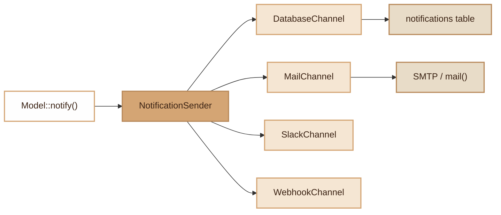

# Notifications

> Multi-channel notification system (database, mail, Slack, webhook) with `HasNotifications` trait for models.

## Overview

The Notifications module allows sending notifications to entities (users, etc.) via multiple channels simultaneously. Each notification declares its channels via the `via()` method and provides a representation adapted to each channel (`toDatabase()`, `toMail()`, `toSlack()`, `toWebhook()`).

The system follows the **Strategy** pattern: the `NotificationSender` resolves the channel by name and delegates the sending. Models use the `HasNotifications` trait to access `$model->notify()` and to read notifications stored in the database.

## Diagram



## Public API

### Creating a Notification

Extend the abstract `Notification` class and override the necessary methods:

```php
use Fennec\Core\Notification\Notification;
use Fennec\Core\Notification\Messages\MailMessage;
use Fennec\Core\Notification\Messages\SlackMessage;

class OrderConfirmed extends Notification
{
    public function __construct(
        private int $orderId,
        private float $total,
    ) {}

    public function via(): array
    {
        return ['database', 'mail', 'slack'];
    }

    public function toDatabase(): array
    {
        return [
            'order_id' => $this->orderId,
            'total' => $this->total,
            'message' => 'Order #' . $this->orderId . ' confirmed',
        ];
    }

    public function toMail(): MailMessage
    {
        return (new MailMessage())
            ->subject('Order #' . $this->orderId . ' confirmed')
            ->body('<h1>Thank you!</h1><p>Total: ' . $this->total . ' EUR</p>');
    }

    public function toSlack(): SlackMessage
    {
        return (new SlackMessage())
            ->text('New order #' . $this->orderId . ' - ' . $this->total . ' EUR')
            ->channel('#orders');
    }
}
```

### Sending a Notification

```php
// Via the HasNotifications trait on a model
$user->notify(new OrderConfirmed(orderId: 42, total: 99.90));

// Via the sender directly
$sender = new NotificationSender();
$sender->send($user, new OrderConfirmed(orderId: 42, total: 99.90));
```

### Reading Notifications (trait `HasNotifications`)

```php
// All notifications
$all = $user->notifications();

// Unread only
$unread = $user->unreadNotifications();

// Mark as read
$user->markNotificationRead($notificationId);
```

### Fluent Messages

#### `MailMessage`

```php
(new MailMessage())
    ->to('user@example.com')     // Recipient (otherwise $notifiable->email)
    ->from('noreply@app.com')    // Sender (otherwise MAIL_FROM)
    ->subject('Subject')
    ->body('<html>...</html>')
    ->replyTo('support@app.com');
```

#### `SlackMessage`

```php
(new SlackMessage())
    ->text('Text message')
    ->channel('#general')
    ->username('Fennec Bot')
    ->iconEmoji(':fox:');
```

#### `WebhookMessage`

```php
(new WebhookMessage())
    ->url('https://api.example.com/hook')
    ->secret('hmac-secret-key')
    ->event('order.confirmed')
    ->payload(['order_id' => 42])
    ->headers(['X-Custom' => 'value']);
```

## Configuration

| Variable | Default | Description |
|---|---|---|
| `MAIL_HOST` | `''` | SMTP host (empty = native mail()) |
| `MAIL_PORT` | `587` | SMTP port |
| `MAIL_USER` | `''` | SMTP user |
| `MAIL_PASSWORD` | `''` | SMTP password |
| `MAIL_FROM` | `noreply@localhost` | Default sender address |
| `SLACK_WEBHOOK_URL` | `''` | Slack webhook URL (required for the Slack channel) |

## DB Tables

### `notifications`

| Column | Type | Description |
|---|---|---|
| `id` | `SERIAL` | Primary key |
| `notifiable_type` | `VARCHAR` | Recipient class (e.g. `App\Models\User`) |
| `notifiable_id` | `INT` | Recipient ID |
| `type` | `VARCHAR` | Notification class |
| `data` | `JSONB` | Serialized data (return of `toDatabase()`) |
| `read_at` | `TIMESTAMP NULL` | Read date (null = unread) |
| `created_at` | `TIMESTAMP` | Creation date |

## Integration with other modules

- **Queue**: the `WebhookChannel` dispatches a `WebhookDeliveryJob` via the queue system for asynchronous delivery with retry
- **Webhooks**: the webhook channel reuses `WebhookDeliveryJob` with HMAC-SHA256 signature
- **Models**: the `HasNotifications` trait can be added to any model exposing an `$id` property
- **Mail**: the `MailChannel` supports SMTP with STARTTLS and AUTH LOGIN authentication, or fallback to native `mail()`

## Full Example

```php
// 1. Define the notification
class InvoicePaid extends Notification
{
    public function __construct(
        private string $invoiceNumber,
        private float $amount,
    ) {}

    public function via(): array
    {
        return ['database', 'mail', 'webhook'];
    }

    public function toDatabase(): array
    {
        return [
            'invoice' => $this->invoiceNumber,
            'amount' => $this->amount,
        ];
    }

    public function toMail(): MailMessage
    {
        return (new MailMessage())
            ->subject('Invoice ' . $this->invoiceNumber . ' paid')
            ->body('<p>Amount: ' . $this->amount . ' EUR</p>');
    }

    public function toWebhook(): WebhookMessage
    {
        return (new WebhookMessage())
            ->url('https://erp.example.com/webhooks')
            ->secret('my-hmac-secret')
            ->event('invoice.paid');
    }
}

// 2. Model with the trait
class User extends Model
{
    use HasNotifications;
}

// 3. Send
$user = User::find(1);
$user->notify(new InvoicePaid('FA-2026-0042', 1500.00));

// 4. Read unread notifications
$unread = $user->unreadNotifications();
foreach ($unread as $n) {
    echo $n['type'] . ': ' . $n['data'] . "\n";
    $user->markNotificationRead($n['id']);
}
```

## Module Files

| File | Role |
|---|---|
| `src/Core/Notification/NotificationInterface.php` | Notification interface |
| `src/Core/Notification/Notification.php` | Abstract base class |
| `src/Core/Notification/NotificationSender.php` | Multi-channel dispatcher |
| `src/Core/Notification/HasNotifications.php` | Trait for recipient models |
| `src/Core/Notification/Channels/DatabaseChannel.php` | Database channel |
| `src/Core/Notification/Channels/MailChannel.php` | Email channel (SMTP / mail()) |
| `src/Core/Notification/Channels/SlackChannel.php` | Slack webhook channel |
| `src/Core/Notification/Channels/WebhookChannel.php` | Signed HTTP webhook channel |
| `src/Core/Notification/Messages/MailMessage.php` | Email message value object |
| `src/Core/Notification/Messages/SlackMessage.php` | Slack message value object |
| `src/Core/Notification/Messages/WebhookMessage.php` | Webhook message value object |
