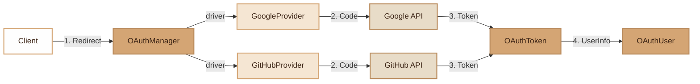

# OAuth

> OAuth2 authentication with Google and GitHub via an extensible manager and immutable value objects.

## Overview

The OAuth module provides an abstraction for social authentication via the OAuth2 protocol. It natively supports Google and GitHub, and can be extended with new providers by inheriting from the abstract `OAuthProvider` class.

The standard OAuth2 flow is implemented in 3 steps:
1. Generation of the authorization URL with CSRF protection (state)
2. Exchange of the authorization code for an access token
3. Retrieval of user information

HTTP requests are made via `file_get_contents` + `stream_context_create` (no cURL dependency).

## Diagram



## Public API

### OAuthManager (factory)

```php
$oauth = new OAuthManager();

// Get a provider
$google = $oauth->driver('google');
$github = $oauth->driver('github');

// Instances are cached (singleton per provider)
```

Available providers: `google`, `github`. Any other name throws a `RuntimeException`.

### OAuthProvider (abstract class)

Each provider implements 3 methods:

```php
// 1. Authorization URL (with CSRF state)
$url = $provider->getAuthorizationUrl($state);

// 2. Exchange the code for a token
$token = $provider->getAccessToken($code);

// 3. User information
$user = $provider->getUserInfo($token->accessToken);
```

Protected HTTP methods available for custom providers:

```php
$data = $this->httpGet($url, ['Authorization' => 'Bearer xxx']);
$data = $this->httpPost($url, ['key' => 'value'], ['Accept' => 'application/json']);
```

### OAuthToken (value object)

```php
$token->accessToken;   // string — access token
$token->refreshToken;  // ?string — refresh token
$token->expiresIn;     // ?int — validity duration in seconds
$token->tokenType;     // string — type (default: 'Bearer')
```

### OAuthUser (value object)

```php
$user->id;        // string — unique identifier at the provider
$user->email;     // ?string — email
$user->name;      // ?string — full name
$user->avatar;    // ?string — avatar URL
$user->provider;  // string — 'google' or 'github'
$user->raw;       // array — raw API data
```

## Configuration

### Google

| Environment Variable | Description |
|---|---|
| `OAUTH_GOOGLE_CLIENT_ID` | Google application Client ID |
| `OAUTH_GOOGLE_CLIENT_SECRET` | Client Secret |
| `OAUTH_GOOGLE_REDIRECT` | Callback URL |

Requested scopes: `openid email profile`
Options: `access_type=offline`, `prompt=consent` (forces refresh token)

### GitHub

| Environment Variable | Description |
|---|---|
| `OAUTH_GITHUB_CLIENT_ID` | GitHub application Client ID |
| `OAUTH_GITHUB_CLIENT_SECRET` | Client Secret |
| `OAUTH_GITHUB_REDIRECT` | Callback URL |

Requested scopes: `user:email read:user`

Note: GitHub may not include the email in the main profile. The provider automatically queries `/user/emails` to retrieve the verified primary email.

## Integration with other modules

- **Auth/JWT**: after OAuth authentication, generate a JWT via the internal auth system
- **User Model**: create or find the local user from `OAuthUser`
- **SecurityLogger**: trace OAuth logins in security logs

## Full Example

```php
use Fennec\Core\OAuth\OAuthManager;

class AuthController
{
    private OAuthManager $oauth;

    public function __construct()
    {
        $this->oauth = new OAuthManager();
    }

    // Step 1: redirect to the provider
    public function redirect(string $provider): array
    {
        $state = bin2hex(random_bytes(16));
        $_SESSION['oauth_state'] = $state;

        $url = $this->oauth->driver($provider)->getAuthorizationUrl($state);

        return ['redirect' => $url];
    }

    // Step 2: provider callback
    public function callback(string $provider, string $code, string $state): array
    {
        if ($state !== ($_SESSION['oauth_state'] ?? '')) {
            throw new \RuntimeException('CSRF state mismatch');
        }

        $driver = $this->oauth->driver($provider);

        // Exchange the code for a token
        $token = $driver->getAccessToken($code);

        // Retrieve user info
        $oauthUser = $driver->getUserInfo($token->accessToken);

        // Create or find the local user
        $user = User::firstOrCreate([
            'email' => $oauthUser->email,
        ], [
            'name'   => $oauthUser->name,
            'avatar' => $oauthUser->avatar,
        ]);

        return ['user' => $user, 'token' => $token->accessToken];
    }
}
```

### Creating a Custom Provider

```php
use Fennec\Core\OAuth\OAuthProvider;
use Fennec\Core\OAuth\OAuthToken;
use Fennec\Core\OAuth\OAuthUser;

class MicrosoftProvider extends OAuthProvider
{
    public function getAuthorizationUrl(string $state): string
    {
        return 'https://login.microsoftonline.com/...?state=' . $state;
    }

    public function getAccessToken(string $code): OAuthToken
    {
        $data = $this->httpPost('https://login.microsoftonline.com/.../token', [
            'code' => $code,
            'grant_type' => 'authorization_code',
        ]);

        return new OAuthToken(accessToken: $data['access_token']);
    }

    public function getUserInfo(string $accessToken): OAuthUser
    {
        $data = $this->httpGet('https://graph.microsoft.com/v1.0/me', [
            'Authorization' => 'Bearer ' . $accessToken,
        ]);

        return new OAuthUser(
            id: $data['id'],
            email: $data['mail'],
            name: $data['displayName'],
            provider: 'microsoft',
            raw: $data,
        );
    }
}
```

## Module Files

| File | Description |
|---|---|
| `src/Core/OAuth/OAuthManager.php` | Provider factory (cached singleton) |
| `src/Core/OAuth/OAuthProvider.php` | Abstract class with HTTP helpers |
| `src/Core/OAuth/OAuthToken.php` | Token value object (readonly) |
| `src/Core/OAuth/OAuthUser.php` | User value object (readonly) |
| `src/Core/OAuth/Providers/GoogleProvider.php` | Google provider (OpenID Connect) |
| `src/Core/OAuth/Providers/GitHubProvider.php` | GitHub provider (+ email fallback) |
