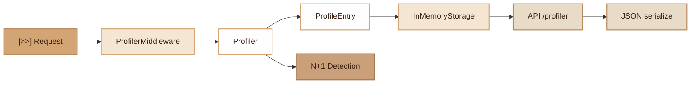

# Profiler
> HTTP request profiling tool: duration, memory, SQL queries, N+1 detection, events and middlewares.

## Overview

The Profiler module collects performance metrics for each HTTP request processed by the application. It records total duration, memory consumption, executed SQL queries (with automatic N+1 problem detection), dispatched events and traversed middlewares.

Storage is done in memory via a static ring buffer (persists between requests in FrankenPHP worker mode). The architecture is extensible via the `ProfilerStorageInterface`.

## Diagram



## Public API

### Profiler

Central singleton that orchestrates profiling.

```php
use Fennec\Core\Profiler\Profiler;
use Fennec\Core\Profiler\InMemoryStorage;

// Initialization (done automatically by the framework)
$profiler = new Profiler(new InMemoryStorage(100), enabled: true);
Profiler::setInstance($profiler);

// Start/stop profiling (done by ProfilerMiddleware)
$profiler->start('GET', '/api/users');
$entry = $profiler->stop(); // returns ProfileEntry

// Add metrics manually
$profiler->addQuery('SELECT * FROM users WHERE id = :id', [':id' => 1], 2.5);
$profiler->addEvent('user.created', 0.8);
$profiler->addMiddleware('AuthMiddleware', 1.2);
$profiler->addResolution('App\\Services\\UserService');

// View profiles
$all = $profiler->getAll();         // ProfileEntry[] (most recent first)
$one = $profiler->getById($id);     // ProfileEntry|null
```

### ProfileEntry

Value object containing all metrics for a request. Implements `JsonSerializable`.

```php
$entry = new ProfileEntry('POST', '/api/users');
// ... processing ...
$entry->stop();

// Collected data:
$entry->id;           // string (16 random hex)
$entry->method;       // 'POST'
$entry->uri;          // '/api/users'
$entry->durationMs;   // float (ms)
$entry->peakMemory;   // int (bytes)
$entry->statusCode;   // int
$entry->queries;      // array{sql, params, ms}[]
$entry->events;       // array{name, ms}[]
$entry->middlewares;   // array{class, ms}[]
$entry->n1Warnings;   // string[] (detected N+1 alerts)

// JSON serialization
json_encode($entry);
```

### InMemoryStorage

Static ring buffer with LRU eviction. Default size: 50 entries.

```php
use Fennec\Core\Profiler\InMemoryStorage;

$storage = new InMemoryStorage(maxSize: 100);

// Cleanup (useful between worker requests)
InMemoryStorage::clear();
InMemoryStorage::count(); // int
```

### ProfilerMiddleware

HTTP middleware that automatically starts and stops the profiler.

```php
use Fennec\Middleware\ProfilerMiddleware;

// Registration as global middleware
$app->addGlobalMiddleware(new ProfilerMiddleware($profiler));
```

## Configuration

| Variable | Description | Default |
|---|---|---|
| `PROFILER_ENABLED` | Enable/disable the profiler | `true` in dev |

The profiler is designed to be active in development and disabled in production.

## Integration with other modules

- **Database**: SQL queries are tracked via `addQuery()` from the database driver
- **Events**: dispatched events are recorded via `addEvent()`
- **Middleware**: each traversed middleware is timed via `addMiddleware()`
- **Container**: DI container resolutions are tracked via `addResolution()`
- **Admin UI**: the React dashboard displays profiles via the `/api/ui/profiler` API

## N+1 Detection

The profiler automatically detects N+1 queries after profiling stops. An alert is generated when the same SQL query (normalized) is executed more than 3 times in a single HTTP request.

```php
// If the same SELECT query is executed 5 times:
// $entry->n1Warnings will contain:
// ["Query executed 5x: SELECT * FROM posts WHERE user_id = ?"]
```

## Full Example

```php
use Fennec\Core\Profiler\Profiler;
use Fennec\Core\Profiler\InMemoryStorage;
use Fennec\Middleware\ProfilerMiddleware;

// 1. Initialization
$storage = new InMemoryStorage(50);
$profiler = new Profiler($storage, enabled: true);
Profiler::setInstance($profiler);

// 2. Register the middleware
$app->addGlobalMiddleware(new ProfilerMiddleware($profiler));

// 3. Requests are profiled automatically

// 4. View results
$entries = $profiler->getAll();
foreach ($entries as $entry) {
    echo sprintf(
        "%s %s — %sms, %s queries, %s MB\n",
        $entry->method,
        $entry->uri,
        $entry->durationMs,
        count($entry->queries),
        round($entry->peakMemory / 1048576, 2)
    );

    foreach ($entry->n1Warnings as $warning) {
        echo "  [N+1] {$warning}\n";
    }
}
```

## Module Files

| File | Description |
|---|---|
| `src/Core/Profiler/Profiler.php` | Main class (singleton) |
| `src/Core/Profiler/ProfileEntry.php` | Request profile value object |
| `src/Core/Profiler/ProfilerStorageInterface.php` | Storage interface |
| `src/Core/Profiler/InMemoryStorage.php` | In-memory ring buffer storage |
| `src/Middleware/ProfilerMiddleware.php` | HTTP instrumentation middleware |
