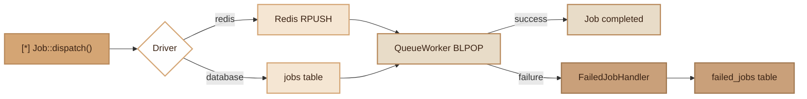

# Queue / Jobs
> Multi-driver async queue system (Redis, database) with retries, failure handling and CLI worker.

## Overview

The Fennec Queue module allows executing tasks in the background. A job is dispatched to a queue (Redis or database), then consumed by a worker (`queue:work`). Failed jobs are stored in `failed_jobs` and can be retried with `queue:retry`.

- **Redis** (default): `RPUSH`/`BLPOP` on Redis lists, performant and real-time.
- **Database**: `jobs` table with `FOR UPDATE SKIP LOCKED` locking, no external dependency.
- **Retries**: each job defines its number of attempts and delay between retries.
- **Failed jobs**: definitive failures are persisted in `failed_jobs` with the complete exception.

## Diagram



## Public API

### `Job` — Dispatching jobs

```php
use Fennec\Core\Queue\Job;

// Dispatch a job to the default queue
Job::dispatch(SendEmail::class, ['to' => 'alice@example.com']);

// Dispatch to a specific queue
Job::dispatch(ProcessImage::class, ['path' => '/uploads/photo.jpg'], 'high-priority');

// Redis connection cleanup (worker cleanup)
Job::resetConnection();
```

### `JobInterface` — Creating a job

Each job must implement `JobInterface`:

```php
use Fennec\Core\Queue\JobInterface;

class SendEmail implements JobInterface
{
    public function handle(array $payload): void
    {
        // Job logic
        $to = $payload['to'];
        // Send the email...
    }

    public function retries(): int
    {
        return 3; // Max number of attempts
    }

    public function retryDelay(): int
    {
        return 60; // Delay in seconds between retries
    }

    public function failed(array $payload, \Throwable $e): void
    {
        // Called when the job definitively fails
        // Notification, log, etc.
    }
}
```

### `QueueWorker` — Job consumer

```php
use Fennec\Core\Queue\QueueWorker;

$worker = new QueueWorker();

// Infinite loop on the 'default' queue with 60s BLPOP timeout
$worker->work(queue: 'default', maxJobs: 0, timeout: 60);

// Process exactly 10 jobs then stop
$worker->work(queue: 'emails', maxJobs: 10, timeout: 30);
```

The worker:
1. Retrieves a job via `BLPOP` (Redis) or `SELECT ... FOR UPDATE SKIP LOCKED` (database).
2. Resolves the class via the `Container` (dependency injection) or direct instantiation.
3. Calls `handle($payload)`.
4. On failure: re-queues if `attempts < retries()`, otherwise calls `failed()` and persists to `failed_jobs`.

### `FailedJobHandler` — Failure handling

```php
use Fennec\Core\Queue\FailedJobHandler;

$handler = new FailedJobHandler();

// Store a failed job
$handler->store('default', SendEmail::class, $payload, (string) $exception);

// Retry a failed job by ID
$handler->retry(42);

// Delete all failed jobs
$handler->flush();
```

## Configuration

| Variable | Default | Description |
|---|---|---|
| `QUEUE_DRIVER` | `redis` | Driver: `redis` or `database` |
| `REDIS_HOST` | `127.0.0.1` | Redis host |
| `REDIS_PORT` | `6379` | Redis port |
| `REDIS_PASSWORD` | _(empty)_ | Redis password |
| `REDIS_DB` | `0` | Redis database (0-15) |
| `REDIS_PREFIX` | `app:` | Redis key prefix (queue: `{prefix}queue:{name}`) |

## DB Tables

### `jobs` (database driver only)

```sql
CREATE TABLE jobs (
    id SERIAL PRIMARY KEY,
    queue VARCHAR(255) NOT NULL DEFAULT 'default',
    job_class VARCHAR(255) NOT NULL,
    payload JSONB,
    attempts INT DEFAULT 0,
    status VARCHAR(20) DEFAULT 'pending',
    available_at TIMESTAMP NULL,
    created_at TIMESTAMP DEFAULT NOW()
);
```

Statuses: `pending`, `processing`, `failed`.

### `failed_jobs` (all drivers)

```sql
CREATE TABLE failed_jobs (
    id SERIAL PRIMARY KEY,
    queue VARCHAR(255) NOT NULL,
    job_class VARCHAR(255) NOT NULL,
    payload JSONB,
    exception TEXT,
    failed_at TIMESTAMP DEFAULT NOW()
);
```

## CLI Commands

| Command | Options | Description |
|---|---|---|
| `queue:work` | `--queue=default --max-jobs=0 --timeout=60` | Start the worker (infinite loop unless max-jobs > 0) |
| `queue:retry` | `--id=N` | Retry a failed job by its ID |
| `queue:retry` | `--all` | Retry all failed jobs |
| `queue:retry` | _(no options)_ | List failed jobs with ID, queue, class and date |
| `make:job` | `<Name>` | Generate `app/Jobs/<Name>.php` with JobInterface skeleton |

```bash
# Start a worker on the default queue
./forge queue:work

# Worker with 100 job limit on a specific queue
./forge queue:work --queue=emails --max-jobs=100 --timeout=30

# List failed jobs
./forge queue:retry

# Retry a specific job
./forge queue:retry --id=42

# Retry all failed jobs
./forge queue:retry --all

# Generate a new job
./forge make:job ProcessPayment
```

## Integration with other modules

- **Events**: a listener can dispatch a job for asynchronous processing.
- **Container**: the `QueueWorker` resolves job classes via `Container::make()` (dependency injection).
- **Redis**: singleton connection with `ping()` health check and `resetConnection()` cleanup (worker-safe).
- **Worker safety**: `Job::$redis` is a static singleton with `ping()` health check and `resetConnection()` for FrankenPHP cleanup.
- **Notifications**: mail/slack/webhook notifications are often dispatched as jobs.

## Full Example

```php
// 1. Generate the job
// ./forge make:job ProcessPayment

// 2. Implement the logic
// app/Jobs/ProcessPayment.php
namespace App\Jobs;

use Fennec\Core\Queue\JobInterface;

class ProcessPayment implements JobInterface
{
    public function handle(array $payload): void
    {
        $orderId = $payload['order_id'];
        $amount = $payload['amount'];

        // Call the payment gateway
        $gateway = new PaymentGateway();
        $gateway->charge($orderId, $amount);

        // Dispatch an event on success
        Event::dispatch('payment.completed', [
            'order_id' => $orderId,
            'amount' => $amount,
        ]);
    }

    public function retries(): int
    {
        return 5; // 5 attempts (payment = critical)
    }

    public function retryDelay(): int
    {
        return 120; // 2 minutes between each retry
    }

    public function failed(array $payload, \Throwable $e): void
    {
        // Notify the team
        SecurityLogger::alert('payment.failed', [
            'order_id' => $payload['order_id'],
            'error' => $e->getMessage(),
        ]);
    }
}

// 3. Dispatch from a controller
use Fennec\Core\Queue\Job;

Job::dispatch(ProcessPayment::class, [
    'order_id' => 42,
    'amount' => 199.99,
]);

// 4. Dispatch to a priority queue
Job::dispatch(ProcessPayment::class, $payload, 'payments');

// 5. Start the worker
// ./forge queue:work --queue=payments --timeout=30
```

## Module Files

| File | Description |
|---|---|
| `src/Core/Queue/Job.php` | Static facade for dispatching jobs (Redis/DB) |
| `src/Core/Queue/JobInterface.php` | Interface each job must implement |
| `src/Core/Queue/QueueWorker.php` | Consumer: BLPOP/SELECT loop, retry, Container resolution |
| `src/Core/Queue/FailedJobHandler.php` | Storage and retry of failed jobs (failed_jobs table) |
| `src/Commands/QueueWorkCommand.php` | CLI `queue:work` command |
| `src/Commands/QueueRetryCommand.php` | CLI `queue:retry` command |
| `src/Commands/MakeJobCommand.php` | Job generator (`make:job`) |
