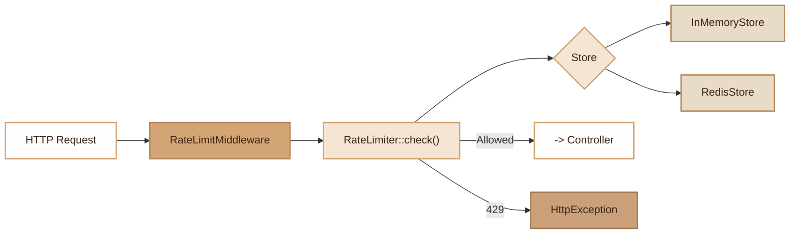

# Rate Limiter

> Sliding window rate limiter with interchangeable stores (memory or Redis), HTTP middleware and PHP 8 attribute.

## Overview

The Rate Limiter module protects endpoints against abuse by limiting the number of requests per key (IP + URI) over a configurable time window. It relies on an interchangeable store architecture: `InMemoryStore` for development and testing, `RedisStore` for multi-instance production.

The framework automatically instantiates the right store based on Redis availability (`App.php`). The middleware injects standard `X-RateLimit-*` headers and throws an `HttpException 429` when the limit is exceeded, with logging in the `SecurityLogger`.

## Diagram



## Public API

### Class `RateLimiter`

#### `__construct(RateLimiterStoreInterface $store)`

Accepts any store implementing the interface.

#### `check(string $key, int $limit, int $windowSeconds): array`

Checks if the request is within the allowed limit.

**Return:**

```php
[
    'allowed'   => bool,  // true if within the limit
    'limit'     => int,   // Configured limit
    'remaining' => int,   // Remaining requests (>= 0)
    'resetAt'   => int,   // Reset timestamp
]
```

**Example:**

```php
$limiter = new RateLimiter(new InMemoryStore());
$result = $limiter->check('user:42', 100, 3600);

if (!$result['allowed']) {
    // Limit exceeded
}
```

### Interface `RateLimiterStoreInterface`

Interface that every store must implement.

#### `increment(string $key, int $windowSeconds): array`

Increments the counter for a key and returns `['hits' => int, 'resetAt' => int]`.

### Class `InMemoryStore`

In-memory store, ideal for development and testing. Worker-compatible thanks to bounded cache.

- **Max size**: 1000 entries (configurable via `setMaxSize()`)
- **Eviction**: FIFO when max size is reached
- **Purge**: automatic every 200 operations (`purgeExpired()`)

```php
InMemoryStore::flush();          // Clear all counters
InMemoryStore::count();          // Number of active counters
InMemoryStore::setMaxSize(500);  // Custom limit
InMemoryStore::purgeExpired();   // Manual purge
```

### Class `RedisStore`

Redis store for production, shared between instances.

#### `RedisStore::fromEnv(): self`

Factory that reads configuration from environment variables.

```php
$store = RedisStore::fromEnv();
$limiter = new RateLimiter($store);
```

#### `__construct(string $host, int $port, ?string $password, int $db, string $prefix)`

| Parameter | Default | Description |
|---|---|---|
| `host` | `127.0.0.1` | Redis host |
| `port` | `6379` | Redis port |
| `password` | `null` | Password |
| `db` | `0` | Database number |
| `prefix` | `app:ratelimit:` | Key prefix |

#### `disconnect(): void`

Closes the Redis connection. Called automatically in the destructor and during worker cleanup.

**Redis implementation:** uses `INCR` + `EXPIRE` (TTL set only on first hit), and `TTL` to calculate `resetAt`. Automatic reconnection via `ping()` health check.

### Middleware `RateLimitMiddleware`

HTTP middleware that applies rate limiting on each request.

```php
use Fennec\Middleware\RateLimitMiddleware;
use Fennec\Core\RateLimiter;

$limiter = new RateLimiter($store);
$middleware = new RateLimitMiddleware($limiter, limit: 100, window: 60);
```

**Behavior:**

1. Generates a key: `md5(IP + URI)`
2. Calls `RateLimiter::check()`
3. Adds response headers:
   - `X-RateLimit-Limit`: configured limit
   - `X-RateLimit-Remaining`: remaining requests
   - `X-RateLimit-Reset`: reset timestamp
4. If limit exceeded:
   - Adds the `Retry-After` header
   - Logs via `SecurityLogger::alert('rate_limit.exceeded', ...)`
   - Throws `HttpException(429, 'Too many requests')`

## Configuration

### Environment Variables (RedisStore)

| Variable | Default | Description |
|---|---|---|
| `REDIS_HOST` | `127.0.0.1` | Redis host |
| `REDIS_PORT` | `6379` | Redis port |
| `REDIS_PASSWORD` | _(empty)_ | Redis password |
| `REDIS_DB` | `0` | Redis database number |

### Automatic Initialization (`App.php`)

The framework automatically chooses the store:

```php
// If Redis is available -> RedisStore
// Otherwise -> InMemoryStore
$this->container->singleton(RateLimiter::class, function () {
    if (extension_loaded('redis') && Env::get('REDIS_HOST')) {
        return new RateLimiter(RedisStore::fromEnv());
    }
    return new RateLimiter(new InMemoryStore());
});
```

## PHP 8 Attributes

### `#[RateLimit]`

- **Target**: `Attribute::TARGET_METHOD | Attribute::TARGET_CLASS`
- **Namespace**: `Fennec\Attributes\RateLimit`

| Parameter | Type | Default | Description |
|---|---|---|---|
| `limit` | `int` | `60` | Max number of requests |
| `window` | `string` | `'minute'` | Window: `second`, `minute`, `hour`, `day` |

The `window` value is converted to seconds in the `windowSeconds` property.

```php
#[RateLimit(limit: 10, window: 'minute')]
public function login(Request $request): Response
{
    // Max 10 attempts per minute
}

#[RateLimit(limit: 1000, window: 'hour')]
class ApiController
{
    // Global limit on the entire controller
}
```

## Integration with other modules

- **Security**: `SecurityLogger::alert()` is called on each limit exceeded, producing an entry in `var/logs/security.log`.
- **Worker**: `InMemoryStore` uses a bounded cache (1000 entries max, periodic purge). `RedisStore` has `disconnect()` and `__destruct()` for cleanup.
- **Middleware**: Integrates into the middleware stack via `addGlobalMiddleware()` or per-route.
- **Container**: Registered as singleton in the `App` DI container.

## Full Example

```php
use Fennec\Attributes\RateLimit;
use Fennec\Core\Request;

class AuthController
{
    #[RateLimit(limit: 5, window: 'minute')]
    public function login(Request $request): array
    {
        // Max 5 login attempts per minute per IP
        $credentials = $request->body();
        return ['token' => AuthService::authenticate($credentials)];
    }

    #[RateLimit(limit: 3, window: 'hour')]
    public function forgotPassword(Request $request): array
    {
        // Max 3 reset requests per hour
        return ['message' => 'Email sent'];
    }
}

// Direct programmatic usage
$limiter = app(RateLimiter::class);
$result = $limiter->check('custom:action:user42', 10, 300);

if (!$result['allowed']) {
    $retryIn = $result['resetAt'] - time();
    throw new \RuntimeException("Retry in {$retryIn}s");
}
```

## Module Files

| File | Role |
|---|---|
| `src/Core/RateLimiter.php` | Main class, check logic |
| `src/Core/RateLimiter/RateLimiterStoreInterface.php` | Store interface |
| `src/Core/RateLimiter/InMemoryStore.php` | In-memory store (dev/test/worker) |
| `src/Core/RateLimiter/RedisStore.php` | Redis store (production) |
| `src/Middleware/RateLimitMiddleware.php` | HTTP middleware |
| `src/Attributes/RateLimit.php` | Declarative PHP 8 attribute |
