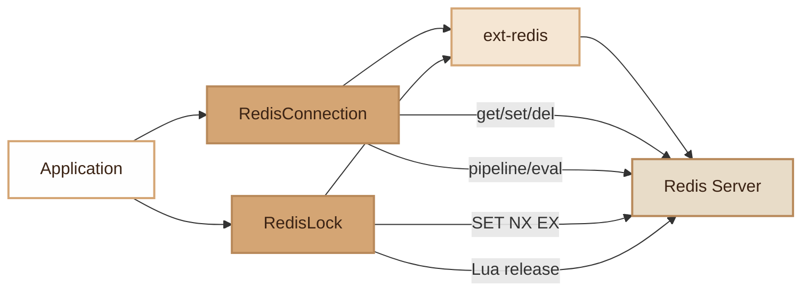

# Redis

> Shared Redis connection with lazy loading, atomic distributed lock and worker-safe management.

## Overview

The Redis module provides two components:

- **RedisConnection**: wrapper around `ext-redis` with lazy connection, automatic key prefixing, and common operations (get, set, del, lists, pipelines, Lua scripts).
- **RedisLock**: distributed lock based on Redis with atomic acquisition (`SET NX EX`) and secure release via Lua script (only the owner can unlock).

Both classes support creation from environment variables and implement robustness mechanisms for long-running workers (ping health check, automatic reconnection, disconnect/destruct).

## Diagram



## Public API

### RedisConnection

```php
// Create from environment variables
$redis = RedisConnection::fromEnv();

// Or create manually
$redis = new RedisConnection(
    host: '127.0.0.1',
    port: 6379,
    password: 'secret',
    db: 0,
    prefix: 'app:',
);

// Basic operations
$redis->set('key', 'value');              // bool
$redis->set('key', 'value', ex: 3600);   // with TTL in seconds
$redis->get('key');                        // mixed|null
$redis->del('key');                        // int
$redis->exists('key');                     // bool
$redis->expire('key', 300);               // bool
$redis->ttl('key');                        // int
$redis->incr('key');                       // int
$redis->setnx('key', 'value');            // bool (set if not exists)

// Lists
$redis->lPush('queue', $data);            // int|false
$redis->lPop('queue');                     // mixed
$redis->rPush('queue', $data);            // int|false

// Lua scripts
$result = $redis->eval($luaScript, ['key1'], ['arg1']);

// Pipeline (grouped execution)
$results = $redis->pipeline(function (\Redis $pipe) {
    $pipe->set('a', '1');
    $pipe->set('b', '2');
    $pipe->get('a');
});

// Health check
$ok = $redis->ping();                     // bool

// Access to the raw \Redis instance
$raw = $redis->connection();
```

All keys are automatically prefixed with the `prefix` value (default: `app:`).

### RedisLock

```php
// Create from environment variables
$lock = RedisLock::fromEnv();

// Acquire with TTL (atomic via SET NX EX)
if ($lock->acquire('my-task', ttlSeconds: 30)) {
    try {
        // Critical section...
    } finally {
        $lock->release('my-task');
    }
}

// Check
$locked = $lock->isLocked('my-task');     // bool

// Cleanup (for workers)
$lock->disconnect();
```

The ownership token is automatically generated: `hostname:pid:random`. Release is atomic via a Lua script that verifies the owner before deletion.

The connection is automatically verified via `ping()` before each operation. On failure, a reconnection is attempted.

## Configuration

| Variable | Default | Description |
|---|---|---|
| `REDIS_HOST` | `127.0.0.1` | Redis server address |
| `REDIS_PORT` | `6379` | Port |
| `REDIS_PASSWORD` | `null` | Password (optional) |
| `REDIS_DB` | `0` | Database number |
| `REDIS_PREFIX` | `app:` | Key prefix |

**Prerequisite**: PHP `ext-redis` extension (`pecl install redis`).

The prefix for `RedisLock` is `{REDIS_PREFIX}lock:` (e.g. `app:lock:my-task`).

## Integration with other modules

- **Cache (TaggedCache)**: uses `RedisConnection` as cache backend via `RedisStore`
- **Queue**: jobs use Redis as message broker (lPush/lPop)
- **Broadcasting**: SSE via Redis pub/sub
- **FeatureFlag**: flag storage in Redis
- **Account Lockout**: attempt counters in Redis
- **Worker**: automatic cleanup via `disconnect()` and `__destruct()`

## Full Example

```php
use Fennec\Core\Redis\RedisConnection;
use Fennec\Core\Redis\RedisLock;

// --- Simple cache ---
$redis = RedisConnection::fromEnv();
$redis->set('user:42:profile', json_encode($profile), ex: 3600);
$cached = $redis->get('user:42:profile');

// --- Rate limiting ---
$key = 'rate:' . $ip;
$count = $redis->incr($key);
if ($count === 1) {
    $redis->expire($key, 60);
}
if ($count > 100) {
    throw new HttpException(429, 'Too many requests');
}

// --- Distributed lock ---
$lock = RedisLock::fromEnv();

if ($lock->acquire('import-csv', 300)) {
    try {
        // Exclusive import for 5 minutes max
        processImport();
    } finally {
        $lock->release('import-csv');
    }
}

// --- Pipeline for grouped operations ---
$redis->pipeline(function (\Redis $pipe) use ($items) {
    foreach ($items as $item) {
        $pipe->rPush('processing:queue', json_encode($item));
    }
});

// --- Custom Lua script ---
$result = $redis->eval(
    'return redis.call("get", KEYS[1]) or ARGV[1]',
    ['my-key'],
    ['default-value']
);
```

## Module Files

| File | Description |
|---|---|
| `src/Core/Redis/RedisConnection.php` | Connection wrapper with lazy loading and prefixing |
| `src/Core/Redis/RedisLock.php` | Atomic distributed lock (SET NX EX + Lua release) |
