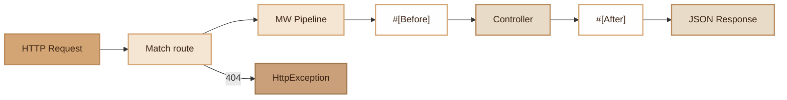

# Router

> HTTP router with support for groups, middlewares, dynamic parameters, DTO validation and Before/After events.

## Overview

The `Router` is the central component of HTTP dispatch in Fennec. It registers routes
(GET, POST, PUT, DELETE, PATCH), organizes them into groups with common prefixes and middlewares,
and resolves incoming requests via regex matching.

During dispatch, the router builds a middleware pipeline (global + route), instantiates
the controller via the DI Container, resolves method arguments (URL parameters, DTOs with
automatic validation), and triggers `#[Before]` and `#[After]` events.

Route caching (via `cache:routes`) allows pre-compiling regex for production.

`ReflectionMethod` and `ReflectionClass` instances are cached in static LRU arrays (max 200 entries per cache, with eviction). This reduces the 5-6 Reflection instantiations per request to 1-2 cache misses after warm-up.

## Diagram



## Public API

### `__construct(?Container $container = null)`

Creates a router with optional dependency injection.

```php
$router = new Router($container);
```

### `get(string $path, array $action, ?array $middleware = null): void`

Registers a GET route.

```php
$router->get('/api/users', [UserController::class, 'index']);
```

### `post(string $path, array $action, ?array $middleware = null): void`

Registers a POST route.

```php
$router->post('/api/users', [UserController::class, 'store']);
```

### `put(string $path, array $action, ?array $middleware = null): void`

Registers a PUT route.

```php
$router->put('/api/users/{id}', [UserController::class, 'update']);
```

### `delete(string $path, array $action, ?array $middleware = null): void`

Registers a DELETE route.

```php
$router->delete('/api/users/{id}', [UserController::class, 'destroy']);
```

### `patch(string $path, array $action, ?array $middleware = null): void`

Registers a PATCH route.

```php
$router->patch('/api/users/{id}', [UserController::class, 'patch']);
```

### `group(array $options, callable $callback): void`

Route group with common prefix and/or middlewares. Supports nesting.

```php
$router->group(['prefix' => '/api/admin', 'middleware' => [AuthMiddleware::class]], function ($r) {
    $r->get('/dashboard', [AdminController::class, 'dashboard']);
    $r->get('/users', [AdminController::class, 'users']);
});
```

### `addGlobalMiddleware(string $class, mixed $params = null): void`

Adds a middleware executed on all routes.

```php
$router->addGlobalMiddleware(CorsMiddleware::class);
```

### `dispatch(string $method, string $uri): void`

Resolves and executes the matching route. Throws `HttpException(404)` if no route matches.

### `getRoutes(): array`

Returns the raw list of registered routes.

### `getCurrent(): ?self`

Returns the current router instance (static).

### `clearReflectionCache(): void`

Clears the static `ReflectionMethod` and `ReflectionClass` caches. Useful for cleanup in worker mode or tests.

```php
Router::clearReflectionCache();
```

## PHP 8 Attributes

### `#[Before(handler: string)]`

Executes a handler before the controller action. The handler must implement `EventHandlerInterface`.
Repeatable: multiple `#[Before]` can be stacked.

```php
#[Before(handler: LogAccessHandler::class)]
public function sensitiveAction(): array { /* ... */ }
```

### `#[After(handler: string)]`

Executes a handler after the controller action, with access to the result.

```php
#[After(handler: CacheResultHandler::class)]
public function expensiveQuery(): array { /* ... */ }
```

## Argument Resolution

The router automatically resolves controller method arguments:

1. **URL parameters**: `{id}` in the path -> argument `$id`
2. **DTOs**: parameter typed with a class -> hydrated from JSON/form/query body
3. **Validation**: validation attributes (`#[Required]`, `#[Email]`, etc.) are automatically checked
4. **Default/null**: default values or null if available

## CLI Commands

| Command | Description |
|---|---|
| `cache:routes` | Pre-compile routes to cache (pre-computed regex) |

## Integration with other modules

- **Container**: controller and middleware resolution by autowiring
- **MiddlewarePipeline**: chained execution of global and route middlewares
- **Validator**: automatic DTO validation in `resolveMethodArgs()`
- **Request/Response**: creates a `Request` for the pipeline, `Response::json()` for output
- **HttpException**: thrown for 404 (route not found) and 422 (validation failed)
- **Cache\RouteCache**: pre-compiled routes loaded at dispatch
- **Profiler**: middleware execution time measurement

## Full Example

```php
// app/Routes/api.php
$router->addGlobalMiddleware(\Fennec\Core\Middleware\CorsMiddleware::class);

$router->group([
    'prefix' => '/api',
    'description' => 'Public API',
], function ($r) {
    $r->get('/products', [ProductController::class, 'index']);
    $r->post('/products', [ProductController::class, 'store'], [AuthMiddleware::class]);

    $r->group([
        'prefix' => '/admin',
        'middleware' => [[AuthMiddleware::class, ['admin']]],
    ], function ($r) {
        $r->get('/stats', [AdminController::class, 'stats']);
        $r->delete('/users/{id}', [AdminController::class, 'deleteUser']);
    });
});
```

## Module Files

| File | Role | Last Modified |
|---|---|---|
| `src/Core/Router.php` | Main router | 2026-03-22 |
| `src/Core/MiddlewarePipeline.php` | Middleware pipeline | 2026-03-21 |
| `src/Attributes/Before.php` | #[Before] attribute | 2026-03-21 |
| `src/Attributes/After.php` | #[After] attribute | 2026-03-21 |
| `src/Commands/CacheRoutesCommand.php` | cache:routes command | 2026-03-21 |
