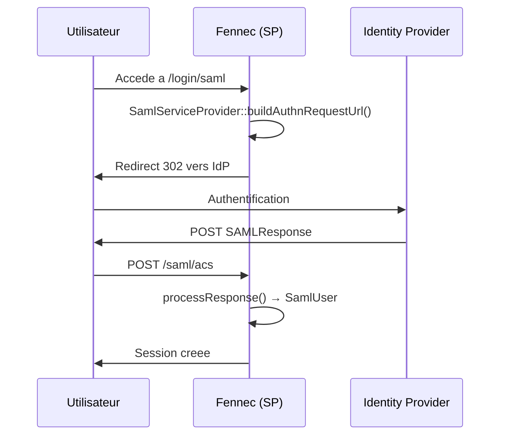

# SAML 2.0

> Service Provider SAML 2.0 natif pour l'authentification SSO d'entreprise (Active Directory, Okta, Azure AD, Keycloak...).

## Vue d'ensemble

Le module SAML fournit une implementation legere de Service Provider (SP) SAML 2.0, sans aucune dependance externe. Il utilise les extensions PHP natives `ext-dom` et `ext-openssl` pour le parsing XML et la verification des signatures cryptographiques.

Cas d'usage principal : connecter une application Fennec a un Identity Provider (IdP) d'entreprise pour du Single Sign-On (SSO).

Le module gere :
- Generation de `AuthnRequest` (HTTP-Redirect binding)
- Validation de `SAMLResponse` (HTTP-POST binding) avec verification de signature XML
- Generation de metadata SP pour l'auto-configuration de l'IdP
- Single Logout (SLO) via HTTP-Redirect

## Diagramme



## API publique

### SamlConfig (configuration)

```php
// Depuis les variables d'environnement
$config = SamlConfig::fromEnv();

// Depuis un tableau (tests, config dynamique)
$config = SamlConfig::fromArray([
    'sp_entity_id'   => 'https://myapp.com',
    'sp_acs_url'     => 'https://myapp.com/saml/acs',
    'idp_entity_id'  => 'https://idp.example.com',
    'idp_sso_url'    => 'https://idp.example.com/sso',
    'idp_certificate' => file_get_contents('/path/to/idp-cert.pem'),
]);
```

### SamlServiceProvider

```php
$sp = new SamlServiceProvider($config);

// 1. Rediriger vers l'IdP
$result = $sp->buildAuthnRequestUrl('/dashboard');
// => ['url' => 'https://idp.../sso?SAMLRequest=...', 'id' => '_abc123']
$_SESSION['saml_request_id'] = $result['id'];
header('Location: ' . $result['url']);

// 2. Traiter la reponse (callback POST)
$user = $sp->processResponse($_POST['SAMLResponse'], $_SESSION['saml_request_id']);
// => SamlUser

// 3. Generer les metadata SP (pour l'IdP)
$metadata = $sp->generateMetadata();
// => XML EntityDescriptor

// 4. Single Logout
$result = $sp->buildLogoutRequestUrl($user->nameId, $user->sessionIndex);
header('Location: ' . $result['url']);
```

### SamlResponse (validation)

Utilise en interne par `processResponse()`. Validations effectuees :
- **StatusCode** — doit etre `Success`
- **Destination** — doit correspondre a l'ACS URL du SP
- **InResponseTo** — doit correspondre a l'ID de l'AuthnRequest original
- **Signature XML** — RSA-SHA1, RSA-SHA256, RSA-SHA384, RSA-SHA512
- **Digest** — verification de l'integrite du contenu signe
- **Conditions** — NotBefore, NotOnOrAfter (2 min de tolerance), AudienceRestriction
- **NameID** — extraction obligatoire

### SamlUser (value object)

```php
$user->nameId;        // string — identifiant SAML (souvent l'email)
$user->nameIdFormat;  // ?string — format (emailAddress, persistent, etc.)
$user->sessionIndex;  // ?string — index de session (pour SLO)
$user->email;         // ?string — extrait automatiquement des attributs
$user->firstName;     // ?string — prenom
$user->lastName;      // ?string — nom
$user->displayName;   // ?string — nom complet
$user->attributes;    // array<string, string[]> — tous les attributs SAML

// Convertir en OAuthUser pour un traitement unifie OAuth/OIDC/SAML
$oauthUser = $user->toOAuthUser();
```

L'extraction des attributs supporte les schemas courants :
- **OASIS** : `http://schemas.xmlsoap.org/ws/2005/05/identity/claims/emailaddress`
- **OID** : `urn:oid:0.9.2342.19200300.100.1.3`
- **Simple** : `email`, `mail`, `givenName`, `sn`, `displayName`, `cn`

### SamlException

Toutes les erreurs SAML levent une `SamlException` avec un message prefixe `[SAML]` :

```php
try {
    $user = $sp->processResponse($samlResponse);
} catch (SamlException $e) {
    // "[SAML] XML signature verification failed"
    // "[SAML] Assertion has expired"
    // "[SAML] Audience restriction does not include our entity ID"
}
```

## Configuration

| Variable | Default | Description |
|---|---|---|
| `SAML_SP_ENTITY_ID` | — | Entity ID du SP (URL de l'application, obligatoire) |
| `SAML_SP_ACS_URL` | — | Assertion Consumer Service URL (obligatoire) |
| `SAML_SP_SLO_URL` | — | Single Logout URL (optionnel) |
| `SAML_SP_PRIVATE_KEY` | — | Cle privee PEM du SP (pour signer les requetes, optionnel) |
| `SAML_SP_CERTIFICATE` | — | Certificat PEM du SP (pour le chiffrement, optionnel) |
| `SAML_IDP_ENTITY_ID` | — | Entity ID de l'IdP |
| `SAML_IDP_SSO_URL` | — | URL SSO de l'IdP (HTTP-Redirect) |
| `SAML_IDP_SLO_URL` | — | URL SLO de l'IdP (optionnel) |
| `SAML_IDP_CERTIFICATE` | — | Certificat X.509 PEM de l'IdP (pour verifier les signatures) |
| `SAML_WANT_SIGNED` | `true` | Exiger la signature des assertions |

Les variables `SAML_SP_PRIVATE_KEY`, `SAML_SP_CERTIFICATE` et `SAML_IDP_CERTIFICATE` acceptent :
- Du PEM inline (`-----BEGIN CERTIFICATE-----\n...`)
- Un chemin vers un fichier PEM (`/etc/saml/idp.pem`)

## Integration avec d'autres modules

- **OAuth/OIDC** : `SamlUser::toOAuthUser()` unifie le traitement avec OAuth et OIDC
- **Auth/JWT** : apres authentification SAML, generer un JWT local via `JwtService`
- **SecurityLogger** : tracer les connexions SAML dans les logs de securite

## Exemple complet

```php
use Fennec\Core\Saml\SamlConfig;
use Fennec\Core\Saml\SamlException;
use Fennec\Core\Saml\SamlServiceProvider;

class SamlController
{
    private SamlServiceProvider $sp;

    public function __construct()
    {
        $this->sp = new SamlServiceProvider(SamlConfig::fromEnv());
    }

    // Etape 1 : redirection vers l'IdP
    public function login(): void
    {
        $result = $this->sp->buildAuthnRequestUrl('/dashboard');
        $_SESSION['saml_request_id'] = $result['id'];
        header('Location: ' . $result['url']);
        exit;
    }

    // Etape 2 : callback POST (ACS)
    public function acs(): array
    {
        try {
            $user = $this->sp->processResponse(
                $_POST['SAMLResponse'],
                $_SESSION['saml_request_id'] ?? null
            );
        } catch (SamlException $e) {
            return ['error' => $e->getMessage()];
        }

        // Creer ou retrouver l'utilisateur local
        $localUser = User::firstOrCreate(
            ['email' => $user->email],
            ['name' => $user->displayName ?? $user->firstName . ' ' . $user->lastName]
        );

        // Generer un JWT pour les requetes suivantes
        $jwt = new JwtService();
        $token = $jwt->generateAccessToken($localUser->email);

        return ['token' => $token['token']];
    }

    // Metadata SP (pour configurer l'IdP)
    public function metadata(): string
    {
        header('Content-Type: application/xml');
        return $this->sp->generateMetadata();
    }
}
```

## Architecture interne

```
SamlConfig
├── fromEnv()       → charge depuis .env
├── fromArray()     → charge depuis un tableau
└── loadPem()       → inline PEM ou chemin fichier

SamlServiceProvider
├── buildAuthnRequestUrl()  → AuthnRequest XML → deflate → base64 → redirect
├── processResponse()       → SamlResponse → validate → SamlUser
├── generateMetadata()      → XML EntityDescriptor
└── buildLogoutRequestUrl() → LogoutRequest XML → redirect

SamlResponse
├── validateStatus()        → StatusCode = Success
├── validateDestination()   → Destination = ACS URL
├── validateInResponseTo()  → InResponseTo = AuthnRequest ID
├── validateSignature()     → RSA + digest verification
├── validateConditions()    → NotBefore, NotOnOrAfter, Audience
└── extractUser()           → NameID + attributes → SamlUser

SamlUser
├── fromAssertion()         → parsing attributs multi-schema
└── toOAuthUser()           → conversion vers OAuthUser unifie
```

## Fichiers du module

| Fichier | Role | Derniere modif |
|---|---|---|
| `src/Core/Saml/SamlServiceProvider.php` | SP principal (AuthnRequest, processResponse, metadata, SLO) | 2026-03-31 |
| `src/Core/Saml/SamlResponse.php` | Parse et valide les reponses SAML (XML, signature, conditions) | 2026-03-31 |
| `src/Core/Saml/SamlConfig.php` | Configuration SP/IdP (env ou tableau) | 2026-03-31 |
| `src/Core/Saml/SamlUser.php` | Value object utilisateur SAML avec mapping multi-schema | 2026-03-31 |
| `src/Core/Saml/SamlException.php` | Exception dediee SAML | 2026-03-31 |
| `tests/Unit/SamlTest.php` | 25 tests (config, user, SP, response validation) | 2026-03-31 |
