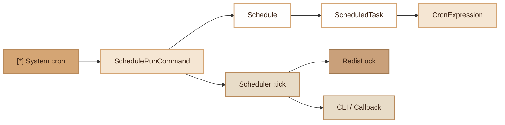

# Scheduler
> Cron expression-based task scheduler with anti-overlap protection via Redis.

## Overview

The Scheduler module allows defining and executing scheduled tasks declaratively. It supports complete cron expressions (minute, hour, day of month, month, day of week), fluent shortcuts (`daily()`, `hourly()`, etc.), and protection against simultaneous execution via a distributed Redis lock.

Tasks are defined in `app/Schedule.php` and executed via the `./forge schedule:run` command. In production, a system cron calls this command every minute.

## Diagram



## Public API

### Schedule

Central registry of scheduled tasks.

```php
use Fennec\Core\Scheduler\Schedule;

$schedule = new Schedule();

// Schedule a callback
$schedule->call(fn () => cleanupExpiredTokens())
    ->name('cleanup:tokens')
    ->daily();

// Schedule a Fennec CLI command
$schedule->command('cache:clear')
    ->name('cache:daily-clear')
    ->dailyAt('03:00');

// Schedule a class method
$schedule->call([App\Jobs\ReportGenerator::class, 'handle'])
    ->name('reports:generate')
    ->weekly();

// Get all tasks
$tasks = $schedule->getTasks(); // ScheduledTask[]
```

### ScheduledTask

Fluent object representing a scheduled task with its cron expression.

```php
$task = $schedule->call($callback)
    ->name('my-task')              // Human-readable name
    ->cron('*/5 * * * *')           // Raw cron expression
    ->withoutOverlapping(1800);     // Anti-overlap lock (TTL in seconds)

// Frequency shortcuts
$task->everyMinute();               // * * * * *
$task->everyFiveMinutes();          // */5 * * * *
$task->everyTenMinutes();           // */10 * * * *
$task->everyFifteenMinutes();       // */15 * * * *
$task->everyThirtyMinutes();        // */30 * * * *
$task->hourly();                    // 0 * * * *
$task->daily();                     // 0 0 * * *
$task->dailyAt('14:30');            // 30 14 * * *
$task->weekly();                    // 0 0 * * 0
$task->weekdays();                  // 0 0 * * 1-5
$task->monthly();                   // 0 0 1 * *

// Check if the task is due
$task->isDue(new \DateTimeImmutable()); // bool
```

### CronExpression

Standard 5-field cron expression parser.

```php
use Fennec\Core\Scheduler\CronExpression;

// Format: minute hour day-of-month month day-of-week
CronExpression::isDue('*/5 * * * *', new \DateTimeImmutable());  // bool
CronExpression::isDue('0 9 * * 1-5', new \DateTimeImmutable());  // Mon-Fri at 9am

// Supported syntax:
// *        — all
// 5        — exact value
// 1,3,5    — list
// 1-5      — range
// */5      — step
// 1-30/5   — range with step
```

### Scheduler

Execution engine with throttle (minimum 60s between two ticks) and distributed lock.

```php
use Fennec\Core\Scheduler\Scheduler;
use Fennec\Core\Redis\RedisLock;

$lock = RedisLock::fromEnv();        // optional
$scheduler = new Scheduler($lock);

// Execute due tasks
$scheduler->tick($schedule);
```

### ScheduleRunCommand

CLI command `schedule:run` that loads `app/Schedule.php` and runs the scheduler.

```bash
./forge schedule:run
```

## Configuration

| Element | Description |
|---|---|
| `app/Schedule.php` | Task definition file (returns a callable) |
| `REDIS_HOST` | Required for anti-overlap lock |
| System cron | `* * * * * ./forge schedule:run >> /dev/null 2>&1` |

The scheduler works without Redis (lockless mode), but `withoutOverlapping()` protection requires Redis to be effective.

## Integration with other modules

- **Redis (RedisLock)**: distributed lock for `withoutOverlapping()`, prevents simultaneous execution in multi-instance
- **CLI**: `schedule:command()` executes Fennec commands via `./forge <command>`
- **Queue**: can schedule `queue:work` or other processing commands
- **Cache**: can schedule `cache:clear` for periodic cleanup

## Full Example

File `app/Schedule.php`:

```php
<?php

use Fennec\Core\Scheduler\Schedule;

return function (Schedule $schedule): void {
    // Heartbeat every 5 minutes
    $schedule->call(fn () => file_put_contents('/tmp/heartbeat', date('c')))
        ->name('heartbeat')
        ->everyFiveMinutes();

    // Queue processing every minute (without overlap)
    $schedule->command('queue:work')
        ->name('process-queue')
        ->everyMinute()
        ->withoutOverlapping(300);

    // Daily cleanup at 3am
    $schedule->call([App\Jobs\CleanupExpiredTokens::class, 'handle'])
        ->name('cleanup:tokens')
        ->dailyAt('03:00')
        ->withoutOverlapping();

    // Monthly audit log purge
    $schedule->command('audit:purge')
        ->name('audit:monthly-purge')
        ->monthly();
};
```

System cron (production):

```bash
* * * * * cd /var/www/app && ./forge schedule:run >> /dev/null 2>&1
```

## Module Files

| File | Description |
|---|---|
| `src/Core/Scheduler/Schedule.php` | Scheduled task registry |
| `src/Core/Scheduler/ScheduledTask.php` | Scheduled task (fluent API) |
| `src/Core/Scheduler/CronExpression.php` | Cron expression parser |
| `src/Core/Scheduler/Scheduler.php` | Execution engine with throttle and lock |
| `src/Commands/ScheduleRunCommand.php` | CLI `schedule:run` command |
| `app/Schedule.php` | User task definition file |
