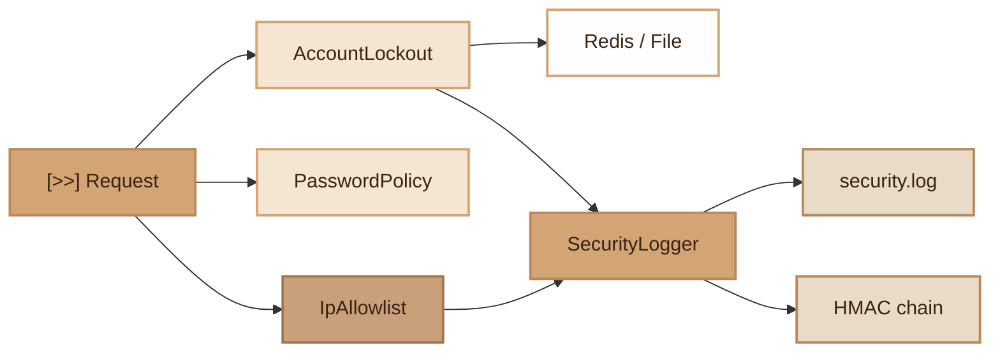

# Security
> Complete security module: password policy, account lockout, secure logging and IP filtering.

## Overview

The Security module implements security controls compliant with ISO 27001 and SOC 2 standards. It includes four main components:

- **PasswordPolicy**: password strength validation with score and blacklist (ISO 27001 A.8.5)
- **AccountLockout**: temporary lockout after N failed attempts, with Redis or file storage (ISO 27001 A.8.5)
- **SecurityLogger**: dedicated Monolog channel for security events with HMAC integrity chain (ISO 27001 A.8.15, SOC 2)
- **IpAllowlistMiddleware**: access restriction by IP address or CIDR range (ISO 27001 A.8.5)

All components are designed for FrankenPHP worker mode: bounded caches with LRU eviction, automatic purge of expired entries, and state reset between requests.

## Diagram



## Public API

### PasswordPolicy

Static password strength validation.

```php
use Fennec\Core\Security\PasswordPolicy;

// Validate a password — returns an array of errors (empty = valid)
$errors = PasswordPolicy::validate('MyP@ss123!');
// []

$errors = PasswordPolicy::validate('weak');
// [
//   'Password must contain at least 12 characters',
//   'Password must contain at least one uppercase letter',
//   'Password must contain at least one special character',
// ]

// Validate and throw an exception if invalid
PasswordPolicy::assertValid('weak');
// RuntimeException: Password must contain at least 12 characters. ...

// Strength score (0-5)
$score = PasswordPolicy::strength('MyP@ss123!'); // 5
```

**Validation rules:**

| Rule | Description |
|---|---|
| Minimum length | Configurable via `PASSWORD_MIN_LENGTH` (default: 12) |
| Uppercase | At least one uppercase letter |
| Lowercase | At least one lowercase letter |
| Digit | At least one digit |
| Special character | At least one non-alphanumeric character |
| Blacklist | Common forbidden passwords (password, azerty, etc.) |

### AccountLockout

Account lockout after failed attempts. Redis storage (production) or file (fallback).

```php
use Fennec\Core\Security\AccountLockout;

// Check if an account is locked
if (AccountLockout::isLocked('user@example.com')) {
    $remaining = AccountLockout::remainingLockout('user@example.com');
    throw new \RuntimeException("Account locked. Retry in {$remaining}s");
}

// Record a failed attempt
AccountLockout::recordFailure('user@example.com');

// Number of attempts
$attempts = AccountLockout::attempts('user@example.com'); // int

// Reset after successful login
AccountLockout::reset('user@example.com');

// List all locked accounts
$locked = AccountLockout::locked();
// ['user@example.com' => ['attempts' => 5, 'locked_until' => 1711100000, 'remaining' => 450]]

// Worker cache management
AccountLockout::cacheSize();           // int
AccountLockout::setMaxCacheSize(1000); // max LRU cache size
AccountLockout::purgeExpired();        // manual purge of expired entries
AccountLockout::flush();               // complete reset (tests)
```

### SecurityLogger

Dedicated Monolog channel for security events with HMAC integrity chain.

```php
use Fennec\Core\Security\SecurityLogger;

// Critical event (auth fail, unauthorized access)
SecurityLogger::alert('auth.failed', [
    'email' => 'user@example.com',
    'ip' => '192.168.1.100',
]);

// Informational event (token revoked, password changed)
SecurityLogger::track('token.revoked', [
    'user_id' => 42,
    'reason' => 'password_change',
]);

// Critical event (intrusion, brute force)
SecurityLogger::critical('brute_force.detected', [
    'ip' => '10.0.0.1',
    'attempts' => 100,
]);

// Inter-request state reset (worker mode)
SecurityLogger::resetRequestState();

// Inject a custom logger (tests)
SecurityLogger::setInstance($mockLogger);
```

**Automatic context enrichment:**

Each log entry is enriched with: `request_id`, `ip`, `uri`, `method`, `user`, `timestamp`, and a chained SHA-256 HMAC (each entry includes the hash of the previous one).

### IpAllowlistMiddleware

IP address restriction middleware with CIDR support.

```php
use Fennec\Middleware\IpAllowlistMiddleware;

// Register on a route group
$router->group(['middleware' => [[IpAllowlistMiddleware::class]]], function ($router) {
    $router->get('/admin', [AdminController::class, 'index']);
});
```

The middleware is **opt-in**: if `IP_ALLOWLIST` is not configured, all requests pass. Blocked IPs are logged via `SecurityLogger::alert()`.

## Configuration

| Variable | Description | Default |
|---|---|---|
| `PASSWORD_MIN_LENGTH` | Minimum password length | `12` |
| `LOCKOUT_MAX_ATTEMPTS` | Attempts before lockout | `5` |
| `LOCKOUT_DURATION` | Lockout duration (seconds) | `900` (15 min) |
| `IP_ALLOWLIST` | Allowed IPs (comma-separated, supports CIDR) | empty (all allowed) |
| `REDIS_HOST` | Redis host for AccountLockout | — |
| `REDIS_PORT` | Redis port | `6379` |
| `REDIS_PASSWORD` | Redis password | — |
| `REDIS_DB` | Redis database | `0` |
| `REDIS_PREFIX` | Redis key prefix | `app:` |
| `SECRET_KEY` | HMAC key for SecurityLogger integrity chain | `fennec-default` |
| `LOG_MASK_FIELDS` | Additional fields to mask in logs | — |

## Integration with other modules

- **Logging (LogMaskingProcessor)**: SecurityLogger automatically applies sensitive data masking
- **Redis**: storage for failed login attempts and locks
- **Middleware**: IpAllowlistMiddleware integrates into the standard HTTP pipeline
- **AccountLockout** to **SecurityLogger**: an `account.locked` event is automatically logged when an account is locked
- **Admin UI**: the dashboard displays security events and locked accounts

## Full Example

```php
// Authentication middleware using all 3 components
use Fennec\Core\Security\AccountLockout;
use Fennec\Core\Security\PasswordPolicy;
use Fennec\Core\Security\SecurityLogger;

function login(string $email, string $password): array
{
    // 1. Check lockout
    if (AccountLockout::isLocked($email)) {
        $remaining = AccountLockout::remainingLockout($email);
        SecurityLogger::alert('auth.locked_attempt', ['email' => $email]);
        throw new \RuntimeException("Account locked ({$remaining}s remaining)");
    }

    // 2. Verify credentials
    $user = User::findByEmail($email);
    if (!$user || !password_verify($password, $user->password)) {
        AccountLockout::recordFailure($email);
        SecurityLogger::alert('auth.failed', ['email' => $email]);
        throw new \RuntimeException('Invalid credentials');
    }

    // 3. Reset lockout after success
    AccountLockout::reset($email);
    SecurityLogger::track('auth.success', ['user_id' => $user->id]);

    return ['token' => generateJwt($user)];
}

// Password change with validation
function changePassword(int $userId, string $newPassword): void
{
    // Validate password policy
    PasswordPolicy::assertValid($newPassword);

    $user = User::find($userId);
    $user->password = Hash::make($newPassword);
    $user->save();

    SecurityLogger::track('password.changed', ['user_id' => $userId]);
}
```

## Password Hashing (Hash Facade)

The `Hash` class provides configurable password hashing via environment variables.

### Configuration (.env)

```env
# Algorithm: bcrypt | argon2i | argon2id (default: bcrypt)
PASSWORD_HASH_ALGO=bcrypt

# Bcrypt cost (4-31, default: 12)
PASSWORD_HASH_COST=12

# Argon2 options (only used when algo is argon2i or argon2id)
PASSWORD_HASH_MEMORY=65536    # Memory cost in KB
PASSWORD_HASH_TIME=4          # Time cost (iterations)
PASSWORD_HASH_THREADS=1       # Parallelism
```

### Usage

```php
use Fennec\Core\Security\Hash;

// Hash a password
$hash = Hash::make($password);

// Verify a password
if (Hash::verify($password, $user->password)) {
    // Transparent rehash when algorithm or cost changes
    if (Hash::needsRehash($user->password)) {
        $user->update(['password' => Hash::make($password)]);
    }
}

// Check current algorithm
Hash::algorithmName(); // 'bcrypt', 'argon2i', or 'argon2id'
```

### Migrating algorithms

Changing `PASSWORD_HASH_ALGO` in `.env` is safe: existing passwords continue to verify (PHP's `password_verify` is algorithm-agnostic). Old hashes are automatically upgraded to the new algorithm on next successful login via `Hash::needsRehash()`.

## Module Files

| File | Description |
|---|---|
| `src/Core/Security/Hash.php` | Configurable password hashing facade |
| `src/Core/Security/PasswordPolicy.php` | Password strength validation |
| `src/Core/Security/AccountLockout.php` | Account lockout with Redis/file |
| `src/Core/Security/SecurityLogger.php` | Secure Monolog channel with HMAC chain |
| `src/Middleware/IpAllowlistMiddleware.php` | IP/CIDR filtering middleware |
