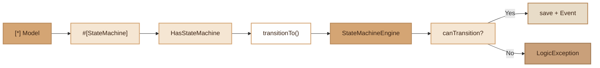

# State Machine

> Declarative state machine engine via PHP 8 attribute, with validated transitions, automatic persistence and events.

## Overview

The State Machine module allows defining state workflows directly on Models via the `#[StateMachine]` attribute. Transitions are declared as `"from->to"` strings, validated at runtime, and each successful transition triggers events consumable by the framework's Event system.

The engine uses a bounded static cache (LRU, 200 entries max) to avoid re-reading reflection attributes on each call, making it compatible with FrankenPHP worker mode.

## Diagram



## Public API

### Trait `HasStateMachine`

The trait is added to a Model decorated with `#[StateMachine]`.

```php
use Fennec\Attributes\StateMachine;
use Fennec\Core\StateMachine\HasStateMachine;

#[StateMachine(column: 'status', transitions: ['draft->pending', 'pending->approved', 'pending->rejected'])]
class Order extends Model
{
    use HasStateMachine;
}
```

#### `transitionTo(string $state): static`

Performs the transition to the target state. Validates the transition, updates the column, saves the model and dispatches events. Throws a `LogicException` if the transition is invalid.

```php
$order->transitionTo('pending'); // draft -> pending
```

#### `canTransitionTo(string $state): bool`

Checks if the transition is allowed from the current state, without modifying the model.

```php
if ($order->canTransitionTo('approved')) {
    $order->transitionTo('approved');
}
```

#### `currentState(): string`

Returns the current value of the state column.

```php
$order->currentState(); // 'pending'
```

#### `availableTransitions(): array`

Returns the list of reachable states from the current state.

```php
$order->availableTransitions(); // ['approved', 'rejected']
```

### Class `StateMachineEngine`

The internal engine that resolves transitions. Rarely used directly.

#### `StateMachineEngine::clearCache(): void`

Clears the configuration cache (useful in tests or worker reset).

#### `StateMachineEngine::cacheSize(): int`

Returns the number of entries in the cache.

## Events

Each successful transition dispatches two events via `Event::dispatch()`:

| Event | Payload |
|---|---|
| `{ClassName}.transition` | `['model' => $model, 'from' => string, 'to' => string]` |
| `{ClassName}.transition.{from}.{to}` | `$model` |

Listening example:

```php
use Fennec\Attributes\Listener;

#[Listener('App\Models\Order.transition')]
class OrderTransitionListener
{
    public function handle(array $data): void
    {
        // $data['model'], $data['from'], $data['to']
    }
}

#[Listener('App\Models\Order.transition.pending.approved')]
class OrderApprovedListener
{
    public function handle(Order $order): void
    {
        // Logic specific to this transition
    }
}
```

## PHP 8 Attributes

### `#[StateMachine]`

- **Target**: `Attribute::TARGET_CLASS`
- **Namespace**: `Fennec\Attributes\StateMachine`

| Parameter | Type | Default | Description |
|---|---|---|---|
| `column` | `string` | `'status'` | Model column containing the state |
| `transitions` | `string[]` | `[]` | Transitions in `"from->to"` format |

Transitions are parsed into an internal `$parsed` map: `['draft' => ['pending'], 'pending' => ['approved', 'rejected']]`.

## Integration with other modules

- **Event**: Each transition dispatches events capturable by `#[Listener]`.
- **Audit Trail**: If the model uses `#[Auditable]` + `HasAuditTrail`, the state column update is automatically audited.
- **Worker**: Cache bounded to 200 entries with FIFO eviction. `clearCache()` method available for worker reset.

## Full Example

```php
use Fennec\Attributes\StateMachine;
use Fennec\Attributes\Table;
use Fennec\Core\Model;
use Fennec\Core\StateMachine\HasStateMachine;

#[Table('tickets')]
#[StateMachine(column: 'status', transitions: [
    'open->in_progress',
    'in_progress->resolved',
    'in_progress->open',
    'resolved->closed',
    'resolved->open',
])]
class Ticket extends Model
{
    use HasStateMachine;
}

// Usage
$ticket = Ticket::find(1);

echo $ticket->currentState();            // 'open'
echo $ticket->canTransitionTo('closed'); // false
echo $ticket->canTransitionTo('in_progress'); // true

$ticket->transitionTo('in_progress');    // Save + event
$ticket->availableTransitions();          // ['resolved', 'open']

try {
    $ticket->transitionTo('closed');     // LogicException
} catch (\LogicException $e) {
    echo $e->getMessage();
    // "Invalid transition: in_progress -> closed on App\Models\Ticket"
}
```

## Module Files

| File | Role |
|---|---|
| `src/Attributes/StateMachine.php` | Declarative PHP 8 attribute |
| `src/Core/StateMachine/HasStateMachine.php` | Trait to use on Models |
| `src/Core/StateMachine/StateMachineEngine.php` | Transition resolution engine |
