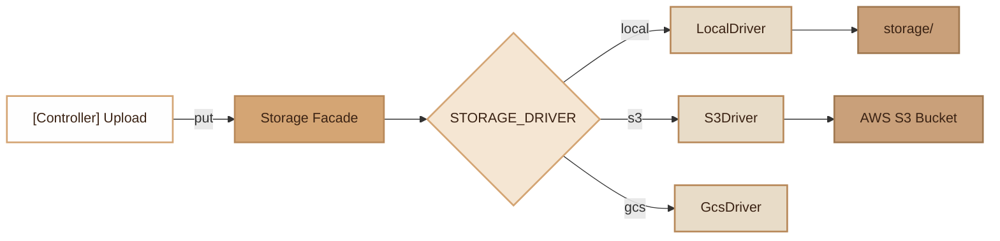

# Storage

> Multi-driver file storage abstraction (local, S3, GCS) with static facade and built-in upload.

## Overview

The Storage module provides a unified interface for manipulating files regardless of the storage backend. Three drivers are available: **local** (filesystem), **Amazon S3** and **Google Cloud Storage**. The driver choice is made via the `STORAGE_DRIVER` environment variable.

The `Storage` class exposes a static facade (singleton) that delegates all operations to the active driver. `Storage` is **lazy-initialized**: it is not instantiated at `App` boot, but only on first call. All facade methods (`put`, `get`, `exists`, etc.) auto-resolve the instance via `getInstance()` which queries the Container if the instance is null.

The `#[FileUpload]` attribute allows documenting upload endpoints in the automatically generated OpenAPI.

## Diagram



## Public API

### Static Facade `Storage`

All methods are static and delegate to the configured driver.

```php
// Write a file
Storage::put('avatars/photo.jpg', $contents);

// Read a file
$data = Storage::get('avatars/photo.jpg');

// Check existence
if (Storage::exists('avatars/photo.jpg')) { ... }

// Delete a file
Storage::delete('avatars/photo.jpg');

// Get the public URL
$url = Storage::url('avatars/photo.jpg');

// Copy / move
Storage::copy('source.txt', 'dest.txt');
Storage::move('old.txt', 'new.txt');

// Size in bytes
$size = Storage::size('document.pdf');

// List files in a directory
$files = Storage::files('avatars');

// Absolute path (local only, null for S3/GCS)
$abs = Storage::absolutePath('avatars/photo.jpg');

// Access the underlying driver
$driver = Storage::driver();
```

### Initialization

```php
// Initialize with the desired driver
$storage = Storage::withDriver('s3');
Storage::setInstance($storage);

// Or via env: STORAGE_DRIVER=local|s3|gcs
$storage = Storage::withDriver($_ENV['STORAGE_DRIVER'] ?? 'local');
Storage::setInstance($storage);
```

### Temporary URLs (S3 and GCS only)

```php
// S3: pre-signed URL valid for 1 hour
$url = Storage::driver()->temporaryUrl('docs/invoice.pdf', 3600);

// S3: pre-signed URL for direct upload
$url = Storage::driver()->temporaryUrl('uploads/file.zip', 3600, 'PutObject');

// GCS: signed URL valid for 1 hour
$url = Storage::driver()->temporaryUrl('docs/invoice.pdf', 3600);
```

### Interface `StorageDriverInterface`

Each driver implements the following methods:

| Method | Return | Description |
|---|---|---|
| `put(path, contents)` | `bool` | Store a file |
| `get(path)` | `?string` | Read contents (null if absent) |
| `exists(path)` | `bool` | Check existence |
| `delete(path)` | `bool` | Delete a file |
| `url(path)` | `string` | Public URL |
| `copy(from, to)` | `bool` | Copy a file |
| `move(from, to)` | `bool` | Move a file |
| `size(path)` | `?int` | Size in bytes |
| `files(directory)` | `array` | List files |
| `absolutePath(path)` | `?string` | Absolute path (local only) |

## Configuration

| Variable | Default | Description |
|---|---|---|
| `STORAGE_DRIVER` | `local` | Active driver: `local`, `s3`, `gcs` |
| `APP_URL` | `''` | Base URL for public URLs (local) |
| `S3_KEY` | `''` | AWS access key |
| `S3_SECRET` | `''` | AWS secret |
| `S3_REGION` | `eu-west-3` | AWS region |
| `S3_BUCKET` | `''` | S3 bucket name |
| `S3_ENDPOINT` | `null` | Custom endpoint (MinIO, etc.) |
| `S3_PREFIX` | `''` | Path prefix in the bucket |
| `S3_URL` | `null` | Custom URL for public files (CDN) |
| `GCS_BUCKET` | `''` | GCS bucket name |
| `GCS_PREFIX` | `''` | Path prefix in the bucket |
| `GCS_PROJECT` | `null` | Project ID (optional if Workload Identity) |
| `GCS_KEY_FILE` | `null` | Service key file path |
| `GCS_URL` | `https://storage.googleapis.com/<bucket>` | Custom public URL (CDN) |

## PHP 8 Attributes

### `#[FileUpload]`

Method attribute for documenting an upload endpoint in OpenAPI.

```php
#[FileUpload(field: 'file', description: 'File to upload (max 10 MB)', maxSize: 10485760)]
public function upload(): FileUploadResponse
```

| Parameter | Type | Default | Description |
|---|---|---|---|
| `field` | `string` | `'file'` | Multipart field name |
| `description` | `string` | `'File to upload'` | OpenAPI description |
| `maxSize` | `int` | `10485760` | Max size in bytes (10 MB) |

## CLI Commands

### `storage:link`

Creates the symbolic link `public/storage` to `storage/` to make local files accessible via HTTP.

```bash
./forge storage:link
```

Compatible with Windows (uses `mklink /D` with admin rights or developer mode).

## Integration with other modules

- **Controllers**: the `#[FileUpload]` attribute generates multipart/form-data OpenAPI documentation
- **ImageTransformer**: uses `Storage::absolutePath()` to access local files
- **Webhooks**: files can be referenced in webhook payloads

## Full Example

```php
// Upload controller with validation
class AvatarController
{
    #[FileUpload(field: 'avatar', description: 'Profile photo')]
    public function upload(): FileUploadResponse
    {
        $file = $_FILES['avatar'];

        // MIME validation
        $finfo = finfo_open(FILEINFO_MIME_TYPE);
        $mime = finfo_file($finfo, $file['tmp_name']);
        finfo_close($finfo);

        // Unique name
        $filename = bin2hex(random_bytes(16)) . '.webp';
        $path = 'avatars/' . $filename;

        // Storage (works with local, S3 or GCS)
        Storage::put($path, file_get_contents($file['tmp_name']));

        return new FileUploadResponse(
            status: 'ok',
            path: $path,
            url: Storage::url($path),
            size: $file['size'],
            mime: $mime,
        );
    }
}
```

## Module Files

| File | Role |
|---|---|
| `src/Core/Storage.php` | Static facade and singleton |
| `src/Core/Storage/StorageDriverInterface.php` | Common driver interface |
| `src/Core/Storage/LocalDriver.php` | Local filesystem driver |
| `src/Core/Storage/S3Driver.php` | Amazon S3 driver (via AWS SDK) |
| `src/Core/Storage/GcsDriver.php` | Google Cloud Storage driver |
| `src/Attributes/FileUpload.php` | PHP 8 attribute for OpenAPI |
| `src/Commands/StorageLinkCommand.php` | CLI `storage:link` command |
| `app/Controllers/StorageController.php` | File CRUD controller (upload/delete/list) |
| `app/Dto/FileUploadResponse.php` | Upload response DTO |
