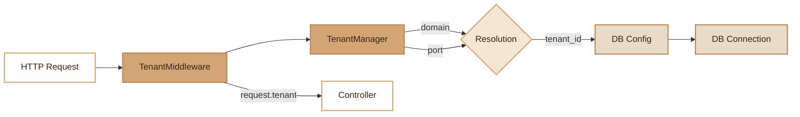

# Tenant

> Multi-tenancy with isolated databases and automatic resolution by domain or port.

## Overview

The Tenant module implements the "database-per-tenant" pattern: each tenant has its own database, and the current tenant resolution is done automatically from the HTTP request (domain or port).

The system relies on three components:

- **TenantManager**: central manager that loads configuration, resolves the tenant from the request, and provides DB connection credentials.
- **TenantMiddleware**: HTTP middleware that intercepts each request to identify the tenant.
- **MakeTenantCommand**: CLI command that generates the `app/config/tenants.php` configuration file.

The resolution follows a priority order: exact domain > wildcard domain (`*.example.com`) > port.

## Diagram



## Public API

### TenantManager

```php
$manager = new TenantManager();

// Load configuration
$manager->loadConfig(__DIR__ . '/app/config/tenants.php');

// Automatic resolution from HTTP request
$tenantId = $manager->resolveFromRequest();  // ?string

// Current tenant
$manager->current();                          // ?string
$manager->setTenant('client1');               // void (for tests/CLI)
$manager->reset();                            // void (between worker requests)

// DB configuration
$config = $manager->getConnectionConfig();    // ?array{host, port, db, user, password}
$config = $manager->getTenantConfig('client1'); // ?array

// State
$manager->isEnabled();                        // bool
$manager->getTenantIds();                     // string[]
```

### Request Resolution

The priority order is as follows:

1. **Exact domain**: direct match with `HTTP_HOST`
2. **Wildcard domain**: pattern `*.example.com` matches any subdomain
3. **Port**: match with `SERVER_PORT`

If no match is found, `resolveFromRequest()` returns `null`.

### TenantMiddleware

```php
// The middleware is registered globally in public/index.php
$app->addGlobalMiddleware(new TenantMiddleware($tenantManager));
```

Behavior:
- If multi-tenancy is not configured (`isEnabled() === false`), the request passes without modification.
- If no tenant is resolved, an `HttpException 400` is thrown.
- The identified tenant is stored in request attributes: `$request->getAttribute('tenant')`.

## Configuration

### File `app/config/tenants.php`

Generated by the `make:tenant` command, this file defines three sections:

```php
return [
    // Domain -> tenant mapping
    'domains' => [
        'client1.example.com' => 'client1',
        'client2.example.com' => 'client2',
        '*.client3.com'       => 'client3',
    ],

    // Port -> tenant mapping (useful for local dev)
    'ports' => [
        8081 => 'client1',
        8082 => 'client2',
    ],

    // Tenants: each value = environment variable names
    'tenants' => [
        'client1' => [
            'host'     => 'POSTGRES_TENANT_CLIENT1_HOST',
            'port'     => 'POSTGRES_TENANT_CLIENT1_PORT',
            'db'       => 'POSTGRES_TENANT_CLIENT1_DB',
            'user'     => 'POSTGRES_TENANT_CLIENT1_USER',
            'password' => 'POSTGRES_TENANT_CLIENT1_PASSWORD',
        ],
    ],
];
```

### Environment Variables

The configuration does not contain credentials directly. It references environment variables following the convention:

```
POSTGRES_TENANT_{ID}_HOST=localhost
POSTGRES_TENANT_{ID}_PORT=5432
POSTGRES_TENANT_{ID}_DB=app_client1
POSTGRES_TENANT_{ID}_USER=postgres
POSTGRES_TENANT_{ID}_PASSWORD=secret
```

## CLI Commands

### `make:tenant`

```bash
./forge make:tenant
```

Generates the `app/config/tenants.php` file with a commented template. If the file already exists, the command indicates so and does not overwrite it.

## Integration with other modules

- **Database**: the current tenant's credentials are used to establish the DB connection
- **Middleware**: `TenantMiddleware` integrates into the global middleware stack
- **Worker (FrankenPHP)**: `reset()` is called between each request to reset the current tenant
- **Migrations**: migrations can be run per tenant via `--connection`

## Full Example

```php
// --- Initial configuration (public/index.php) ---
use Fennec\Core\TenantManager;
use Fennec\Middleware\TenantMiddleware;

$tenantManager = new TenantManager();
$tenantManager->loadConfig(__DIR__ . '/../app/config/tenants.php');

$app->addGlobalMiddleware(new TenantMiddleware($tenantManager));

// --- In a controller ---
class DashboardController
{
    public function __construct(private TenantManager $tenantManager) {}

    public function index(Request $request): array
    {
        $tenantId = $request->getAttribute('tenant');
        $dbConfig = $this->tenantManager->getConnectionConfig();

        return [
            'tenant' => $tenantId,
            'database' => $dbConfig['db'],
        ];
    }
}

// --- In CLI / tests mode ---
$tenantManager->setTenant('client1');
$config = $tenantManager->getConnectionConfig();
// Execute operations for this tenant...
$tenantManager->reset();

// --- Worker cleanup (between requests) ---
$tenantManager->reset();
```

### Complete `.env` configuration

```env
# Tenant client1
POSTGRES_TENANT_CLIENT1_HOST=pg-client1.internal
POSTGRES_TENANT_CLIENT1_PORT=5432
POSTGRES_TENANT_CLIENT1_DB=app_client1
POSTGRES_TENANT_CLIENT1_USER=app
POSTGRES_TENANT_CLIENT1_PASSWORD=s3cret

# Tenant client2
POSTGRES_TENANT_CLIENT2_HOST=pg-client2.internal
POSTGRES_TENANT_CLIENT2_PORT=5432
POSTGRES_TENANT_CLIENT2_DB=app_client2
POSTGRES_TENANT_CLIENT2_USER=app
POSTGRES_TENANT_CLIENT2_PASSWORD=s3cret2
```

## Module Files

| File | Description |
|---|---|
| `src/Core/TenantManager.php` | Central manager (resolution, config, state) |
| `src/Middleware/TenantMiddleware.php` | HTTP middleware for automatic resolution |
| `src/Commands/MakeTenantCommand.php` | CLI config generation command |
| `app/config/tenants.php` | Configuration file (generated) |
