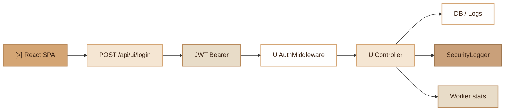

# UI Dashboard
> React admin interface for monitoring and managing a Fennec application

## Overview

The UI Dashboard module provides a complete web administration interface for super-administrators. It consists of:

- **`UiController`**: PHP controller exposing a REST API for the dashboard (authentication, metrics, NF525, audit, security, worker, webhooks)
- **`UiRoutes`**: registration of 20 API routes under the `/api/ui` prefix
- **`UiAuthMiddleware`**: JWT Bearer authentication middleware restricted to configured emails
- **`UiCommand`**: CLI command to launch the Vite development server or build for production
- **`fennec/ui/`**: React 19 application (Vite + TanStack Router/Query + Tailwind CSS 4 + Zustand + react-i18next FR/EN + Recharts)

Authentication relies on the `UI_ADMIN_EMAIL` and `UI_ADMIN_PASSWORD` environment variables. Multiple emails can be authorized (comma-separated).

## Diagram



## Public API

### Authentication

**POST `/api/ui/login`** (without middleware)

```json
// Request
{ "email": "admin@example.com", "password": "secret" }

// Response 200
{
    "token": "eyJ...",
    "refresh_token": "eyJ...",
    "expires_at": 1711200000,
    "email": "admin@example.com"
}
```

All other routes require the `Authorization: Bearer <token>` header.

### Dashboard

**GET `/api/ui/dashboard`**

Returns global metrics: uptime, total requests, req/s, average latency, error rate, memory (usage/peak/limit), PHP version, FrankenPHP mode, and recent security events.

### NF525 (Fiscal Compliance)

| Method | Route                  | Description                          |
|---------|------------------------|--------------------------------------|
| GET     | `/api/ui/nf525/invoices` | Paginated invoice list (20/page) |
| GET     | `/api/ui/nf525/closings` | List of closings                   |
| POST    | `/api/ui/nf525/verify`   | Hash chain verification    |
| POST    | `/api/ui/nf525/close`    | Trigger a closing          |
| GET     | `/api/ui/nf525/fec`      | FEC export (Fichier des Ecritures Comptables) |

Closing example:

```json
// POST /api/ui/nf525/close
{ "type": "monthly", "period": "2026-03" }
```

### Audit (SOC 2 / ISO 27001)

| Method | Route                 | Description                          |
|---------|-----------------------|--------------------------------------|
| GET     | `/api/ui/audit/logs`  | Paginated audit logs with filters (action, table) |
| GET     | `/api/ui/audit/stats` | Statistics (total, retention, last purge) |
| POST    | `/api/ui/audit/purge` | Purge old logs               |

Purge example:

```json
// POST /api/ui/audit/purge
{ "days": 365, "dryRun": true }
// Response: { "deleted": 42, "dryRun": true }
```

Minimum retention: 30 days. `dryRun: true` mode (default) allows previewing without deleting.

### Security

| Method | Route                      | Description                        |
|---------|----------------------------|------------------------------------|
| GET     | `/api/ui/security/events`  | Security events with summary |
| GET     | `/api/ui/security/lockouts`| Currently locked accounts   |
| POST    | `/api/ui/security/unlock`  | Unlock an account            |

Security events are read from `var/logs/security-*.log` files (last 7 files, max 5 events per type to avoid duplicates). The summary includes a counter per event type.

### Worker (FrankenPHP)

| Method | Route                    | Description                   |
|---------|--------------------------|-------------------------------|
| GET     | `/api/ui/worker`         | Worker statistics        |
| POST    | `/api/ui/worker/restart` | Restart signal         |

Exposed metrics: PID, uptime, memory, total requests, active connections, average response time, thread count.

### Webhooks

| Method | Route                              | Description                |
|---------|------------------------------------|----------------------------|
| GET     | `/api/ui/webhooks`                 | List webhooks         |
| POST    | `/api/ui/webhooks`                 | Create a webhook           |
| PUT     | `/api/ui/webhooks/{id}`            | Update a webhook        |
| DELETE  | `/api/ui/webhooks/{id}`            | Delete a webhook       |
| GET     | `/api/ui/webhooks/{id}/deliveries` | Delivery history (50) |

Creation example:

```json
// POST /api/ui/webhooks
{
    "name": "Orders",
    "url": "https://example.com/hook",
    "events": ["order.created", "order.updated"],
    "description": "Order notifications"
}
// Response: { "success": true, "secret": "a1b2c3..." }
```

## Configuration

| Variable            | Description                                    | Default |
|---------------------|------------------------------------------------|--------|
| `UI_ADMIN_EMAIL`    | Authorized email(s), comma-separated     | -      |
| `UI_ADMIN_PASSWORD` | Admin UI password                          | -      |
| `JWT_ACCESS_TTL`    | Access token lifetime (seconds)       | 900    |
| `JWT_REFRESH_TTL`   | Refresh token lifetime      | 86400  |
| `SECRET_KEY`        | Secret key for JWT signing              | -      |
| `DB_DRIVER`         | Database driver (pgsql/mysql/sqlite) | pgsql  |
| `AUDIT_RETENTION_DAYS` | Audit log retention period         | 365    |

The `UI_ADMIN_EMAIL` and `UI_ADMIN_PASSWORD` variables are **required**. Without them, login returns a 503 error and the middleware blocks all requests.

## CLI Commands

```bash
# Launch the dashboard in development mode (Vite)
./forge ui

# Specify a port
./forge ui --port=3002

# Build for production
./forge ui --build

# Regenerate API types via Orval (OpenAPI -> TypeScript)
./forge ui --sync
```

The `ui` command:
1. Checks for Node.js presence
2. Installs npm dependencies if `node_modules/` does not exist
3. Launches Vite in dev, build or sync mode depending on the option

## Integration with other modules

- **JwtService**: generation and validation of access and refresh tokens
- **SecurityLogger**: logging of successful/failed logins, admin actions (purge, unlock, restart, webhook CRUD)
- **AccountLockout**: reading locked accounts and unlocking from the interface
- **HashChainVerifier** / **ClosingService** / **FecExporter**: complete NF525 integration
- **WebhookManager**: webhook CRUD management with cache invalidation
- **DB**: direct database access for audit, invoice, closing and webhook queries

## Full Example

### Complete Dashboard Deployment

```bash
# 1. Configure environment variables
echo "UI_ADMIN_EMAIL=admin@mysite.com" >> .env
echo "UI_ADMIN_PASSWORD=MyPassword123!" >> .env

# 2. Start the API server
./forge serve --port=8080

# 3. Launch the React dashboard
./forge ui --port=3001
# Dashboard accessible at http://localhost:3001
# API proxy to http://localhost:8080

# 4. For production
./forge ui --build
# Files are generated in fennec/ui/dist/
```

### API calls with curl

```bash
# Login
TOKEN=$(curl -s -X POST http://localhost:8080/api/ui/login \
  -H 'Content-Type: application/json' \
  -d '{"email":"admin@mysite.com","password":"MyPassword123!"}' \
  | jq -r '.token')

# Dashboard
curl -H "Authorization: Bearer $TOKEN" http://localhost:8080/api/ui/dashboard

# Verify NF525 integrity
curl -X POST -H "Authorization: Bearer $TOKEN" http://localhost:8080/api/ui/nf525/verify

# List security events
curl -H "Authorization: Bearer $TOKEN" http://localhost:8080/api/ui/security/events?limit=20
```

## Frontend Stack

| Technology       | Role                          |
|-------------------|-------------------------------|
| React 19          | UI rendering                      |
| Vite              | Bundler and dev server         |
| TanStack Router   | SPA routing                   |
| TanStack Query    | API request management      |
| Tailwind CSS 4    | Utility styles            |
| Zustand           | State management              |
| react-i18next     | Internationalization (FR/EN)  |
| Recharts          | Charts and visualizations  |
| Orval             | TypeScript type generation from OpenAPI |

## Module Files

| File | Role |
|---------|------|
| `src/Core/Ui/UiController.php` | API controller (20 endpoints) |
| `src/Core/Ui/UiRoutes.php` | Route registration |
| `src/Middleware/UiAuthMiddleware.php` | JWT super admin middleware |
| `src/Commands/UiCommand.php` | CLI command (dev/build/sync) |
| `fennec/ui/` | React application (SPA) |
