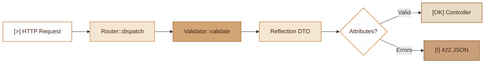

# Validation
> Declarative validation system via PHP 8 attributes for DTOs, integrated with the Fennec router.

## Overview

The Fennec Validation module relies on two components:

- **`Validator`**: static engine that inspects DTO constructor parameters via Reflection, reads PHP 8 attributes and returns an array of errors.
- **Validation attributes**: `#[Attribute]` classes applied to DTO constructor parameters (`#[Required]`, `#[Email]`, `#[Min]`, etc.).

The router automatically calls `Validator::validate()` when dispatching a route bound to a request DTO. No additional configuration is needed.

### Validation Flow

1. The router receives a request and identifies the associated request DTO.
2. `Validator::validate($dtoClass, $data)` is called.
3. For each constructor parameter, the Validator checks:
   - Field presence (required if `#[Required]` or if the type is not nullable and has no default value).
   - Base type (`string`, `int`, `float`, `bool`, `array`).
   - Validation attribute constraints.
4. An error array is returned (empty = valid).

## Diagram



## Public API

### `Validator::validate(string $className, array $data): array`

Validates a data array against a DTO. Returns an error array (empty if all valid).

```php
use Fennec\Core\Validator;

$errors = Validator::validate(UserStoreRequest::class, [
    'email' => 'invalid',
    'name' => '',
]);
// ['email must be a valid email address', 'name is required']
```

### Automatic Validation by the Router

The router detects the DTO in the controller signature and validates automatically:

```php
// In the controller, the DTO is already validated
public function store(UserStoreRequest $dto): array
{
    // $dto is guaranteed valid at this point
    return ['id' => User::create($dto)];
}
```

## PHP 8 Attributes

All attributes target `TARGET_PROPERTY | TARGET_PARAMETER` and accept an optional custom `message`.

### `#[Required]`

Required field. If absent, error "{name} is required".

```php
public function __construct(
    #[Required] public string $email,
)
```

### `#[Email]`

Validates email format via `filter_var(FILTER_VALIDATE_EMAIL)`.

```php
public function __construct(
    #[Email] public string $email,
)
```

### `#[MinLength(int $min)]`

Minimum string length (in multi-byte characters).

```php
public function __construct(
    #[MinLength(3)] public string $name,
)
```

### `#[MaxLength(int $max)]`

Maximum string length.

```php
public function __construct(
    #[MaxLength(255)] public string $name,
)
```

### `#[Min(int|float $min)]`

Minimum numeric value.

```php
public function __construct(
    #[Min(0)] public float $price,
)
```

### `#[Max(int|float $max)]`

Maximum numeric value.

```php
public function __construct(
    #[Max(100)] public int $percentage,
)
```

### `#[Regex(string $pattern)]`

Validation by regular expression.

```php
public function __construct(
    #[Regex('/^[A-Z]{2}[0-9]{4}$/', message: 'must be a valid code')]
    public string $code,
)
```

### `#[Description(string $value)]`

Adds a description for OpenAPI documentation. Does not participate in validation.

```php
public function __construct(
    #[Description('Unique user identifier')]
    public int $id,
)
```

### `#[ArrayOf(string $className)]`

Indicates the type of array elements for OpenAPI documentation. Does not participate in validation.

```php
public function __construct(
    #[ArrayOf(InvoiceLineItem::class)]
    public array $lines,
)
```

## Integration with other modules

| Module | Integration |
|---|---|
| **Router** | Automatic `Validator::validate()` call during dispatch |
| **OpenAPI** | `#[Description]`, `#[ArrayOf]` attributes enrich generated docs |
| **DTOs** | `readonly` classes with validation attributes in the constructor |

## Full Example

```php
// app/Dto/ProductStoreRequest.php
readonly class ProductStoreRequest
{
    public function __construct(
        #[Required]
        #[MinLength(2)]
        #[MaxLength(100)]
        #[Description('Product name')]
        public string $name,

        #[Required]
        #[Min(0)]
        #[Description('Price excl. tax in euros')]
        public float $price,

        #[Email(message: 'must be a valid contact email')]
        public ?string $contactEmail = null,

        #[Regex('/^[A-Z]{3}-[0-9]{4}$/', message: 'expected format XXX-0000')]
        public ?string $sku = null,
    ) {}
}

// Manual validation
$errors = Validator::validate(ProductStoreRequest::class, $request->body());
if (!empty($errors)) {
    return Response::json(['errors' => $errors], 422);
}
```

## Module Files

| File | Role |
|---|---|
| `src/Core/Validator.php` | Validation engine |
| `src/Attributes/Required.php` | Required field attribute |
| `src/Attributes/Email.php` | Email validation attribute |
| `src/Attributes/Min.php` | Minimum value attribute |
| `src/Attributes/Max.php` | Maximum value attribute |
| `src/Attributes/MinLength.php` | Minimum length attribute |
| `src/Attributes/MaxLength.php` | Maximum length attribute |
| `src/Attributes/Regex.php` | Regex attribute |
| `src/Attributes/Description.php` | OpenAPI description attribute |
| `src/Attributes/ArrayOf.php` | OpenAPI array type attribute |
