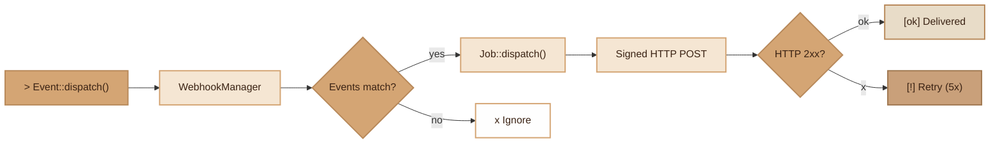

# Webhooks

> Outgoing HTTP notification system with HMAC-SHA256 signature, async delivery via queue, and automatic retry.

## Overview

The Webhooks module allows notifying external services when events occur in the application. An admin registers webhooks (URL + events to listen to), and the `WebhookManager` listens to all internal events via `Event::listen('*')`. When an event matches, an async job is dispatched on the `webhooks` queue to send a signed HTTP POST. If delivery fails, 5 retries with exponential backoff are performed. Each attempt is tracked in `webhook_deliveries` for monitoring.

## Diagram



## Public API

### WebhookManager::dispatch(string $event, array $payload): void
Manually dispatches an event to matching webhooks.
```php
WebhookManager::dispatch('order.paid', ['order_id' => 42, 'amount' => 99.90]);
```

### WebhookManager::send(string $url, array $payload, string $secret, string $event): array
Sends a signed HTTP POST. Returns `['status' => int, 'body' => string, 'success' => bool]`.
```php
$result = WebhookManager::send('https://example.com/hook', $data, $secret, 'order.paid');
```

### WebhookManager::sign(string $payload, string $secret, int $timestamp): string
Generates an HMAC-SHA256 signature. Format: `sha256=<hash>`, message: `{timestamp}.{payload}`.
```php
$sig = WebhookManager::sign($json, $secret, time());
```

### WebhookManager::verify(string $payload, string $secret, string $signature, int $timestamp): bool
Verifies a signature. Rejects requests older than 5 minutes (anti-replay).
```php
$valid = WebhookManager::verify($body, $secret, $sig, $timestamp);
```

### WebhookManager->boot(): void
Registers the wildcard listener `Event::listen('*')`. Called automatically by `App`. Protected against multiple calls (worker mode).

### WebhookManager->clearCache(): void
Clears the LRU webhook cache. Called automatically by the controller after each CRUD operation.

### Webhook::activeForEvent(string $event): array
Returns active webhooks subscribed to an event (wildcard `*` support).
```php
$hooks = Webhook::activeForEvent('user.created');
```

### Webhook::stats(): array
Delivery statistics grouped by webhook (total, delivered, failed, pending).

### WebhookDelivery::recentFailures(int $limit = 20): array
Recent failed deliveries with parent webhook name.

### WebhookDelivery::statsOverview(): array
Global totals by status (pending, delivered, failed).

## Automatic Dispatch via Events

The `WebhookManager` intercepts **all** application events. Events automatically dispatched by the framework:

| Event | Trigger |
|---|---|
| `App\Models\Xxx.created` | `Model::create()` or first `save()` |
| `App\Models\Xxx.updated` | `save()` with modified attributes |
| `App\Models\Xxx.deleted` | `delete()` (soft or hard) |
| `Xxx.transition` | State change (StateMachine) |
| `Xxx.nf525.created` | NF525 document creation |

A webhook subscribed to `App\Models\User.created` will be notified on each user creation, without additional code.

## Security — HMAC-SHA256 Signature

Each outgoing request includes:

| Header | Content |
|---|---|
| `X-Webhook-Signature` | `sha256=<HMAC-SHA256(timestamp.payload, secret)>` |
| `X-Webhook-Timestamp` | Unix timestamp (seconds) |
| `X-Webhook-Event` | Event name |
| `User-Agent` | `Fennec-Webhook/1.0` |

The receiver must verify the signature and reject requests older than 5 minutes.

## Retry and Backoff

| Attempt | Delay |
|---|---|
| 1 | 10s |
| 2 | 30s |
| 3 | 90s |
| 4 | 270s |
| 5 | 810s |

After 5 failures, the job is marked `failed` in `webhook_deliveries`. An admin can manually retry via `POST /webhooks/deliveries/{id}/retry`.

## DB Tables

### `webhooks`

| Column | Type | Description |
|---|---|---|
| `id` | BIGSERIAL | PK |
| `name` | VARCHAR(255) | Webhook name |
| `url` | VARCHAR(2048) | Destination URL |
| `secret` | VARCHAR(255) | HMAC-SHA256 key |
| `events` | JSONB | Event list (`["*"]` = all) |
| `is_active` | BOOLEAN | Active/inactive |
| `description` | TEXT | Optional description |
| `created_at` | TIMESTAMP | Creation date |
| `updated_at` | TIMESTAMP | Update date |

Index: `idx_webhooks_is_active`

### `webhook_deliveries`

| Column | Type | Description |
|---|---|---|
| `id` | BIGSERIAL | PK |
| `webhook_id` | BIGINT | FK -> webhooks (CASCADE) |
| `event` | VARCHAR(255) | Triggered event |
| `url` | VARCHAR(2048) | Called URL |
| `payload` | JSONB | Sent payload |
| `status` | VARCHAR(50) | `pending` / `delivered` / `failed` |
| `http_status` | INTEGER | Returned HTTP code |
| `response_body` | TEXT | Response body (truncated to 2000 chars) |
| `attempt` | INTEGER | Attempt number |
| `created_at` | TIMESTAMP | Attempt date |

Index: `idx_webhook_deliveries_webhook_id`, `idx_webhook_deliveries_status`

## API Routes (admin only)

All routes are protected by `Auth::class, ['admin']`.

| Method | Route | Action |
|---|---|---|
| `GET` | `/webhooks` | List (paginated, `is_active` filter) |
| `POST` | `/webhooks` | Create a webhook |
| `GET` | `/webhooks/{id}` | Details |
| `PUT` | `/webhooks/{id}` | Update |
| `DELETE` | `/webhooks/{id}` | Delete |
| `PATCH` | `/webhooks/{id}/toggle` | Enable/disable |
| `GET` | `/webhooks/{id}/deliveries` | Delivery history |
| `GET` | `/webhooks/stats` | Global statistics |
| `GET` | `/webhooks/failures` | Recent failures |
| `POST` | `/webhooks/deliveries/{id}/retry` | Retry a failure |

## CLI Commands

| Command | Description |
|---|---|
| `./forge make:webhook` | Generate the complete module: migration + Models + DTOs + Controller + Routes |

## Integration with other modules

- **Events**: `WebhookManager` listens to all events via `Event::listen('*')` — this is the core of automatic dispatch
- **Queue**: each delivery is a `WebhookDeliveryJob` dispatched on the `webhooks` queue
- **Notifications**: the `WebhookChannel` allows sending webhooks via the notification system (`$user->notify()`)
- **Model**: `created/updated/deleted` events are automatically dispatched by `Fennec\Core\Model`
- **App**: the `WebhookManager` is registered as a lazy singleton in the Container (instantiated on first use, not at boot)

## Worker — Memory Safety

- `WebhookManager` is **lazy-initialized**: it is not instantiated at `App` boot, but only on first use via Container singleton. `getInstance()` auto-resolves from the Container when the instance is null.
- Bounded LRU cache of 100 entries (configurable via `setMaxCacheSize()`)
- `$booted` guard against re-registrations in worker mode
- `clearCache()` called after each CRUD modification

## Full Example

```php
// 1. Create a webhook (via API or code)
$webhook = Webhook::create([
    'name' => 'Slack notifications',
    'url' => 'https://hooks.slack.com/services/xxx',
    'secret' => bin2hex(random_bytes(32)),
    'events' => json_encode(['App\\Models\\User.created', 'App\\Models\\Order.updated']),
    'is_active' => true,
]);

// 2. Anywhere in business code:
$user = User::create(['name' => 'Alice', 'email' => 'alice@test.com']);
// -> Event "App\Models\User.created" automatically dispatched
// -> WebhookManager intercepts, dispatches a job
// -> Signed POST sent to Slack with user data

// 3. Manual dispatch for a custom event:
WebhookManager::dispatch('payment.received', [
    'amount' => 150.00,
    'currency' => 'EUR',
]);
```

## Module Files

| File | Role | Last Modified |
|---|---|---|
| `src/Core/Webhook/WebhookManager.php` | Main manager, dispatch, signature | 2026-03-22 |
| `src/Core/Webhook/WebhookDeliveryJob.php` | Async job with retry and logging | 2026-03-22 |
| `src/Core/Notification/Channels/WebhookChannel.php` | Webhook notification channel | 2026-03-22 |
| `src/Commands/MakeWebhookCommand.php` | Complete module generator | 2026-03-22 |
| `database/migrations/2026_03_22_012911_create_webhooks_tables.php` | Migration (pgsql/mysql/sqlite) | 2026-03-22 |
| `app/Controllers/WebhookController.php` | CRUD + deliveries + stats + retry | 2026-03-23 |
| `app/Models/Webhook.php` | ORM Model (casts, relations, stats) | 2026-03-23 |
| `app/Models/WebhookDelivery.php` | ORM Model (stats, failures) | 2026-03-23 |
| `app/Dto/WebhookStoreRequest.php` | Creation/update DTO | 2026-03-23 |
| `app/Dto/WebhookItem.php` | Webhook response DTO | 2026-03-23 |
| `app/Dto/WebhookDeliveryItem.php` | Delivery response DTO | 2026-03-23 |
| `app/Dto/WebhookResponse.php` | Response wrapper DTO | 2026-03-23 |
| `app/Dto/WebhookListRequest.php` | Pagination + filter DTO | 2026-03-23 |
| `app/Routes/webhook.php` | Admin routes | 2026-03-23 |
